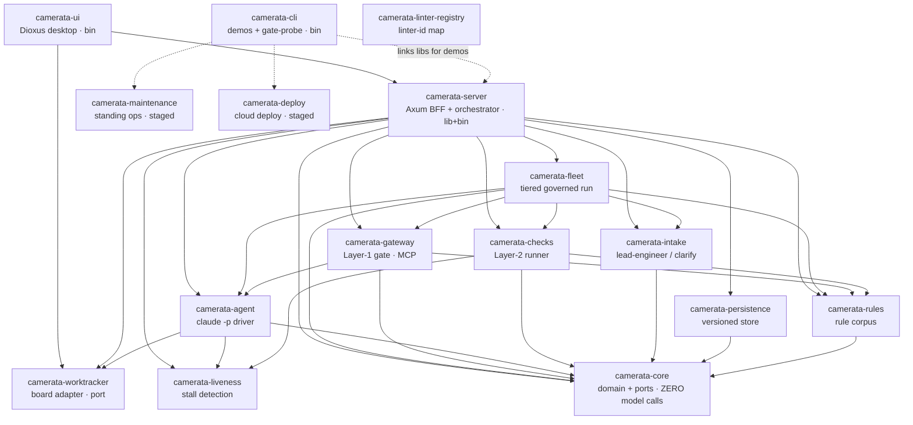

# Camerata Orchestrator

I set out to build Camerata because managing multiple AI agents across multiple projects through conversational chat alone became unwieldy, and frankly cognitively tiring. The governance itself worked: my rules held and the agent's code quality stayed high. But routines would fail silently, and I often wouldn't know a run had failed until I went and asked the agent about it. The missing piece was never the governance, it is already baked into my process. What was missing was a structured place for it to live: status and state visible and managed in a real interface, instead of buried in chat. That is what Camerata is: a structured management layer for orchestrating AI agents across any number of projects, while enforcing rules and deterministic gates to maintain code quality.

Camerata is an all-Rust, governed multi-agent engineering platform. This README leads with what runs and is defensible today, and is explicit about what is built but staged. The intended reader is the person who will clone the repo and check, so the line between "proven" and "built but not yet validated live" is drawn deliberately, not blurred.

The fastest way to see it: `cargo run -p camerata-ui` (the Enterprise Cockpit, a Dioxus desktop app), then walk **Onboard repos → Governed Development**.

```text
 CAMERATA — WHAT'S REAL vs STAGED
 ════════════════════════════════════════════════════════════════════════════

 ✅ REAL — runs today, you can reproduce it
    ▸ GOVERNANCE GATE — deny-before-execute blocks a real `claude -p` agent's
      forbidden write before it touches disk. Fail-closed, provider-neutral,
      binary pass/fail (not an LLM grading an LLM).      ← the defensible wedge
      Proven standalone at the CLI (`camerata -- live-demo`); the deterministic
      gate self-check also runs in-app (Governed Development → Run gate self-check).
    ▸ BROWNFIELD ONBOARDING, end-to-end in the UI — per-repo detect → two-tier
      audit → calibrate/dedup → triage → baseline waivers + GitHub issues → apply.
    ▸ GOVERNED DEVELOPMENT CONSOLE — pull issues, create Units of Work, and drive
      the full lifecycle (investigation → decisions → development → update-branch
      → PR → sign-off) with a project-aware chat assistant. Wired end-to-end in
      the UI; live-agent runs across the cycle are the validation milestone below.
    ▸ EVERY AGENT IS GROUNDED — on-demand READ access to the entire set of a
      project's repo clones + the project's rules; writes stay gated to one worktree.
    ▸ PROVIDER-AGNOSTIC RUNTIME: a native in-process ApiAgentDriver owns the
      MCP tool-use loop for any provider; the Claude CLI driver remains for the
      subscription path. Model registry combines Claude static entries with live
      OpenRouter discovery (free / tool-use / caching / vision flags, pricing).
    ▸ DOMAIN-AWARE MODEL TIERING: Strongest / Balanced / Fast fleet bands plus
      an optional Designer (vision) band; suggested profiles (Balanced, Max
      Efficiency, Max Quality, Custom); per-step helper models; L3 AI code review.
    ▸ CONSOLIDATED SETTINGS: one Settings nav item covering cross-project
      credentials (keychain-backed, masked) + Bombe animation controls, and
      per-project model configuration. The Rules page is rules-only.
    ▸ 16-crate Rust workspace · ~2,000 tests · governs its OWN source in CI.

 ⏳ STAGED — built & tested, NOT yet validated live (please don't grade these as proven)
    ▸ The gate inside a full LIVE development cycle — the engine + UI are wired and
      unit-tested; a live model doing real multi-step work with layer-2 bounce-back
      has not been run end-to-end yet. This is the next milestone.
    ▸ Consumer "AI lead engineer" app-builder is a deterministic stub by default
      (real governed fleet opt-in: CAMERATA_LIVE_BUILD=1); Azure deploy = plan.
    ▸ Architect / board adapters tested against fake transports — 0 live calls.

 → Grade the wedge: the GATE is the proven core, and the governed dev console is now
   built around it in the app. Everything still staged is labeled honestly below.
```

## What works today: brownfield onboarding, end to end

Point Camerata at one or more existing GitHub repositories and it runs the full onboarding flow, in-app, front to back:

- **Per-repo stack detection** (languages and frameworks) and a **per-repo proposed ruleset** drawn from a corpus of **350+ rules across many language and framework stacks** (Rust/Axum/SeaORM/Dioxus, Python/Django/Flask/FastAPI, Go, JS/TS/React/Vue/Angular/Next/Nest, Java/Spring, C#/ASP.NET, Ruby/Rails, SQL, fullstack, plus the always-on security floor and the agentic governance rules). Each repo is scanned against its own selected rules plus an always-on deterministic security floor.
- **A two-tier audit:** a deterministic mechanical scan (hardcoded secrets, raw-SQL concatenation, path escapes, plus clippy/ruff/semgrep/osv preview) and an AI architectural audit (missing auth on a write path, a service bypassing the repository layer, N+1, cross-boundary imports, and the like), with severity/authority calibration, cross-rule dedup, and snippet-to-line resolution. CI/runtime-context rules are deliberately routed to CI, where they can actually be checked.
- **Three triage tables** (Unresolved / Ignored / Tech debt) with free re-bucketing, then a **Process** step that turns each disposition into a durable artifact: ignores become reasoned baseline waivers, and every tech-debt item is filed as a real **GitHub issue** (the story).
- **Apply:** the chosen governance files (`AGENTS.md`, `CONVENTIONS.md`, a CI workflow for the mechanical rules, and `.camerata/baseline.json`) are written to a governance branch and pushed, with the PR opened as a separate, deliberate step.

The honest boundary: this has been run on **small fixture repositories, not yet on a large real-world codebase**, so the AI audit's precision and recall at scale are not yet proven. Onboarding's design principle is that it **emits stories and never does the development work itself** — a "resolve now" finding and up to two CI-wiring tasks (mechanical rules → off-the-shelf linters; architectural rules → custom checkers) each become a GitHub issue the development layer picks up. Walked screen by screen in [`docs/USER_GUIDE.md`](docs/USER_GUIDE.md); mechanics in [`docs/TECHNICAL.md`](docs/TECHNICAL.md).

### Report everything, enforce the delta

The audit shows **every** existing violation, but onboarding does **not** freeze your team on day one: arming snapshots the current violations into a committed `.camerata/baseline.json` as accepted pre-existing debt, and the gate then enforces only on **new or changed** code (the eslint/ruff/sonar baseline model). The match is by rule id plus a content fingerprint, so touching a baselined line un-baselines it: fix it or waive it. Suppression has two homes by intent — a per-line inline `// camerata:allow <RULE> -- reason` (reviewable in the diff, attributed by `git blame`) and the central `.camerata/baseline.json` for bulk/legacy/policy. Three rules always hold: a **reason is mandatory**, **everything is indexed centrally**, and **stale waivers are surfaced** for removal.

## The governed development console

Once a project is onboarded, **Governed Development** is where work gets done:

- **Issue management** — pull all open issues across the project's repos, see the real Epic → sub-issue tree (via GitHub's sub-issues), and create a **Unit of Work** from any issue (or author a new story with an AI lead engineer that drafts against the actual codebase).
- **The UoW lifecycle** — each unit moves through **investigation → decisions → development → update-branch → PR → sign-off**, every phase persisted as structured data rather than ephemeral chat, with a model selector and a Stop control per run, and a deterministic **gate self-check** runnable in-app.
- **A project-aware chat assistant** grounded, per turn, in the rules catalog, the project's committed/selected rules, the live development state, and the latest scan — with an explicit "what this assistant can see" panel and a hard no-fabrication contract.
- **Human-review escalations with resume** — when an agent's work meets the escalation condition of a rule you selected, the run *pauses* instead of failing: it checkpoints, surfaces in the **NEEDS YOU** queue, and you **Approve / Amend / Reject**. Approve and Amend re-spawn the agent from the checkpoint to continue; Reject reverts and stops. Which rules escalate is driven by the corpus, not hardcoded. See [`docs/ESCALATION_RESUME_DESIGN.md`](docs/ESCALATION_RESUME_DESIGN.md).

This console is wired end-to-end in the UI and unit-tested. The validation milestone (see Status) is a **live** model driving real multi-step development through the gate with layer-2 bounce-back — built, not yet exercised live.

## The governance gate: a proven seam, narrow by design

The technical wedge is **deterministic governance, not an AI verifier**: a real-time, deny-before-execute MCP tool-gateway that blocks a forbidden agent write before a byte hits disk, fail-closed and provider-neutral. Binary pass/fail, not "the model thinks this looks right."

**Proven today:** `cargo run -p camerata -- live-demo` runs a real `claude -p` agent locked to a single gated tool and shows the forbidden write denied before it reaches disk, in-process and fail-closed; a second, non-Claude driver shows the seam is provider-neutral ([`docs/PROVIDER_NEUTRALITY.md`](docs/PROVIDER_NEUTRALITY.md)). The captured proof is in [`docs/LIVE_RUN_VERIFICATION.md`](docs/LIVE_RUN_VERIFICATION.md); the gateway's jail tests (path/secret guards, planted-violation denial, fail-closed-on-unknown-session) run on every `cargo test`.

**The honest boundary:** this is proven as a **standalone denial** and as the in-app deterministic self-check. The gate has **not** yet been exercised inside a full **live** development cycle, where an agent does real multi-step work and the loop iterates to a result. The console for that cycle is built (above); validating it live is the next milestone. The gate currently enforces a high-strictness security tier (a `..`/`.git`/`.ssh` path guard, a secret-file guard, and content heuristics for secrets / raw-SQL-concat / secrets-in-URLs; no AST yet) — deepening the enforced rule set behind the seam is incremental, not architectural.

## The enforcement model (rules → layers)

Rules are the single source of truth, but the layers consume them differently: **L3 reads any
rule as prose instantly, while L2/L4 only enforce rules you wire into the pipeline** (mechanical
rules need wiring; architectural rules need defining *then* wiring). That difference is why the
layers can drift — the full model is in [`docs/ENFORCEMENT_MODEL.md`](docs/ENFORCEMENT_MODEL.md):

**The CI layer (L4) is scaffolded and suggested, not auto-enforced.** Apply *generates the files*
(the CI workflow `.github/workflows/camerata-gates.yml` and the `.camerata/checks.toml` manifest,
where mechanical rules get a runnable command from the rule's conformance hint and architectural
rules get a commented TODO placeholder), and onboarding files wiring stories (GitHub issues) for both
tiers. But generating the workflow file is not the same as enforcing it: the team reviews and commits
the workflow, provisions the linters, and writes the bespoke checkers for architectural rules. CI
enforcement is opt-in and manually wired, never switched on automatically by apply.


## Every agent is grounded in the real project

A foundational invariant: **every agent that runs inside a project has on-demand READ access to the entire set of that project's repo clones** (a project can hold several distinct repos), plus the project's rules and a cheap always-on digest. It is not a context-less chatbot guessing at your stack — the story-author, the investigation agent, and the developer agent can all open any file in any of the project's repos before they reason or write. **Writes stay gated:** the only write path is the gateway's tool, jailed to a single Unit-of-Work worktree, so cross-repo reading never widens what an agent can change. See [`docs/decisions/2026-06-25_all-agents-grounded-in-repo-and-rules.md`](docs/decisions/).

Beyond the repos and rules, each project carries **soft context** that travels with its export: a **product brief** (what the product is, who it's for, the quality bar), **operating principles** (how a good engineer works here), and an accumulating, human-curated **project memory** (decisions, patterns, gotchas) that agents propose and you approve. All three feed the same grounding, so the agents read the *why* before the *what*. See [`docs/PROJECT_CONTEXT_LAYERS.md`](docs/PROJECT_CONTEXT_LAYERS.md).

## Where this leads (staged honestly, not the showcase)

These surfaces are built to varying depth and labeled in [Status](#status). They show where the architecture points; none is claimed proven end to end.

- **Consumer app-builder.** A non-technical owner refines an app with an AI lead engineer through a clarification-first intake (a Product Owner interviewed before any code is written). The data-and-flow spine is built and tested; the default lead engineer is a deterministic stub with the real governed fleet opt-in behind `CAMERATA_LIVE_BUILD=1`. See [`docs/CONSUMER_UX.md`](docs/CONSUMER_UX.md).
- **Architect / board surface.** Governed agents collaborate with a requirements owner through the tracker they already use (Jira / Azure DevOps / GitHub) and write provenance, gate results, PR links, and sign-off back to the work item. The most code and most-tested adapter crate — but every adapter test runs against a scripted fake transport: no live board call yet. See [`docs/WORKTRACKER_INTEGRATION.md`](docs/WORKTRACKER_INTEGRATION.md).
- **Standing maintenance agent and a consented design corpus.** Keeping a published app alive (upgrades, security patches, key rotation) through the same governed loop, with prior builds making future ones faster. Designed and partially built.

## Status

A compiling, tested, all-Rust workspace, not a design folder.

**Verified at runtime (you can reproduce it):**

- A **16-crate workspace, ~2,000 passing tests**, `clippy -D warnings` + `unsafe`-forbidden + fmt enforced in CI, governing its OWN source ([`docs/ENFORCEMENT.md`](docs/ENFORCEMENT.md)).
- **Brownfield onboarding, end to end** on fixture repos: per-repo detection and rule proposal, the two-tier audit with calibration and dedup, the triage tables, Process emitting baseline waivers and GitHub issues, and Apply writing the governance branch.
- **The gate denies a real agent (standalone)** via `camerata -- live-demo`, with the gateway's verdict + jail tests covered by `cargo test`.
- **The governed development console** — issue pull + Epic/sub-issue tree, UoW creation and the full lifecycle UI, the project-aware chat assistant, and the deterministic gate self-check — wired and unit-tested in-app.
- **Universal agent grounding** — full multi-repo read access + rule context, write gate unchanged (proven by the gateway jail tests).

**Built and tested, but not yet validated live:**

- **The gate inside a live development cycle** — the engine and console are wired and unit-tested at the argv/jail/state level, but a live model doing real multi-step work with layer-2 bounce-back has not been run end-to-end.
- **The consumer app-builder default flow is deterministic, not model-driven** (real fleet behind `CAMERATA_LIVE_BUILD=1`; Azure deploy is a plan).
- **The architect surface has made zero live board calls** — the `WorkItemProvider` port, the Jira/ADO/GitHub adapters, and the sync policy exist with an end-to-end flow test against scripted fakes only.

**Still ahead:** the live development-cycle validation; live wiring for the worktracker adapters (OAuth, webhooks) and the Azure deploy adapter; the dev-engine ingest of "resolve now" stories; and deepening the gate's rule set (more enforcement arms, AST-level checks).

## Try it (runnable demos)

These run end to end on in-process providers and stubs, no network or credentials needed:

```
cargo run -p camerata-ui                    # ► START HERE: the Enterprise Cockpit (Onboard repos → Governed Development)
cargo run -p camerata -- live-demo          # the gate denies a real claude -p agent's forbidden write
cargo run -p camerata -- po-demo            # a PO form -> lead engineer -> governed fleet -> cargo build/test
cargo run -p camerata -- worktracker-demo   # architect surface (against a fake board transport)
cargo run -p camerata -- maintenance-demo   # the standing ops agent (recommendation, approval gate, rotation)
cargo run -p camerata -- deploy-demo        # the draft->publish gate, a local deploy, and the Azure az-CLI plan
```

## Read in this order

1. [`docs/USER_GUIDE.md`](docs/USER_GUIDE.md): the flows and features, how to use them.
2. [`docs/TECHNICAL.md`](docs/TECHNICAL.md): how it works under the hood (the gate, the scan pipeline, agent grounding, persistence).
3. [`docs/ARCHITECTURE.md`](docs/ARCHITECTURE.md): the all-Rust stack, top to bottom.
4. [`docs/decisions/`](docs/decisions/): the design-decision records.
5. [`docs/VISION.md`](docs/VISION.md): the north star and where the architecture leads.

## Architecture in one breath

- **Everything load-bearing is Rust** (no TypeScript core; that early design was abandoned on evidence). One Tokio process is the server, the brain, and the gate.
- **Orchestrator core:** deterministic Rust that makes ZERO model calls (intake, rule selection, planning, worktrees, coordination, provenance).
- **Governance gateway:** a Rust MCP server. Every agent tool call routes through it; it allows or denies before anything executes (deny-before-execute).
- **Agent layer:** short-lived agents, one per role, scoped by prompt, allowed tools, path boundaries, and rule subset. Each gets read access to all of the project's repos; writes are jailed to its worktree. Two drivers: `ClaudeCliDriver` (subscription path, drives `claude -p`) and `ApiAgentDriver` (in-process, owns the MCP tool-use loop, works with any OpenRouter-listed or Anthropic API provider).
- **Model registry:** Claude static entries merged with live OpenRouter discovery. Each entry is flagged for free tier, tool-use support, prompt caching, vision capability, and pricing. Fleet routing is domain-first (visual work to the Designer band) then by difficulty within the Strongest / Balanced / Fast logic ladder.
- **Persistence:** a versioned store (SQLite now, Postgres later behind the same trait seam) so every user/AI edit is saved with full history.
- **UI:** a Dioxus desktop app whose Bletchley Bombe background is an AI-activity indicator: it powers up (lights up, rotors spin) only while genuine AI / heavy work is in flight (chat turns, authoring, investigation/live-run, scans/audits) and powers down to a dim idle the rest of the time, with the rotor knobs freezing in place between runs. Trivial fetches never animate it. Tabular surfaces dogfood [Chorale](../rust-chorale).

## The crate dependency graph

The real `[dependencies]` graph between the library crates — a strict DAG the compiler
enforces (a cycle between crates does not compile). Read it bottom-up: `camerata-core` and
the leaf utilities depend on nothing; adapters and capabilities build on the floor;
`camerata-server` is the composition root; `camerata-ui` / `camerata-cli` are thin binaries
on top.



The dashed `camerata-cli` edges are its demo/probe harness reaching each subsystem directly;
`camerata-linter-registry` is used by the maintainer-only `corpus-verifier` tool, so it has
no app-crate edge. Full crate map + the runtime model in [`docs/TECHNICAL.md`](docs/TECHNICAL.md) §1.

## How an AI agent fits behind the gate

The orchestrator makes zero model calls; it prepares a session and spawns an agent behind the `AgentDriver` seam. Two drivers implement that seam: `ClaudeCliDriver` (drives `claude -p` subprocesses, used with the Claude subscription path) and `ApiAgentDriver` (in-process, owns the MCP tool-use loop for any provider reachable via the Anthropic API or OpenRouter). Either way, the agent can READ the project's repos but its built-in write tools are disallowed. Its only way to write is the gateway's MCP tool, which denies or allows each write before it executes (layer 1). Allowed writes land in an isolated worktree; layer-2 checks bounce failures back. The gate is provider-neutral and model-agnostic.


## Family

- [camerata-ai](../camerata-ai): the conventions engine the corpus format originates from. The corpus is vendored into this repo at `crates/rules/principles/` (350+ TOML rules), so the workspace is self-contained; override with `CAMERATA_CORPUS_PATH`.
- [rust-chorale](../rust-chorale): the headless, virtualized Dioxus / Leptos table library used for tabular surfaces.
- this repo: the conductor that leads the ensemble.

## License

Source-available under the [PolyForm Noncommercial License 1.0.0](LICENSE). The code is fully readable, and noncommercial use (study, evaluation, personal and research projects) is permitted. Commercial and competing use is reserved by the copyright holder, Zachary Ernst. This is a deliberate choice over a permissive license: a license can be loosened later but never tightened, so it starts reserved.
