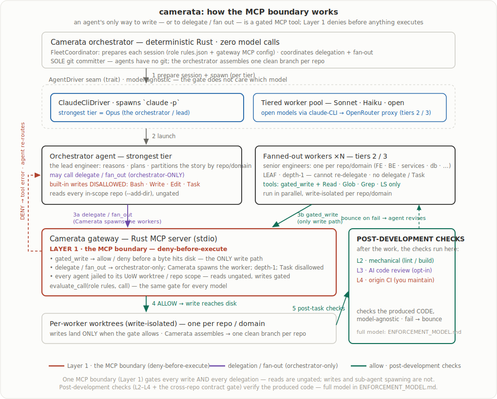

# Camerata Orchestrator

> Working name. "Conductor" is a candidate, fitting the Camerata / Chorale musical
> theme: Camerata writes the rules, Chorale renders the tables, the Conductor leads
> the ensemble.

**The proven core, in one sentence:** Camerata is a deterministic, deny-before-execute
MCP gate written in Rust; a real `claude -p` agent, locked to a single gated tool, is
blocked from a forbidden write before it touches disk, in microseconds, in-process and
fail-closed. That is the claim this repo backs end to end, and it is reproducible by
running `cargo run -p camerata -- live-demo`.

Everything else here is built around that core to show where the architecture leads: a
governed multi-agent engineering engine exposed through two interaction surfaces. What
is genuinely proven versus what is staged or opt-in is stated plainly in
[Status](#status-what-runs-today-and-what-is-staged) below; this intro does not blur the
two.

- **The app-builder surface.** A non-technical user refines an app with an AI lead
  engineer, gets a working app they own on their own cloud, and a standing AI
  maintenance routine keeps it alive. The full data-and-flow spine is built and tested
  end to end; in the default experience the "lead engineer" is a deterministic stub and
  the build screen is a timed narrative, with the real governed fleet available opt-in
  (see Status). It is the broadest surface. See
  [`docs/CONSUMER_UX.md`](docs/CONSUMER_UX.md).
- **The architect surface (governed orchestration).** A human architect and a real
  requirements owner collaborate through the tracker they already use (Jira / Azure
  DevOps / GitHub), governed agents execute, and Camerata writes provenance, gate
  results, PR links, and sign-off back onto their work items. It is the most code and the
  most-tested crate, but, stated honestly, every adapter test runs against a scripted
  fake and no live Jira/ADO/GitHub call has been made yet (the real HTTP transport
  exists but is wired in nowhere). The design rationale is in
  [`docs/RATIONALE.md`](docs/RATIONALE.md); the integration design is in
  [`docs/WORKTRACKER_INTEGRATION.md`](docs/WORKTRACKER_INTEGRATION.md).

## The app-builder surface in detail

A non-technical user is the requirements owner, with no developer or architect in the
loop. They fill a structured intake form (including a shipped style kit), then work a
**refinement session** with an AI lead engineer: an editable list of plain-language
user stories, a climbing confidence score, proactive suggestions, and honest limits.
The same refinement loop runs before the build, during it (escalations), and after it
(QA + structured bug reports), including a standing AI maintenance routine. The whole
flow is the artifact. See [`docs/CONSUMER_UX.md`](docs/CONSUMER_UX.md).

The interaction-design reasoning behind the clarification-first intake is in
[`docs/RATIONALE.md`](docs/RATIONALE.md).

## What makes it different

Spawning parallel agents is commodity. The differentiators, in order of weight:

1. **A clarification-first, consumer-facing intake.** The user is a Product Owner
   being interviewed before any code is written, not an engineer editing YAML. This
   is the hero of the experience and the thing the prompt-to-app tools do not have.
2. **Deterministic governance, not an AI verifier.** A real-time MCP tool-gateway
   denies bad agent actions before they execute, and an out-of-process structural
   check bounces violations back for revision. Binary pass/fail, not "the model
   thinks this looks right." The architecture is the differentiator, not the rule
   count. The gate is the high-strictness SECURITY tier — write-time checks that deny
   before a byte hits disk: a `..`/`.git`/`.ssh` path guard, a secret-FILE guard
   (`.env`/`.pem`/`.key`/`id_rsa`/…, templates exempt), and content heuristics for
   secrets / raw-SQL-concat / secrets-in-URLs (no AST yet). Consistency/architectural
   rules are enforced one tier out, at CI/integration: arming a mechanical corpus rule
   emits `.camerata/ci-checks.json` + a governance workflow, because those checks
   (lint, query-plan, migration audit, AST) need build context the write-time gate
   doesn't have. The point this repo proves is the *seam* (deny-before-execute,
   provider-neutral, fail-closed) and the right enforcement tier per rule; deepening the
   set behind it is incremental, not architectural.
3. **A standing maintenance/ops agent.** A published app is alive: upgrades, security
   patches, key rotation, all run through the same governed loop, with calm
   plain-language recommendations. The owner gets the maintenance a real team would
   give, without hiring one.
4. **A shared, consented design corpus.** With opt-in (and opt-out-is-deletion),
   abstracted designs and bug fixes from prior apps make future builds faster, more
   consistent, and easier to maintain. A network effect a lone owner could never have.

## Brownfield onboarding: report everything, enforce the delta

Pointing Camerata at an existing repo runs a two-tier audit: a deterministic mechanical
scan (secrets, raw SQL, path escapes) and an AI architectural audit (missing auth on a
write path, services bypassing the repository layer, N+1, cross-boundary imports, and
the like). The report shows **every** existing violation, but onboarding does **not**
freeze your team on day one: arming snapshots the current violations into a committed
`.camerata/baseline.json` as accepted pre-existing debt, and the gate then enforces only
on **new or changed** code (the eslint/ruff/sonar baseline model). Touching a baselined
line un-baselines it — fix it or waive it. Fixing audited items runs as a normal governed
development task (the same worktree → gate → checks → bounce loop as any other work).

### Suppressing a rule

Two homes, by intent:

- **Per-line, surgical waiver — an inline comment**, co-located with the code:

  ```rust
  let key = SANDBOX_PUBLIC_KEY; // camerata:allow SEC-NO-HARDCODED-SECRETS-1 -- public sandbox value, JIRA-123
  ```

  The waiver applies to the offending line it trails (or the line directly below it). It
  shows up in the PR diff, so silencing a rule is a reviewable, challengeable act, and
  `git blame` records who/when for free.

- **Bulk / legacy / policy — the central `.camerata/baseline.json`** (written for you at
  onboarding; also where an org-wide "waive rule X until Q3" policy lives).

Three rules hold regardless of where a suppression lives:

1. **A reason is mandatory.** A bare `// camerata:allow SEC-X` with no `-- reason`
   suppresses nothing and is itself flagged as a violation (`CAM-WAIVER-NEEDS-REASON`).
2. **Everything is indexed centrally.** Inline waivers and baseline entries roll up into
   one auditable registry — "show me everything we've waived, by rule / age / who" is a
   lookup, not a grep.
3. **Stale waivers are surfaced.** A waiver whose violation no longer exists is a dead
   directive that would silently mask the next one; Camerata flags it for removal.

A waiver can carry its tracked ticket (`-- accepted as debt, JIRA-123`), linking the
suppression to the tracked story, so "ignore" and "open a debt story" are one act.

## Status: what runs today, and what is staged

This is a compiling, tested, all-Rust workspace, not a design folder. The line between
what is verified at runtime and what is built-but-not-yet-live is drawn deliberately,
because the intended reader is exactly the person who will run the code and check.

**Verified at runtime (you can reproduce it):**

- A 14-crate workspace, 670+ passing tests, zero warnings, no
  `todo!`/`unimplemented!` stubs, governing its OWN source in CI (unsafe forbidden,
  clippy `-D warnings`, fmt, tests; see [`docs/ENFORCEMENT.md`](docs/ENFORCEMENT.md)).
- **The gate denies a real agent.** `camerata -- live-demo` runs a real `claude -p`
  subprocess locked to a single gated tool and shows the forbidden write blocked before
  it hits disk. Provider-neutrality is shown with a second, non-Claude driver
  ([`docs/PROVIDER_NEUTRALITY.md`](docs/PROVIDER_NEUTRALITY.md)). Caveat, stated so you
  are not surprised: the committed proof in
  [`docs/LIVE_RUN_VERIFICATION.md`](docs/LIVE_RUN_VERIFICATION.md) /
  [`docs/RUST_CORE_VERIFICATION.md`](docs/RUST_CORE_VERIFICATION.md) is a captured
  transcript, and `cargo test` exercises the gate against a fake in-process
  `EchoDriver`, not a live model. The live denial is reproducible by running the
  `live-demo` binary; it is not re-run by the test suite (a live agent in CI spends
  tokens on every push). The gate's five enforced rules and the pure verdict
  function ARE covered by the suite against synthetic tool calls.
- **The Tier-2 data-and-flow spine, end to end:** typed intake + style kit, the
  refinement session, versioned persistence with full revision history (durable
  on-disk across launches), the shared corpus, and the post-build bug loop, composed
  into a runnable Dioxus desktop app.

**Built and tested, but not yet wired to anything live:**

- **The default app-builder experience is deterministic, not model-driven.** The "AI
  lead engineer" in the default flow is a deterministic `StubRefinementReviewer` (it asks
  smart, form-derived questions, but calls no model), and the build screen is a timed
  narrative. The REAL governed fleet (gateway + `claude -p` agents, the same path the
  `po-demo` exercises) is opt-in behind `CAMERATA_LIVE_BUILD=1`, because a live build
  spends tokens. Publish runs through a deploy seam whose Azure path is a plan, not a
  live `az` execution.
- **The architect surface is the most code and the most-tested crate, and has made zero
  live API calls.** The `WorkItemProvider` port, the Jira / Azure DevOps / GitHub adapters, the
  async clarify-bridge, and SyncPolicy per-field source-of-truth + echo suppression all
  exist with an end-to-end flow test, but every adapter test runs against a scripted
  fake transport. The real `ReqwestTransport` compiles but is instantiated nowhere; no
  real board has been touched yet.

**Still ahead:** live execution wiring for the worktracker adapters (OAuth / webhooks),
the Azure deploy adapter's live execution (BYO-infra credentials), deepening the gate's
rule set (more enforcement arms, AST-level checks), and closing the tracked
unwrap-cleanup frontier into the blocking lint bar.

## Try it (runnable demos)

These run end to end on the in-process providers and stubs, no network or credentials
needed, and narrate what they exercise:

```
cargo run -p camerata -- live-demo          # the gate denies a real claude -p agent's forbidden write
cargo run -p camerata -- po-demo            # a PO form -> lead engineer -> governed fleet -> cargo build/test
cargo run -p camerata -- worktracker-demo   # architect surface: ingest a story, the owner answers from their board, status written back
cargo run -p camerata -- maintenance-demo   # app-builder surface: the standing ops agent (security recommendation, approval gate, rotation)
cargo run -p camerata -- deploy-demo        # app-builder surface: the draft->publish gate, a local deploy, and the Azure az-CLI plan
cargo run -p camerata-ui                    # the Dioxus app-builder surface (desktop)
```

## Read in this order

1. [`docs/CONSUMER_UX.md`](docs/CONSUMER_UX.md) — the app-builder flow, screen by
   screen, and the lead engineer's behavior.
2. [`docs/RATIONALE.md`](docs/RATIONALE.md) — why it is built this way, and the honest
   caveats.
3. [`docs/ARCHITECTURE.md`](docs/ARCHITECTURE.md) — the all-Rust stack, top to bottom.
4. [`docs/decisions/`](docs/decisions/) — the design-decision records (start with the
   [index](docs/decisions/README.md)).
5. [`docs/VISION.md`](docs/VISION.md) — the technical north star and where the
   architecture leads.

## Architecture in one breath

- **Everything load-bearing is Rust** (no TypeScript core; that early design was
  abandoned on evidence). One Tokio process is the server, the brain, and the gate.
- **Orchestrator core:** deterministic Rust that makes ZERO model calls (intake,
  rule selection, planning, worktrees, coordination, provenance).
- **Governance gateway:** a Rust MCP server. Every agent tool call routes through it;
  it allows or denies before anything executes (deny-before-execute).
- **Agent layer:** short-lived `claude -p` subprocesses, one per role, scoped by
  prompt, allowed tools, path boundaries, and rule subset. Provider/model agnostic
  behind a seam.
- **Persistence:** a versioned, event-sourced store (SQLite now, Postgres later behind
  the same trait seam) so every user/AI edit is saved with full history.
- **UI:** a Dioxus app; tabular surfaces dogfood [Chorale](../rust-chorale).

## How an AI agent fits behind the gate

The orchestrator makes zero model calls; it prepares a session and spawns a `claude -p`
agent behind the `AgentDriver` seam. The agent's built-in write tools are disallowed,
so its only way to write is the gateway's MCP tool, which denies or allows each write
before it executes (layer 1). Allowed writes land in an isolated worktree; layer-2
checks bounce failures back. The agent uses your own local Claude login (Camerata holds
no model credentials), and the gate is model-agnostic.



## Family

- [camerata-ai](../camerata-ai) — the conventions engine the corpus format originates
  from. The rule corpus itself is now vendored into this repo at
  `crates/rules/principles/` (107 TOML rules), so the workspace is self-contained;
  override the corpus dir with `CAMERATA_CORPUS_PATH`.
- [rust-chorale](../rust-chorale) — the headless, virtualized Dioxus / Leptos table
  library used for tabular surfaces.
- this repo — the conductor that leads the ensemble.

## License

Source-available under the [PolyForm Noncommercial License 1.0.0](LICENSE). The code
is fully readable, and noncommercial use (study, evaluation, personal and research
projects) is permitted. Commercial and competing use is reserved by the copyright
holder, Zachary Ernst. This is a deliberate choice over a permissive license: a
license can be loosened later but never tightened, so it starts reserved.
