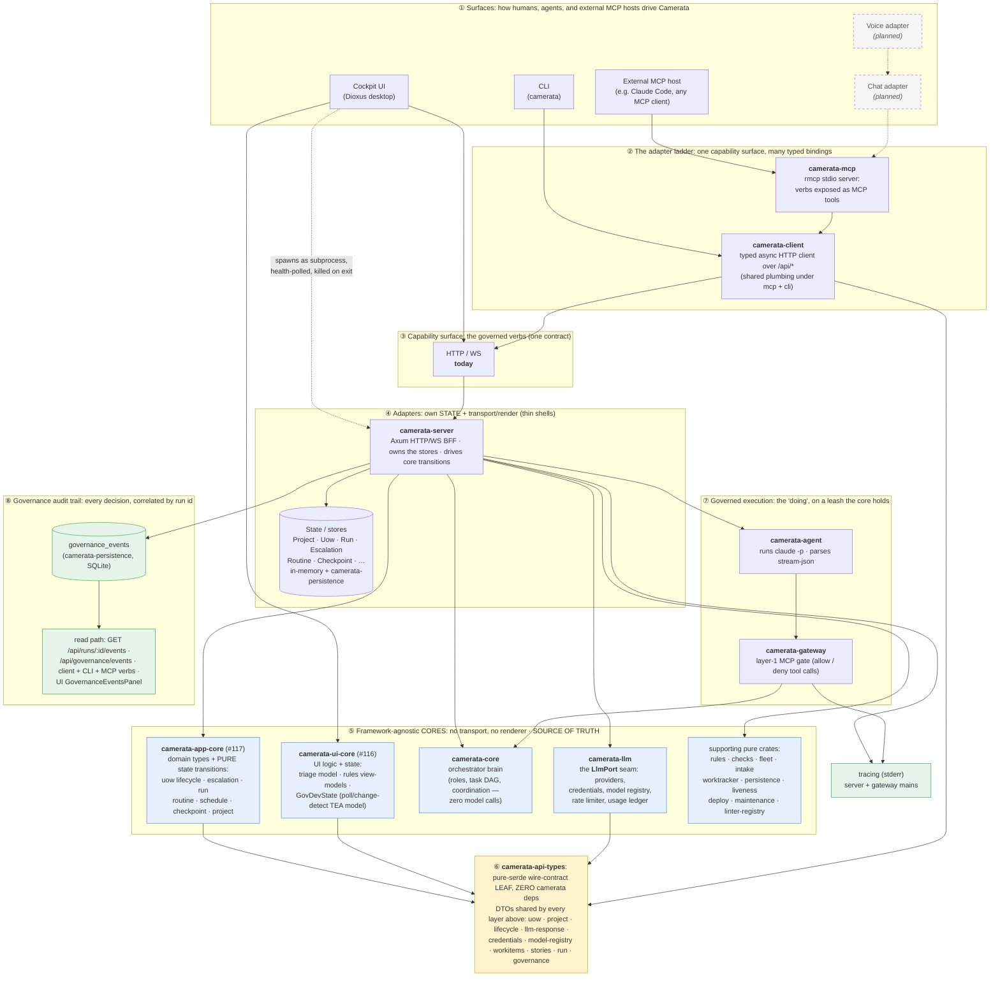

# ARCHITECTURE.md

The Camerata Orchestrator stack, top to bottom and sideways. This reflects the
**verified all-Rust core** (see `RUST_CORE_VERIFICATION.md`). It supersedes the
TypeScript-core / Rust-BFF shape in the earlier `TECH_DESIGN.md` and `UI_DESIGN.md`
diagrams; the design *reasoning* in those docs still holds, only the language
boundary moved.

> **Update (post-#116/#117):** the two headless-core extractions refined the "Orchestrator Core"
> below into three *framework-agnostic core crates* plus thin adapters. The layered chart in the next
> section is the current, canonical view; the ASCII vertical stack further down remains accurate as
> the *runtime / agent-execution* view.

> **Update (2026-07-08, adapter ladder + headless core batch):** a pure contract leaf
> (`camerata-api-types`) now sits under every core and adapter; the LLM provider seam moved out of
> `camerata-server` into its own crate, `camerata-llm`, and was renamed `Completer` -> `LlmPort`; a
> typed HTTP client (`camerata-client`) and a first MCP adapter (`camerata-mcp`) were added above the
> BFF; `camerata-cli` became a real HTTP adapter over that client; and `camerata-ui` stopped embedding
> the BFF in-process, instead spawning `camerata-server` as a subprocess. A governance audit trail
> (`governance_events` in `camerata-persistence`, plus `tracing`) makes gate decisions and lifecycle
> events readable after the fact. See
> [`docs/decisions/2026-07-08_adapter-ladder-and-headless-core.md`](decisions/2026-07-08_adapter-ladder-and-headless-core.md).

---

## The layer separation (post-#116/#117)

**Thesis:** Camerata is a **framework-agnostic governance + orchestration core** wrapped by **thin
adapters**. The core is the single source of truth for *how everything works*; every interface
(visual, CLI, and — planned — chat and voice) is just an adapter over it. **State lives on the
adapter, not in the core.**

- **#116** — the UI headless core (`camerata-ui-core`): pure UI logic/state, no rendering framework.
- **#117** — the backend headless core (`camerata-app-core`): pure app-orchestration domain types +
  state transitions, no transport framework.

Both are enforced by `RUST-HEADLESS-CORE-1` + `RUST-PURE-STATE-TRANSITIONS-1` (see `../CONVENTIONS.md`).



Solid boxes exist today; dashed boxes are either the planned multi-adapter future or a
process-lifecycle edge (the UI spawning the server). Reading it bottom-up: the pure
`camerata-api-types` leaf (⑥) has zero dependencies of its own, so every stateless core (⑤) and the
typed client (②) can depend on it without pulling in a transport or a renderer; the governed-execution
layer (⑦) is what actually does work, on a leash the core holds; and the audit trail (⑧) makes every
gate decision and lifecycle event readable after the fact, correlated by run id.

### Four rules that hold the whole thing together

1. **The cores are the source of truth.** `camerata-core`, `camerata-app-core`, and
   `camerata-ui-core` own *how everything works*: the rules, the lifecycle state machine (`UowStage`),
   and the decisions (is this run cancellable, is this escalation blocked, is this tool call allowed).
   They are **stateless** — state goes in, the next state comes out.
2. **The cores never import a transport or a renderer.** `camerata-app-core` has no `axum`;
   `camerata-ui-core` has no `dioxus`. The compiler enforces this by crate boundary, which is why the
   logic is unit-testable with no HTTP server and no VirtualDom. This is `RUST-HEADLESS-CORE-1`.
3. **State lives on the adapter, not in the core.** The stores (`ProjectStore`, `UowStore`,
   `RunStore`, …) live in `camerata-server`. The adapter *owns* state and asks the stateless core how
   it should change, then persists the result. This is `RUST-PURE-STATE-TRANSITIONS-1`.
4. **The core governs execution; it is not the executor.** `camerata-agent` does the actual work
   (drives the LLM, executes tool calls); `camerata-gateway` is the layer-1 MCP gate that allows/denies
   each call against the core's rules. The core decides and governs; the agent acts, on a leash.

### Why this shape (and what it unlocks)

Adding an interface should mean **writing an adapter, not re-architecting**. Because the cores are
framework-agnostic and state lives on the adapter, a new surface is a thin shell that owns/holds state
and drives the **capability surface** (Camerata's governed verbs: create project, start run, answer
escalation, materialize a design):

- **Cockpit UI** — a visual adapter that renders `camerata-ui-core` state.
- **CLI** — a text adapter over the same capability surface.
- **Chat adapter** *(planned)* — an LLM agent whose tools *are* Camerata's capability surface.
- **Voice adapter** *(planned)* — the chat adapter + speech-to-text / text-to-speech.
- **Voice + cockpit together** *(planned)* — the voice agent and the UI driving **one shared state
  model**, which is exactly what the #116 UI state-lift makes possible.

Today the capability surface is HTTP endpoints on the server adapter. Exposing that same surface as
**MCP tools** turns "add a chat/voice interface" into "point an LLM agent at the existing governed
verbs" — no bespoke integration. That is the natural next architectural unit after #116/#117.

### The adapter ladder, the `LlmPort` seam, and the governance trail (2026-07-08)

The 2026-07-08 batch built the first real rung of "add an interface, not a re-architecture," plus
the audit trail that makes the gate's decisions readable after the fact. Full detail in
[`docs/decisions/2026-07-08_adapter-ladder-and-headless-core.md`](decisions/2026-07-08_adapter-ladder-and-headless-core.md).

- **The pure contract leaf.** `camerata-api-types` sits under everything: a serde-only crate
  (`serde`, `serde_json`, `chrono`, `thiserror`; zero `camerata-*` dependencies) holding the DTOs
  every adapter and core speaks (uow, project, lifecycle, LLM-response, credentials,
  model-registry, workitems, stories, run, governance). Any crate can depend on it without pulling
  in a transport, a renderer, or the domain logic, which is what let the layers above it be built
  and tested independently, without a cycle.
- **The adapter ladder.** Above the BFF's HTTP/WS contract, `camerata-client` is a typed async
  client over `/api/*` (base URL from `CAMERATA_BFF_URL`, default `http://127.0.0.1:8787`).
  `camerata-mcp` is the first MCP adapter rung: an `rmcp` stdio server exposing the same verbs
  (`list_stories`, `get_run`, `list_uows`, `assign_work_item`, `start_run`, `run_events`,
  `recent_events`) as MCP tools, each a thin delegation to `camerata-client`. `camerata-cli`
  (package `camerata`) is now an HTTP adapter over that same client, in addition to its existing
  in-process demo subcommands. An outside MCP host, or a script driving the CLI, now exercises the
  exact same capability surface the Dioxus cockpit does, without linking a single
  behavior-carrying Camerata crate.
- **`camerata-ui` is no longer privileged.** The cockpit used to embed
  `camerata_server::serve()` in-process on its own thread. It now SPAWNS `camerata-server` as a
  subprocess: runtime binary resolution, a health-poll wait for readiness, reuse of an
  already-healthy server already on the port, and a watchdog that kills the child process on exit.
  `camerata-ui` no longer depends on the `camerata-server` crate at all; it talks to the BFF over
  the same HTTP/WS contract every other adapter uses. (It currently does this over raw `reqwest`
  calls rather than through `camerata-client` (folding the cockpit onto the typed client is a
  tracked follow-up, not yet done.)
- **The `LlmPort` seam.** The trait that used to live in `camerata-server` as `Completer` was
  relocated to its own crate, `camerata-llm`, and renamed `LlmPort`: the hexagonal port every LLM
  provider implements (the `Llm` Anthropic transport, `OpenRouterCompleter`, the `build_completer`
  factory and fallback chain), alongside the credential store, model registry, rate limiter, and
  usage ledger. `camerata-llm` depends only on `camerata-api-types`, so it sits beside
  `camerata-app-core` on the same contract leaf, with neither depending on the other.
- **The governance audit trail.** Denials and lifecycle moments used to be visible only in the
  moment (the agent's own transcript). `camerata-persistence` now writes a `governance_events`
  SQLite table (`GovernanceLog`) recording, correlated by run id: `gate_deny` (with the
  human-readable denial reason, never a hash), `gate_allow`, `agent_step`, `run_started`,
  `run_finished`, `layer2_bounce`, `check_failed`, `escalation_raised` (carrying the agent's own
  justification), `escalation_answered`, `sign_off`, and `stall_cancel`. A `tracing` /
  `tracing-subscriber` stack now runs in both the server and gateway mains (stderr-only, so it
  never collides with the gateway's stdio MCP transport). The read path is wired all the way up the
  ladder: `GET /api/runs/:id/events` and `GET /api/governance/events` on the server, a
  `camerata-client` verb, `events` / `recent-events` CLI subcommands, `run_events` /
  `recent_events` MCP tools, and a `GovernanceEventsPanel` in the cockpit.

### Crate map

| Layer | Crate | Role |
|---|---|---|
| Contract (leaf) | `camerata-api-types` | Pure serde wire-contract leaf: DTOs shared across every layer (uow/project/lifecycle/llm-response/credentials/model-registry/workitems/stories/run/governance). Zero `camerata-*` dependencies. |
| Core | `camerata-core` | Orchestrator brain: roles, task DAG, coordination (zero model calls) |
| Core | `camerata-app-core` | **(#117)** Backend domain types + pure state transitions |
| Core | `camerata-ui-core` | **(#116)** Framework-agnostic UI logic + state, including the `GovDevState` TEA model (governed-dev poll/change-detection) |
| Core | `camerata-llm` | The `LlmPort` seam (formerly `Completer` in `camerata-server`): provider stack (Llm/OpenRouter, credential store, model registry, rate limiter, usage ledger); depends only on `camerata-api-types` |
| Core (support) | `camerata-rules` | Rule corpus loader, enforcement kinds, rule-subset selection |
| Core (support) | `camerata-checks` | Layer-2 post-task gate logic (CheckRunner) |
| Core (support) | `camerata-fleet` | Reusable governed-fleet build logic (CLI + UI) |
| Core (support) | `camerata-intake` | PO-mode intake schema + LeadEngineer |
| Core (support) | `camerata-worktracker` | WorkItemProvider port + canonical shapes |
| Core (support) | `camerata-persistence` | SQLite state + JSON provenance, plus the `governance_events` audit trail (`GovernanceLog`) |
| Core (support) | `camerata-liveness` | LivenessTracker + heartbeat/idle probe |
| Core (support) | `camerata-deploy` | Tier-2 BYO-infra publish (DeployTarget seam) |
| Core (support) | `camerata-maintenance` | Tier-2 standing post-publish ops agent |
| Core (support) | `camerata-linter-registry` | Citation validator (canonical linter rule-id lists) |
| Execution | `camerata-gateway` | Layer-1 real-time MCP governance gate (allow/deny) |
| Execution | `camerata-agent` | Agent runtime: drives `claude -p`, parses stream-json |
| Adapter | `camerata-server` | Axum HTTP/WS BFF; **owns the stores**; drives core transitions |
| Adapter | `camerata-client` | Typed async HTTP client over the BFF's `/api/*` routes; shared plumbing under the MCP and CLI adapters |
| Adapter | `camerata-mcp` | First MCP adapter rung: `rmcp` stdio server exposing Camerata's verbs as MCP tools, delegating to `camerata-client` |
| Adapter | `camerata-ui` | Dioxus cockpit; SPAWNS `camerata-server` as a subprocess (no longer embeds it in-process, no crate dependency on it) |
| Adapter | `camerata-cli` (`camerata`) | HTTP adapter over `camerata-client` (clap-based), plus its existing in-process demo subcommands |

---

## Glossary (read this first)

| Term | What it is | Familiar analogy |
|---|---|---|
| **LLM** | Claude itself, the raw model | a contractor you pay per message |
| **Agent** | an LLM given a job, tools, and boundaries, running in a loop | an LLM wrapped in a loop that can call functions |
| **`claude -p` / the CLI** | Claude Code run headlessly; the orchestrator spawns it | `child_process.spawn`; this *is* the agent runtime |
| **Agent SDK** | Anthropic's in-process agent library (TS/Python only, no Rust) | the library we deliberately do NOT use; replaced by `ApiAgentDriver` |
| **`ApiAgentDriver`** | Camerata's own in-process agent driver; owns the MCP tool-use loop for any API-reachable provider | the in-house equivalent of the Agent SDK, written in Rust |
| **Orchestrator** | the "staff engineer" brain; deterministic Rust, **zero model calls** | a CI server / job scheduler, for agents |
| **MCP** (Model Context Protocol) | open standard for giving a model tools via a separate "tool server" | a plugin protocol; the model uses only the plugins you expose |
| **MCP tool-gateway** | *our* Rust MCP server that checks every tool call against the rules before running it | authorization middleware for agent actions |
| **Governance gate** | the checkpoint every agent action passes through (deny-before-execute) | auth middleware, but for what agents do |
| **`PreToolUse` hook** | Claude Code's older "block a tool before it runs" script | replaced by the MCP gateway (stronger) |
| **BFF** (Backend-for-Frontend) | thin server shaping core data for the UI | in the old TS design it bridged Rust-UI ↔ TS-core; all-Rust, the cross-language **boundary** disappears (the BFF survives as `camerata-server`, which the UI now spawns as a subprocess rather than embedding in-process) |
| **Axum** | Rust web framework | Express, for Rust |
| **Dioxus** | Rust UI framework (desktop/web) | React, for Rust |
| **worktree** | multiple working dirs from one git repo, each on its own branch | lets each agent work isolated without collisions |
| **rule corpus** (camerata-ai) | the library of 100+ coding conventions | the law book |
| **rule-subset** | the few rules relevant to *this* task, selected from the corpus | load the 6 rules that matter, not all 100 |
| **provenance** | the audit trail: who did what, under which rules, with what result | git-blame for agent actions |
| **task DAG** | the plan as a dependency graph (task B waits on A) | a build graph / dependency tree |
| **two-layer gate** | layer 1 = block bad tool calls live; layer 2 = structural check after the task | a pre-commit hook + a CI check |

---

## The vertical stack (top = you, bottom = the model)

```
+--------------------------------------------------------------+
|  YOU - Product Owner / Principal Architect                   |
|  Answer clarifying questions, approve plans, judge QA.       |
+------------------------------+-------------------------------+
                               | steer from one screen
+------------------------------v-------------------------------+
|  1. COCKPIT UI  -  Dioxus desktop app (Rust)                 |
|     intake | investigation panels | clarify loop | live plan |
|     | agent status | QA review with provenance               |
|     Dashboard grids dogfood rust-chorale.                    |
+------------------------------+-------------------------------+
                               | localhost HTTP + WebSocket
                               | (NO cross-language boundary: the BFF is now embedded all-Rust)
+------------------------------v-------------------------------+
|  2. ORCHESTRATOR CORE  -  Rust, makes ZERO model calls       |
|     - Intake driver        (your request -> work)            |
|     - Investigation        (product + tech tradeoff panels)  |
|     - Rule selection       (pick the rule-subset per task)   |
|     - Planner -> Task DAG  (dependency graph of work)        |
|     - Worktree manager     (isolated git workdir per agent)  |
|     - Coordinator / merge  (sequence agents, merge results)  |
|     - Persistence + provenance  (SQLite + audit logs)        |
+------------------------------+-------------------------------+
                               | spawns + supervises
+------------------------------v-------------------------------+
|  3. GOVERNANCE GATEWAY  -  Rust MCP server   [VERIFIED]      |
|     Every agent tool call routes through here. It looks up   |
|     session -> role -> rule-subset and ALLOWS or DENIES      |
|     before anything executes. Deny-before-execute.          |
+------------------------------+-------------------------------+
                               | agent's ONLY tools are the gated ones
+------------------------------v-------------------------------+
|  4. AGENT LAYER  -  `claude -p` subprocesses, one per role   |
|     (Backend agent, Frontend agent, ...) each scoped by:     |
|     system prompt | allowed tools | path boundaries | rules  |
+------------------------------+-------------------------------+
                               | tool calls + responses
+------------------------------v-------------------------------+
|  5. THE LLM  -  Claude (provider/tier/model-agnostic seam)   |
+--------------------------------------------------------------+
```

The verification's structural win: layers 2 and 3 were TypeScript with a Rust BFF
bolted on to reach the UI. They are now Rust, and the cross-language BFF *boundary*
vanishes: the BFF survives as `camerata-server` (Axum), now a same-language component
rather than a cross-stack bridge. (As of the 2026-07-08 batch, the UI reaches it by
spawning it as a subprocess, not by embedding it in-process.)

---

## The sideways pieces (supporting systems)

```
   camerata-ai            rust-chorale           Work Tracker
   (rule corpus)          (table library)        (async bridge)
        |                      |                      |
        | feeds                | renders the          | a REMOTE Product
        | rule-selection       | dashboard grids      | Owner's tasks/replies
        v                      v                      v
   ORCHESTRATOR  --------->  COCKPIT UI  <-------  ORCHESTRATOR
                                                   (no shared cloud; the tracker
                                                    is the asynchronous handoff)

   Persistence: SQLite (state) + JSON provenance logs (audit)
   sits directly under the orchestrator.
```

- **camerata-ai** = the law book the rule-selection reads from.
- **rust-chorale** = the grid component the dashboards are built on.
- **Work tracker** = how a *remote* product owner participates with no shared
  server: the orchestrator reads/writes tasks there asynchronously (see
  `WORKTRACKER_INTEGRATION.md`).
- **Persistence/provenance** = the memory and audit trail under everything.

---

## The infrastructure as it runs (processes on the machine)

```
  Dioxus desktop process  --spawns + health-polls-->  camerata-server process
  (camerata-ui)              (watchdog kills on exit)  (camerata-server)
                                              |  +- Axum HTTP/WS server (the UI then talks to
                                              |  |   this over localhost, same as any adapter)
                                              |  +- embeds the Rust MCP governance gateway
                                              |  +- owns the SQLite db + provenance logs +
                                              |  |   the governance_events audit trail
                                              |  +- spawns, per task:
                                              |       claude -p (Backend role)   -+
                                              |       claude -p (Frontend role)  -+- all tool calls
                                              |       ... in isolated worktrees  -+   route back through
                                              |                                       the gateway
                                              +------------------------------------>  (deny-before-execute)
```

**Two Rust binaries, not one (as of the 2026-07-08 adapter-ladder batch).** `camerata-ui` (the
cockpit) no longer embeds the server in-process; it spawns `camerata-server` as a subprocess (with
health-poll readiness, reuse-if-already-healthy, and a watchdog that kills the child on exit) and
then talks to it exactly like any other adapter would. `camerata-server` remains the process that
*is* the server, the brain, and the gate, fanning out short-lived `claude -p` agents into isolated
git worktrees, with every action they take passing back through its governance gate.

---

## The language boundary

| Piece | Language | Why |
|---|---|---|
| Cockpit UI | Rust (Dioxus) | native, dogfoods chorale |
| Orchestrator core | Rust | deterministic, zero model calls |
| Governance gateway | Rust (rmcp/MCP) | **verified**; MCP has a first-party Rust SDK |
| Persistence | Rust (sqlx/serde) | language-agnostic, Rust-native |
| Agent runtime | `claude -p` subprocess (`ClaudeCliDriver`) OR in-process `ApiAgentDriver` | two drivers behind one `AgentDriver` trait; both are Rust; the CLI subprocess is used for the subscription path, the in-process driver for any API provider |
| `ts-morph` sidecar | TypeScript | *optional*, P2+; only for TS-AST checks the linter can't express; a subprocess, not core |

Everything load-bearing is Rust. The single optional TS piece is a sidecar for
governing TypeScript *target* code, not part of the engine.

---

## Two-layer governance (how the gate actually works)

- **Layer 1 (real-time):** the Rust MCP gateway. Denies a tool call before it
  executes, per the role's rule-subset. Proven in `RUST_CORE_VERIFICATION.md`.
- **Layer 2 (post-task):** a structural check after the agent finishes (lint /
  AST / rule audit). On a violation, the specific failed rule is bounced back to
  the agent for revision. This is the "examples are not enforcement; the gate is"
  principle.

Layer 1 stops the action; layer 2 catches what slips through structurally and
forces a fix. Both are written against a provider-neutral seam so a non-Claude
model can be swapped in without rewriting the gate logic.
