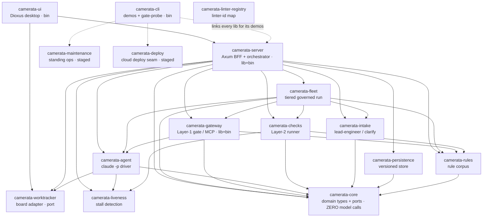
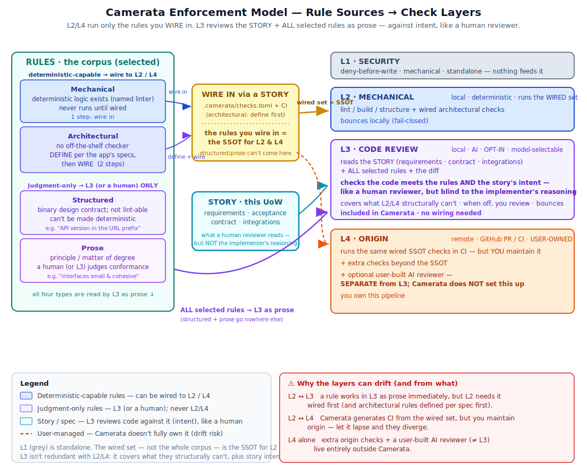

# TECHNICAL.md — Camerata Under the Hood

> **Audience:** developers and architects who want to understand HOW Camerata
> works in code, not what it does for end users. For the user-facing feature
> reference, see `docs/USER_GUIDE.md`.
>
> **Accuracy discipline:** this document must be kept in sync with the code as
> things change. If you rename a crate, move a module, add an enforcement arm,
> or change a store's persistence path, update the relevant section here in the
> same commit. A stale technical reference is worse than no reference.

---

## 1. System overview and crate map

Camerata is a single Rust workspace. The shipped app is 16 crates under
`crates/` (plus one maintainer-only tool, `tools/corpus-verifier`, that is NOT a
dependency of any app crate). All load-bearing code is Rust; the only optional
non-Rust piece is a future TypeScript AST sidecar described in
`docs/ARCHITECTURE.md` that does not exist yet.

### Workspace members (`Cargo.toml`)

| Crate | Binary / Lib | One-line purpose |
|---|---|---|
| `camerata-core` | lib | Orchestrator brain: roles, tasks, DAG, coordination. Makes ZERO model calls. Defines the shared traits (`GovernanceGateway`, `AgentDriver`, `CheckRunner`) the rest of the stack depends on. |
| `camerata-intake` | lib | PO-mode intake form schema + LeadEngineer (architect-abstracted second level). |
| `camerata-gateway` | lib + bin (`camerata-gateway`) | Layer-1 real-time governance gate. A Rust MCP server; also usable in-process. |
| `camerata-agent` | lib | Agent runtime: drives `claude -p` subprocesses, parses stream-json. Implements `AgentDriver`. |
| `camerata-rules` | lib | Rule corpus loader, `EnforcementKind` classifier, rule-subset selection. |
| `camerata-persistence` | lib | SQLite state store (`sqlx`) + JSON provenance. |
| `camerata-checks` | lib | Layer-2 post-task gate: `CheckRunner` + `cargo fmt`/`cargo clippy`/`cargo test` subprocess runners. |
| `camerata-fleet` | lib | Reusable governed-fleet build logic, shared by CLI and UI. |
| `camerata-server` | lib + bin | Axum HTTP/WS server the cockpit talks to. Embedded in the UI process. Contains the onboarding scan pipeline, arm/emit, workspace/git controls, the WorkItem/UoW layer, and all HTTP routes. |
| `camerata-cli` | bin (`camerata`) | CLI binary entry point wiring everything together, including `live-demo`. |
| `camerata-ui` | bin (`camerata-ui`) | Dioxus desktop cockpit. Separate process; talks to the embedded `camerata-server` over localhost HTTP. |
| `camerata-worktracker` | lib | `WorkItemProvider` port: canonical story shapes, sync policy, native provider, and adapters for GitHub Issues, GitHub Projects v2, Jira Cloud, Azure DevOps Boards. |
| `camerata-maintenance` | lib | Tier-2 standing post-publish ops agent (dependency upgrades, security patches, secret rotation). |
| `camerata-deploy` | lib | Tier-2 BYO-infra publish: `DeployTarget` seam + local + Azure adapter. |
| `camerata-linter-registry` | lib | Citation validator: canonical linter rule-id lists per tool, plus a corpus-scan report used to ground `mechanical` rules to real linter ids (`Verification::Grounded`). |
| `camerata-liveness` | lib | Run-liveness / stall detection primitive (progress-based, not wall-clock) shared by the agent runtime, the layer-2 runner, and the server for the watched/routine stall thresholds and cancellation. |

> The maintainer-only `tools/corpus-verifier` (a separate workspace member,
> not a `crates/` member) promotes rules `grounded → verified` via a branch + PR.
> It is the only write path to `verified` and is never a dependency of the
> shipped app.

### The crate dependency graph (the real DAG)

This is the actual `[dependencies]` graph between the library crates (test-only
`[dev-dependencies]` are excluded — those can point "back up" for integration tests
without forming a real cycle).



Read it bottom-up. `camerata-core` and the leaf utilities (`liveness`, `linter-registry`)
depend on nothing. Adapters (`persistence`, `worktracker`, `deploy`) and capabilities
(`agent`, `gateway`, `checks`, `intake`, `fleet`) build on the floor. `camerata-server` is
the **composition root** that wires them behind the Axum BFF, and `camerata-ui` /
`camerata-cli` are thin binaries on top. Every arrow points down the stack: the graph is a
DAG, and the compiler enforces it — a cycle between library crates does not compile.
(`camerata-cli` links the libraries directly to drive its demos/probes — those edges are
dashed; `camerata-linter-registry` is consumed by the maintainer-only `corpus-verifier`
tool, so it carries no app-crate edge.)

### Process and runtime model

When you run `cargo run -p camerata-ui`:

1. The Dioxus desktop process starts. In `crates/ui/src/main.rs`, `use_hook`
   spawns a dedicated OS thread that starts a `tokio::Runtime` and calls
   `camerata_server::serve("127.0.0.1:8787")`. This is the **embedded BFF**.
2. The BFF binds Axum to `127.0.0.1:8787`. All cockpit data flows over
   localhost HTTP/WebSocket. The cockpit never calls backend crates directly.
3. When a governed run is triggered, the orchestrator inside `camerata-server`
   spawns short-lived `claude -p` subprocesses (one per task/role), each locked
   to the MCP governance gate.
4. The MCP governance gate runs either as an in-process `GovernedGateway` (the
   `GovernanceGateway` trait implementation in `crates/gateway/src/lib.rs`) or
   as a separate stdio MCP server binary (`crates/gateway/src/main.rs`). Both
   call the same pure `evaluate_call` function — no divergence.

### Language boundary

Everything load-bearing is Rust. The cockpit UI (`camerata-ui`) is Dioxus (Rust
targeting desktop via WebView). `camerata-server` is Axum (Rust). The governance
gate is `rmcp`-based Rust. The agent runtime drives `claude -p` (the Claude Code
CLI) as a subprocess. There is no Node.js or TypeScript in the active runtime.
The historical `TECH_DESIGN.md` describes a TypeScript orchestrator that was
replaced; disregard it for current code.

---

## Enforcement model overview

Camerata enforces rules across **four check layers** — **L1** Security · **L2** Mechanical ·
**L3** AI code review · **L4** Origin/CI — bound by the rules as a single source of truth, with
the lead orchestrator guaranteeing cross-repo contracts on top. The canonical model (rule types,
the wiring cost, and why the layers drift) is [`ENFORCEMENT_MODEL.md`](ENFORCEMENT_MODEL.md):



> **Numbering note — reconciled.** Camerata's canonical four-stage model is
> **L1** Security (MCP gate) · **L2** Mechanical (post-task check runner) · **L3** AI code
> review (the agentic reviewer) · **L4** Origin/CI (the repo's own pipeline). The prose in
> this file and in USER_GUIDE.md is now reconciled to that numbering: every reference that
> means CI reads **L4** (or "Layer 4"), and **L3** is reserved for the AI code reviewer. The
> ONLY remaining legacy is the **code** flag name `layer3_only` (`Rule::is_layer3_only()`),
> which means **CI-only (L4)** despite its name. **The flag name is intentionally not renamed
> in code** to avoid a corpus-wide migration, so a reader who greps the source for "layer3"
> finds the CI tier, not the AI reviewer. The canonical ENFORCEMENT_MODEL.md is the
> authoritative stage reference.

## 2. Layer-1 MCP gate

### What the gate is

`crates/gateway` is a Rust MCP server that implements the
`camerata_core::GovernanceGateway` trait. It is the **deny-before-execute**
checkpoint: every tool call an agent attempts is evaluated against the role's
rule-subset BEFORE the side effect happens. A denied write never touches the
filesystem.

### How it is defined

`crates/gateway/src/lib.rs` is the library half. The key types:

- `GovernedGateway` — holds a `HashMap<SessionId, Role>`. Each `Role` carries
  its `rule_subset: Vec<RuleId>` (assigned when an agent is spawned). `bind()`
  registers a session; `evaluate()` looks up the session's role and calls
  `evaluate_call`.
- `evaluate_call(rule_subset, call)` — the single source of truth for layer-1
  governance. It iterates the subset, calling `apply_rule` on each. The **first
  rule that denies wins** (fail-closed, cheapest explanation in the bounce-back
  message). Pure function: same inputs always yield the same `Decision`.
- `apply_rule(rule, call)` — dispatches through `RULE_REGISTRY` by rule-id
  string. Unknown ids are safe no-ops: the gate is permissive about rules it
  has not implemented, never about calls.
- `RULE_REGISTRY: &[RuleEntry]` — static ordered list of all implemented rule
  arms. Each entry is `(id, description, arm: RuleArmFn)` where `RuleArmFn` is
  `fn(path: &str, content: &str) -> Result<(), String>`.

The gate currently enforces eleven rules across `RULE_REGISTRY`. The
**deterministic security floor** — the seven `SEC-*`/`ARCH-*` content and path
rules — is the conceptual backbone for the enforcement tables in §5a:

| Rule ID | Keys off | What it denies |
|---|---|---|
| `GOV-1` | path | Writes whose path contains the substring `"forbidden"`. |
| `SEC-NO-PATH-ESCAPE-1` | path | Writes with a `..` traversal segment or a `.git`/`.ssh` directory component (segment-split, not substring). |
| `SEC-NO-SECRET-FILES-1` | path (filename) | Writing a real `.env`, private-key files (`.pem`/`.key`/`.p12`/`.pfx`/`id_rsa`/etc.), or keystores. |
| `SEC-NO-HARDCODED-SECRETS-1` | content | Hardcoded credential literal: GitHub tokens (`ghp_`/`gho_`/`ghu_`/`ghs_`/`github_pat_`), Slack tokens (`xox[baprs]-`), AWS keys (`AKIA`), OpenAI/Stripe `sk-` keys, Google API keys (`AIza`), PEM private-key headers, or a long opaque literal assigned to a secret-named identifier. Uses a `OnceLock<Regex>` compiled once. |
| `SEC-NO-RAW-SQL-CONCAT-1` | content | SQL built via string concatenation or format interpolation; requires DML keyword + confirming SQL clause + interpolation marker to fire. |
| `ARCH-NO-SECRETS-IN-URL-1` | content | A URL carrying a secret in its query string (`api_key`/`token`/`secret`/`password`/`access_token`). |
| `SEC-NO-PRIVATE-KEY-1` | content | PEM private-key block header (RSA, EC, DSA, OPENSSH, PGP, PKCS#8). |
| `SEC-NO-VENDOR-TOKEN-1` | content | High-precision vendor credential token shapes: AWS `AKIA`/`ASIA`, GitHub `gh*_`, Slack `xox*-`, Stripe `sk_live_`, Google `AIza*`, Anthropic `sk-ant-`. |
| `SEC-NO-SECRET-FILE-1` | path | Writing a path whose name marks it as secret-bearing (`.pem`, `.p12`, `.pfx`, `.key`, `.jks`, `.keystore`, `id_rsa`/`dsa`/`ecdsa`/`ed25519`, real `.env` files). Companion to `SEC-NO-SECRET-FILES-1` for the brownfield audit. |
| `SEC-NO-DISABLED-TLS-1` | content | Content that disables TLS verification (`verify=False`, `rejectUnauthorized:false`, `InsecureSkipVerify:true`, `NODE_TLS_REJECT_UNAUTHORIZED=0`, `CURLOPT_SSL_VERIFYPEER false/0`). |
| `SEC-NO-CAMERATA-CONFIG-1` | path | Any `gated_write` target whose path contains a `.camerata` segment (split on `/` and `\`). Protects the SSOT manifest and all operator config from agent edits. See §3 SSOT manifest. |

The **deterministic floor** is the seven `SEC-*`/`ARCH-*` content and path rules:
`SEC-NO-HARDCODED-SECRETS-1`, `SEC-NO-RAW-SQL-CONCAT-1`, `ARCH-NO-SECRETS-IN-URL-1`,
`SEC-NO-PRIVATE-KEY-1`, `SEC-NO-VENDOR-TOKEN-1`, `SEC-NO-SECRET-FILE-1`,
`SEC-NO-DISABLED-TLS-1`. The path-escape and GOV-1 rules are write-time structural
gates (not content scanners) and are NOT included in the brownfield audit floor;
`SEC-NO-CAMERATA-CONFIG-1` is a manifest-protection rule, described separately.

See `docs/decisions/2026-06-22_floor_rules_and_test_scope_gate.md` for the full
expansion history and rationale.

### Test-scope-aware gate (`TestScopePolicy`)

Each gate rule declares a `TestScopePolicy` (defined in `crates/gateway/src/lib.rs`):

- **`Waive`** — the rule does not apply in test scope. Used for
  `SEC-NO-RAW-SQL-CONCAT-1` (test migrations write raw SQL legitimately) and
  `SEC-NO-DISABLED-TLS-1` (test infrastructure may connect to local TLS proxies
  without proper certs). At the gate, Waive means the arm returns `Ok(())` —
  the write is allowed.
- **`Downgrade`** — the rule fires in test scope. At the gate, Downgrade still
  returns `Err(...)` — the write is DENIED. The brownfield audit (scan layer)
  additionally down-ranks the finding to `low` severity and adds a test-path
  note; but at the GATE the deny is unconditional. Default for unknown rules
  (conservative).

`test_scope_policy(rule_id)` is the single source of truth. The test-scope
primitives — `is_test_or_fixture_path`, `test_scope_line_ranges`, `is_in_test_scope`,
`TEST_PATH_NOTE`, `TEST_PATH_SEVERITY` — live in `crates/gateway/src/lib.rs` as `pub`
items and are re-exported for use by `crates/server/src/onboard.rs`.

**Cross-layer contract.** The Waive/Downgrade distinction means:

| Layer | Waive | Downgrade |
|---|---|---|
| Gate (layer-1) | Allow (arm returns `Ok`) | DENY (arm returns `Err`) |
| Scan (brownfield audit) | Finding dropped entirely | Finding kept, severity lowered to `low`, `in_test=true` |

### How the gate is wired to agents

`crates/agent/src/lib.rs` builds the `claude -p` argv in `ClaudeCliDriver::build_args`:

- `--allowedTools` is set to `Read Glob Grep LS mcp__camerata__gated_write` only.
- `--disallowedTools` explicitly lists `Bash Write Edit MultiEdit NotebookEdit Task`.
- `--strict-mcp-config` ensures only the Camerata MCP server's tools are available.
- `--mcp-config <path>` points to the JSON file that tells Claude Code to connect
  to the gate (the stdio transport in `crates/gateway/src/main.rs`).

The net effect: an agent's **only mutation path** is `mcp__camerata__gated_write`,
which routes every byte through `evaluate_call` before touching disk. The `Task`
tool (subagent spawning) is explicitly denied to prevent a child agent regaining
`Write`/`Bash`.

Gate evaluation is a pure, in-memory pass over the role's rule subset: path
checks are segment tests; the content rules are pre-compiled regexes
(`OnceLock<Regex>`). Even over a multi-domain subset of dozens of rule ids the
cost is dominated by the few content regexes, not the iteration. The `claude -p`
round-trip is model inference, orders of magnitude larger; the gate adds no
perceptible latency. (The specific microbenchmark figures previously quoted here
were point-in-time and are not reproduced from code — treat the relative
ordering, not absolute numbers, as the durable claim.)

### Honesty caveat: no human-visible audit log yet

The gate denies and bounces the call back to the agent. There is **no
human-visible enforcement catch-ledger** in the current build (Phase 2, tracked
in GitHub issue #69). Do not assume "audit trails" exist for denied writes; the
gate enforces silently from the operator's perspective until that feature ships.

### Fail-closed behavior

An unknown session (`SessionId` not in the `GovernedGateway` map) returns
`Decision::Deny { rule: gov1_rule(), reason: "no role bound..." }`. There is no
silent allow path for an unregistered session.

---

## 3. Layer-2 post-task checks

Layer-2 is the deterministic gate that runs on the agent's OUTPUT after a task
finishes, in the coordinator's bounce-and-revise loop. It is **cross-language,
polyglot, repo-pinned, and fail-closed** — no longer Rust-only-hardcoded.

### The SSOT manifest (`.camerata/checks.toml`)

`.camerata/checks.toml` is the **single source of truth** for custom deterministic
gate checks. Both Layer 2 and Layer 4 derive from this file; drift between them is
structurally impossible. See
`docs/decisions/2026-06-22_check_manifest_single_source_of_truth.md`.

**Manifest schema:**

```toml
[[check]]
id       = "ARCH-API-LAYERING-1"          # rule id; violation id on nonzero exit
name     = "API layering"                  # human-readable label
command  = "scripts/check_layering.sh"     # shell command; cwd = repo root
severity = "high"                          # "high" | "medium" | "low" (all severities block)
in_loop  = true                            # true = Layer 2 + Layer 4; false = CI-only (Layer 4)

# Optional pinning fields (see §3 "Tool-version pinning" below)
tool     = "dependency-cruiser"
version  = "6.3.0"
install  = "npm install -g dependency-cruiser@6.3.0"
```

All five core fields are **required** (no serde defaults). A missing field is a
parse error, not a silent mis-configuration. A missing manifest is NEVER fatal —
it logs a warning and yields zero custom checks; built-in runners (fmt/clippy/test)
are unaffected.

**`in_loop` vs `ci-only`:**

| `in_loop` | Runs at | Use when |
|---|---|---|
| `true` | Layer 2 AND Layer 4 | Check is fast (< 30 s), needs no external secrets or services; the agent gets early feedback. |
| `false` | Layer 4 (CI) only | Check needs secrets, external services, or a long runtime that would stall the agent loop. |

**Parity guarantee — structural, not conventional.** Both the Layer-2
`ManifestCheckRunner` and the Layer-4 CI workflow generator in
`crates/server/src/workflow_gen.rs` call the SAME shared functions:

- `layer2_commands(stack, manifest)` — exact commands Layer 2 runs: built-in
  stack commands + `in_loop = true` manifest entries.
- `all_ci_commands(stack, manifest)` — superset Layer 4 runs: built-in stack
  commands + ALL manifest entries (in_loop + ci-only).

`layer2_commands ⊆ all_ci_commands` holds by construction (same built-ins, same
in_loop entries, plus ci-only extras). A unit test in `workflow_gen.rs` asserts
this parity for all stack variants.

**Composition.** The manifest runner is ADDITIVE on top of the built-in language
runners:

```
CombinedCheckRunner
  ├── PolyglotCheckRunner (language runners — Rust/JS/Go/Python/Ruby/Java/C#)
  └── ManifestCheckRunner (in_loop checks from .camerata/checks.toml)
```

`runner_for_worktree` in `crates/checks/src/multilang.rs` returns a
`CombinedCheckRunner`. The manifest runner runs AFTER the language runner. Both
run on every bounce pass — the agent gets the full picture in one bounce-back.

**Gate-edit hard-guard.** The manifest defines what Layer 2 enforces; an agent
that could edit `.camerata/checks.toml` could silently disable its own gates.
`SEC-NO-CAMERATA-CONFIG-1` (§2) denies any `gated_write` targeting a `.camerata`
path segment. Only operator commits (human, not agent) can change the manifest.

### Tool-version pinning

**The problem.** The manifest SSOT eliminates rule-definition drift. But an
external linter at the wrong version (e.g. `dependency-cruiser` 5.x vs 6.x, or
Semgrep 1.x vs 1.y) can return DIFFERENT results on the same ruleset — producing
"green at Layer 2, red at Layer 4" even with a stable rule definition. The SSOT
breaks at the tool-version boundary.

**The fix.** Three optional fields on `ManifestCheck` (all `#[serde(default)]` for
back-compat with existing manifests):

| Field | Type | Semantics |
|---|---|---|
| `tool` | `Option<String>` | Tool/binary name (`"dependency-cruiser"`, `"semgrep"`). Required when `version` is set. |
| `version` | `Option<String>` | EXACT pinned version string (`"6.3.0"`). No ranges, no carets — determinism requires an exact match. |
| `install` | `Option<String>` | Exact install command (`"npm install -g dependency-cruiser@6.3.0"`). Explicit because install mechanisms span pip/npm/cargo/go; guessing is fragile. |

**Layer 4 installs; Layer 2 verifies.** For a pinned check the generated CI
workflow emits a dedicated install step IMMEDIATELY before the check's run step:

```yaml
- name: "install dependency-cruiser (6.3.0)"  # pinned install for ARCH-API-LAYERING-1
  run: npm install -g dependency-cruiser@6.3.0

- name: "dependency-cruiser layering (ARCH-API-LAYERING-1)"
  run: depcruise --config .dependency-cruiser.cjs src
```

`all_ci_commands` and `layer2_commands` both interleave install entries
immediately before their check entries in the returned list. The parity invariant
(`layer2_commands ⊆ all_ci_commands`) is preserved: in_loop install+check pairs
appear in both; ci-only install+check pairs appear only in `all_ci_commands`.

**Layer 2 checks the version before running the command.**
`check_tool_version(tool, pinned)` in `crates/checks/src/manifest_runner.rs` runs
`<tool> --version` and compares the output using the pure function
`version_matches(output, pinned)`.

`version_matches` enforces word-boundary semantics: the character immediately
before/after the match must NOT be a digit or dot (the boundary chars of a version
token). This ensures `"6.3.0"` does NOT match inside `"16.3.0"` (left boundary is
digit `1`) but DOES match in `"v6.3.0"` (boundary is `v`) and `"tool 6.3.0\n"`
(boundary is whitespace). Comparison is byte-exact; no semver range semantics.

**On mismatch or tool absent: hard violation, not a warning.** A version mismatch
is reported as a violation under the check's `id` — not a warning. Rationale: a
warning would still allow the agent loop to complete "green" on the wrong version,
reproducing the exact failure mode being fixed. The check command is NOT run on
mismatch (its output would be untrustworthy). The violation message always includes
the `install` command so the operator knows exactly how to resolve it.

**Layer 2 does NOT install tools.** Installing tools in the agent dev loop is too
heavy and side-effectful. This division — Layer 2 verifies the version, Layer 4
installs it — is the deliberate design. The repo's `rust-toolchain` / `go.mod`
already pin the repo's toolchain; version-pinning in the manifest closes the
"SSOT is only as deterministic as its least-pinned external dependency" gap for
user-registered linters.

### The Rust runner (`crates/checks/src/lib.rs`)

`RustCheckRunner` implements `camerata_core::CheckRunner` and composes three
concrete sub-runners:

- `FmtCheckRunner` — shells out to `cargo fmt --check`; maps failure to
  `RuleId("RUST-FMT")`.
- `ClippyCheckRunner` — shells out to `cargo clippy -- -D warnings`; maps
  warnings/errors to `RuleId("RUST-CLIPPY")`.
- `TestCheckRunner` — shells out to `cargo test --no-fail-fast`; maps a failed
  test or compile failure to `RuleId("RUST-TEST")`.

`RustCheckRunner::check` runs them sequentially, cheapest-first (fmt errors make
clippy noisy; a compile failure makes tests redundant) and deduplicates the
resulting `Vec<RuleId>`. The subprocess invocation layer
(`crates/checks/src/subprocess.rs`) and the output-to-`RuleId` mapping layer
(`crates/checks/src/parse.rs`) are kept separate so the mapping logic is
unit-testable without spawning real subprocesses.

### The cross-language runners and the worktree selector (`crates/checks/src/multilang.rs`)

The Rust runner was historically the ONLY layer-2 gate, hardcoded at every
fleet/po-demo injection site, so a non-Rust worktree got no meaningful
bounce-and-revise. `multilang.rs` closes that gap. It adds, mirroring the Rust
runner's shape (one runner per supported language):

- `JsCheckRunner` — lockfile-pinned install (`npm ci` / `pnpm install
  --frozen-lockfile` / `yarn install --frozen-lockfile`, detected via
  `JsPackageManager::detect`; falls back to `npm install` with no lockfile) into
  `node_modules` if absent, then the repo's own `npm run lint` and `npm run test`
  scripts. Both failures map to `LAYER2-JS-CHECKS-1`.
- `PythonCheckRunner` — isolates deps in a `.camerata-venv` (`python3 -m venv`),
  installs from the repo's manifest (`pip install -r requirements.txt`, or
  `pip install -e .` for `pyproject.toml`/`setup.py`), then runs the venv-local
  `ruff check .` and `pytest`. Failures map to `LAYER2-PY-CHECKS-1`. (A
  `Pipfile`-only tree fails closed: pipenv is not auto-invoked.)
- `GoCheckRunner` — `gofmt -l .` (non-empty stdout = unformatted), `go vet
  ./...`, `go test ./...`. Failures map to `LAYER2-GO-CHECKS-1`.
- `RubyCheckRunner` (manifest `Gemfile`) — `bundle install` + `bundle exec rubocop`
  + `bundle exec rspec`/`rake test`, pinned by `Gemfile.lock`. Maps to
  `LAYER2-RUBY-CHECKS-1`.
- `JavaCheckRunner` (manifest `pom.xml` for Maven, `build.gradle`/`build.gradle.kts`
  for Gradle) — `./mvnw -q verify` / `./gradlew check`, preferring the repo's wrapper
  for pinning and falling back to global `mvn`/`gradle`. Maps to `LAYER2-JAVA-CHECKS-1`.
- `CSharpCheckRunner` (manifest `*.csproj`/`*.sln`) — `dotnet format
  --verify-no-changes` + `dotnet build` + `dotnet test`, SDK pinned by `global.json`.
  Maps to `LAYER2-CSHARP-CHECKS-1`.

All SEVEN languages the corpus ships rules for now have a layer-2 runner (Rust, JS/TS,
Python, Go, Ruby, Java, C#). See
`docs/decisions/2026-06-22_layer2_ruby_java_csharp_runners.md`.

**Repo-pinned toolchain.** Linter/test versions come from the REPO's
lockfile/manifest, never baked into Camerata: `npm run lint` resolves the repo's
`node_modules` binaries, `ruff`/`pytest` are the venv-local ones, Go and Rust are
pinned by `go.mod` / `rust-toolchain`. The effect is that layer-2 runs the SAME
toolchain as the repo's CI (layer-4). See
`docs/decisions/2026-06-21_layer2_repo_pinned_toolchain.md`.

**Polyglot composition.** `runner_for_worktree(worktree)` is the single
injection point the fleet and po-demo use in place of the old hardcoded
`RustCheckRunner::new()`. It calls `detect_languages(worktree)`, which
recursively walks the tree (pruning `node_modules`, `target`, `.git`, vendored
dirs, etc.) and pairs EVERY detected language with the directory whose manifest
declared it. It then builds a `PolyglotCheckRunner` that runs one sub-runner per
`(language, dir)` project — each against ITS subtree, not the worktree root — and
returns the UNION of their violations (deduped). A single-language repo simply
yields one sub-runner; a polyglot monorepo gets one per project.

**Fail-closed, on every axis.** A runner that CANNOT run returns `Err`, never a
false clean:
- toolchain missing on PATH → spawn `Err` propagates;
- no check defined (e.g. a `package.json` with neither a `lint` nor a `test`
  script) → `Err` ("could-not-run" is not a pass);
- dep install / venv creation failure → `Err`.

`PolyglotCheckRunner` runs ALL sub-runners (it never aborts early) and then, if
ANY returned `Err`, the composite itself returns `Err` naming every project that
could not be verified — a half-verified polyglot tree is not a verified one. The
ONE explicit pass-through is `NoopChecks`: when `detect_languages` finds zero
recognised manifests, the selector degrades to a no-op AND logs a loud warning.
That is not the fail-closed path — an unrecognised tree has no toolchain to be
"missing", so there is no check to fail closed on.

The fleet wiring lives at `crates/fleet/src/lib.rs` (`use
camerata_checks::runner_for_worktree;`, called where the coordinator's
`CheckRunner` is constructed).

**Bounce-and-revise loop:** when the coordinator (in `crates/core/`) receives
violations from the `CheckRunner`, it re-runs the agent with the violated rule ids
appended to the task, then re-checks. A rule still violated after the revise pass
becomes a residual in `RunReport::final_violations`; escalation is the caller's
policy. There is currently one bounce pass.

**Gate-probe — the end-to-end go/no-go (`crates/fleet/src/gate_probe.rs`).** `run_gate_probe()` is
the deterministic, hermetic proof that BOTH gate layers are wired — no `claude`, no network, no
tokens, so it runs in CI. It drives a story through the real engine: **Layer 1** has the real
`GovernedGateway` evaluate one planted violation for **every rule in `enforced_gate_rules()`** (the
full security floor) plus a clean control — every violation must `Decision::Deny` before it touches
disk and the control must `Allow` (proves the gate isn't deny-all). **Layer 2** runs the real
`FleetCoordinator` with a `BounceThenCleanDriver` + `DirtyThenCleanChecks` so the stage bounces
exactly once and resolves on the revise pass. `GateProbeResult::go()` is the conjunction (whole floor
denied ∧ control allowed ∧ bounced ∧ revise clean). Surfaced three ways: the CLI `camerata
gate-probe` (exit 1 on NO-GO), the `gate_probe_is_go_end_to_end` CI test, and the in-app **Gate
self-check** panel (`POST /api/gate-probe`) in Governed Development. Where `acceptance` proves a few
rules in isolation and the coordinator unit tests prove layer 2, this runs the WHOLE loop and reports
one verdict; `live-demo` is its non-hermetic twin (a real `claude -p` through the MCP gateway).

There is also a VCS-action gate (`crates/checks/src/vcs_action.rs`) that applies
deterministic process rules (`PROCESS-*`) over commit/PR/branch metadata — the
fourth enforcement point distinct from the content-layer `CheckRunner`. This gates
the metadata of the commit or PR Camerata is about to perform.

### Layer-2 bootstrap bypass (`skip_layer2`)

Layer 2 is fail-closed: a repo with a manifest but no lint/test wired returns
"could-not-run" (a hard failure), not a silent pass. That is correct governance, but it creates
a **bootstrap deadlock** — the very dev run that would *install* the linters/checkers fails
layer 2 *because the tools aren't there yet*. The escape hatch is an explicit, default-OFF,
per-run skip of ONLY layer 2:

- `StartRunReq` (`crates/server/src/lib.rs`) gains `skip_layer2: Option<bool>`
  (`#[serde(default)]` → absent = off). `start_run` reads it (`unwrap_or(false)`) and threads it
  through `start_governed_run` into both live executors (`execute_live_run` and
  `execute_live_run_tiered` in `live_fleet.rs`), which emit a visible cockpit info event when the
  bypass is active.
- `crates/fleet/src/lib.rs`: the private `layer2_runner(worktree, skip_layer2)` selects
  `NoopChecks` when `skip_layer2`, else the real language-matched `runner_for_worktree`. Two
  additive public entry points (`build_from_plan_with_model_iterations_and_layer2`,
  `build_from_plan_with_tier_map_and_layer2`) take the flag; the existing entry points delegate
  with `skip_layer2 = false`, so every existing caller is unchanged.
- **The gate is NEVER bypassed.** The bootstrap option skips only the post-task layer-2 lint/test
  bounce. Layer 1 (the MCP deny-before-write gate — agents are still spawned with `gated_write`
  only, `Task` disallowed) and the no-code-first decisions gate (`ensure_development_gate`) are
  UNCHANGED in both the on and off cases.
- The UI exposes it as a clearly-labeled, default-OFF, non-sticky per-run checkbox on the
  `DecisionsApproved` development-run control: "Bootstrap run — skip layer-2 checks". The POST
  body includes `"skip_layer2": true` ONLY when on; when off, the body is byte-for-byte today's
  contract.

See `docs/decisions/2026-06-22_ci_wiring_both_layers_and_layer2_bootstrap_bypass.md` and
`docs/decisions/2026-06-22_uow_button_styling_and_bootstrap_bypass.md`.

### Disk safety (cross-cutting)

Three mitigations prevent Camerata's own multi-UoW dev work from filling the disk.
See `docs/decisions/2026-06-22_dogfood_disk_safety.md`.

**1. Single shared `CARGO_TARGET_DIR`.** Without a shared target, each UoW worktree
writes its own `target/` (~5 GiB per worktree). The fix: set `CARGO_TARGET_DIR` to
`<clone>/.camerata-shared-target` — a sibling of `.camerata-worktrees/` inside the
shared clone, per-repo (different repos cannot share a cargo target). This collapses
N worktrees to one target directory, cutting N×5 GiB down to ~5 GiB.

Helper functions in `crates/server/src/workspace.rs`:
- `shared_target_dir(clone: &Path) -> PathBuf` — `<clone>/.camerata-shared-target`.
- `ensure_shared_target_dir(clone)` — creates it (best-effort).
- `derive_shared_target_dir(worktree)` — encodes the canonical layout
  (`<clone>/.camerata-worktrees/<branch-seg>` → `<clone>`), falls back to `None`
  for out-of-band worktrees.

`CARGO_TARGET_DIR` is injected at four call sites: `run_fmt_check`, `run_clippy`,
`run_test` (in `crates/checks/src/subprocess.rs`) and `ClaudeCliDriver::build_command`
/ `GenericCliDriver::build_command` (in `crates/agent/`).

Concurrency tradeoff: Cargo file-locks `target/` during a build, so concurrent
builds on the same repo serialize at the lock. Correctness over parallelism.

**2. Hard disk preflight guard.** In `crates/server/src/workspace.rs`:
- `available_disk_bytes(path) -> Option<u64>` — one `fs2::available_space`
  (statvfs) call.
- `ensure_disk_headroom(path, min_bytes) -> anyhow::Result<()>` — returns `Ok` when
  space is sufficient OR when the query fails (fail-open for cross-platform safety);
  returns a descriptive error when below the threshold.
- `disk_headroom_threshold_bytes() -> u64` — reads
  `CAMERATA_MIN_DISK_HEADROOM_GB` env var; defaults to 10 GiB
  (`MIN_DISK_HEADROOM_BYTES = 10 * 1024 * 1024 * 1024`).

Call sites: top of `ensure_uow_worktree` (refuses to create another worktree when
disk is low) and top of each `CheckRunner::check` (refuses to start a cargo build).
One `statvfs` syscall; no shell-out to `df`.

**3. Terminal-state worktree teardown + startup sweep.**

- **On sign-off teardown** — calls `remove_uow_worktree` in `sign_off_run` (`lib.rs`).
  **Deferred while a run is live (LIFECYCLE-9):** the destructive teardown is withheld until
  `run.done`, so a sign-off cannot yank the worktree out from under a still-running agent. The
  sign-off itself is still recorded; only `remove_uow_worktree` is deferred (with an honest history
  note) until the run reaches a terminal state.
- **Startup sweep (extended):** Pass 1 — Terminal-state sweep: for every UoW in
  `SignedOff` state that has a branch, call `remove_uow_worktree` (reclaims
  worktrees that leaked through crashes between sign-off and the on-sign-off
  teardown). Conservative: only `SignedOff` UoWs (the sole terminal stage as of
  this decision). Pass 2 — `git worktree prune` across all repo clones (unchanged).
  Both passes are best-effort + non-fatal; the preflight guard (Decision 2) is the
  hard backstop.

---

## 4. Agent runtime

`crates/agent/` contains two `AgentDriver` implementations that share the same
`camerata_core::AgentDriver` trait and identical governance wiring (gate, jail,
allowed/disallowed tools, read scope). The right driver is selected at spawn time
based on which provider path is configured.

### `ClaudeCliDriver` (subscription path)

`crates/agent/src/lib.rs` drives `claude -p` as a subprocess. Used when the
operator runs via the Claude CLI (local subscription).

Key behavior:

- `ClaudeCliDriver::new(mcp_config_path)` — stores the path to the MCP config
  JSON. The config tells Claude Code where to connect for the governed write tool.
- `with_worktree(path)` — binds the agent to a git worktree: `current_dir` +
  `--add-dir` in the CLI invocation.
- `with_read_dirs(dirs)` — adds extra READ-ONLY directories, each emitted as its
  own `--add-dir` (deduped against the cwd worktree). This is the **multi-repo
  read scope**: a project contains MULTIPLE repos, so an agent bound to one
  worktree gets the OTHER project repo clones added here as read windows. It
  widens READS only; `gated_write` (jailed to `CAMERATA_WORKTREE_ROOT`) stays the
  only write path. See `2026-06-25_all-agents-grounded-in-repo-and-rules.md`.
- `build_args(role, task)`: pure function that constructs the full `claude` argv:
  `-p <task>`, `--strict-mcp-config`, `--mcp-config`, `--allowedTools`,
  `--disallowedTools`, `--dangerously-skip-permissions`, `--output-format json`,
  and one `--add-dir` per worktree + extra read dir.
- `run(role, task)` — spawns the process, streams stdout line-by-line with
  inactivity and total-ceiling timeouts (see §4a), and parses the JSON output via
  `serde_json`. Fields extracted: `session_id`, `result`, `total_cost_usd`,
  `permission_denials`. Returns an `AgentOutcome`.

`GenericCliDriver` (`crates/agent/src/generic.rs`) is a more general CLI variant.

### `ApiAgentDriver` (in-process, provider-agnostic path)

`crates/agent/src/api_driver.rs` is a native in-process driver. It owns the MCP
tool-use loop directly, without spawning a subprocess, and works with any provider
reachable via the Anthropic Messages API or OpenRouter.

Key design points:

- **MCP tool-use loop**: the driver sends the task to the model, handles
  `tool_use` blocks by evaluating each call through the SAME `GovernanceGateway`
  as `ClaudeCliDriver` (the gate seam is shared; neither driver bypasses it), then
  sends the `tool_result` back. The loop runs until the model emits a stop block
  or a configured iteration ceiling is reached.
- **Provider selection**: the driver is initialized with a provider URL + API key.
  An OpenRouter key routes through `https://openrouter.ai/api/v1`; an Anthropic
  key routes directly. The Messages API shape is identical; only the base URL and
  `Authorization` header differ. For the Claude vendor specifically, the transport
  is chosen by `CAMERATA_LLM_BACKEND` (default `cli`): set `CAMERATA_LLM_BACKEND=api`
  with `ANTHROPIC_API_KEY` to run Camerata's Claude agents over the Anthropic Messages
  API directly, with no Claude CLI installed (issue #110); otherwise the `ClaudeCliDriver`
  drives `claude -p`.
- **Per-model provider coupling**: a model always runs on its own provider's transport.
  When the fleet mixes models from different providers, each model is dispatched through
  the provider it belongs to rather than being forced onto one shared transport.
- **Model registry**: `crates/agent/src/model_registry.rs` combines a static
  list of Claude model entries with live OpenRouter discovery
  (`GET /api/v1/models`). Each entry is tagged with capability flags:
  `free`, `tool_use`, `caching`, `vision`, plus `input_price`/`output_price`
  (per-million-token). The registry is fetched once per session and cached.
- **Prompt caching**: ephemeral `cache_control` blocks are injected on the
  static system-prompt prefix, making the prefix cache-eligible. OpenRouter
  response caching is honoured via `X-OpenRouter-Cache` (the driver reads
  `Cache-Status` and `Cache-Clear` response headers). Both forms of caching are
  transparent to the caller.
- **Rate limiting**: per-provider rate-limit headers are parsed and respected;
  on a 429 the driver backs off and retries within the per-request fallback policy.
- **Request-level fallback**: if the configured primary model returns an error
  (or is unavailable), the driver tries each model in the band's fallback chain
  in order before surfacing an error to the coordinator.

The same `with_worktree` / `with_read_dirs` read-scope semantics apply; the gate
jail (`CAMERATA_WORKTREE_ROOT`) is enforced identically.

`SessionSpawn` (`crates/agent/src/session.rs`) handles the per-session prep:
`prepare_session(gateway_bin, role, worktree, read_dirs)` writes the MCP config
JSON and the rules file to temp paths; `RULES_FILE_ENV` is the env var name
(`CAMERATA_RULES_FILE`) passed to the gate process. The `worktree` arg sets BOTH
the driver cwd + primary `--add-dir` AND the gateway's `CAMERATA_WORKTREE_ROOT`
write jail; the `read_dirs` slice is the **multi-repo read scope** — the other
project repo clones, each added as a read-only `--add-dir` (it does NOT widen the
write jail). The server computes `read_dirs` from
`AppState::active_repo_dirs()` (the local clones of EVERY repo in the active
project; isolation-safe — active project only). Write-class unit-of-work agents
(`dev_implement_run`, `update_branch_run`, `pr_resolve_run`) keep cwd + jail on
their single worktree and add the OTHER repos read-only; project-level agents
(investigation, intake, story-author, decompose, escalation) use the primary
clone as cwd and add-dir all of them.

---

## 4a. Run liveness and cancellation

### The core principle: progress, not wall-clock

A run (or onboarding scan) is stalled when it produces **no progress** for an idle
window — not when it has run for a total elapsed time. A legitimately long build
step that keeps emitting output is NOT stalled. A process that goes silent IS. Wall-
clock is the wrong discriminator; inactivity is the right one.

This principle is applied at three layers.

### Layer 1 — Bounded subprocess (in `crates/agent/src/`)

Both `ClaudeCliDriver` and `GenericCliDriver` previously called `cmd.output().await`,
which buffers ALL subprocess output until the child exits. A hung agent produces
complete silence: no error, no timeout, no heartbeat — the whole run hangs
indefinitely.

The drivers now **stream stdout line-by-line** via `tokio::io::BufReader::lines()`
with a per-line `tokio::time::timeout(INACTIVITY_WINDOW, ...)`. Each arriving line:
1. Fires an injected `on_activity: Option<HeartbeatFn>` callback (`Option<Arc<dyn
   Fn() + Send + Sync>>`), which resets the inactivity clock at the run layer (§4a
   Layer 2).
2. Resets the per-line deadline.

If no line arrives within `INACTIVITY_WINDOW`, the child is killed and
`AgentError::Stalled { idle_secs, last_line }` is returned — a fail-soft error,
not a panic. A separate **total hard-ceiling** (`TOTAL_TIMEOUT`) kills runaway
processes that keep trickling output without doing meaningful work.

| Env var | Default | Controls |
|---|---|---|
| `CAMERATA_AGENT_INACTIVITY_SECS` | 120 | Per-line inactivity window in the subprocess driver |
| `CAMERATA_AGENT_TOTAL_TIMEOUT_SECS` | 3600 | Hard total ceiling in the subprocess driver |

The `on_activity` callback is `Option<HeartbeatFn>` — existing callers that do not
set it pass `None` and see no behavior change, except that the subprocess is now
bounded where it was formerly unbounded.

**Motivating example — dep-audit provisioning hang.** `ensure_osv_scanner` built a
`reqwest::Client` with no connect timeout and no total timeout. On a slow or blocked
network the download future never resolved, hanging every onboarding scan and every
test that exercised `audit_repos`. The fix: `connect_timeout(5s)` + `timeout(30s)`
on the client; the `go install` fallback is bounded at 60 s; the `osv-scanner`
subprocess itself is bounded at 120 s. On timeout, `run_dep_audit_with_tooling`
returns an empty findings list with a `CoverageNote` — fail-soft, not a hang.
(`CAMERATA_DISABLE_DEP_AUDIT` provides a test-isolation escape hatch; never set it
in production.) This is the "bound the externals" principle in concrete form: any
async call that touches a network, subprocess, or filesystem-over-network must carry
an explicit deadline. An unbounded wait is a correctness issue, not a performance
issue.

### Layer 2 — Run-level heartbeat and stall detection (in `crates/server/src/`)

`Run` tracks two fields:
- `last_activity_ms: u128` — epoch-ms timestamp of the last progress event,
  initialized at run creation.
- `last_progress_label: String` — human-readable description of the last event.

`RunStore::push_event` auto-updates both on every gate event. The driver's
`on_activity` callback calls `RunStore::touch_activity` so each streamed output line
also advances the clock.

Two pure functions derive stall state:
- `idle_ms(last_activity_ms, now_ms) -> u128`
- `is_stalled(idle_ms, threshold_ms) -> bool`

For onboarding scan jobs, `JobMeta.last_activity_ms` is updated by
`det_tool_running` and `det_tool_done`, so scan jobs carry the same liveness
tracking.

### Layer 3 — API contract (liveness layer)

`GET /api/runs/:id` returns a `RunStatusResponse` that includes computed stall
fields alongside the run's normal state:

```json
{
  "id": "run-1",
  "story_id": "CAM-7",
  "status": "executing",
  "events": [...],
  "done": false,
  "mode": "live",
  "last_activity_ms": 1750000000000,
  "last_progress_label": "stage info",
  "idle_ms": 4200,
  "stalled": false,
  "stall_threshold_ms": 120000,
  "stall_policy": "alert",
  "failure_reason": null
}
```

`GET /api/onboard/audit/job/:id` returns `{ job: JobState, idle_ms: Option<u128>,
cancel_requested: bool }` (the `JobStatusEnvelope` shape). The UI polls both
endpoints and renders stall state from the response fields.

### Stall policy: alert vs. cancel

`StallPolicy` (defined in `crates/server/src/`) is keyed off `RunKind`:

| `RunKind` | `StallPolicy` | What happens on stall |
|---|---|---|
| `Watched` (interactive dev run) | `Alert` | The cockpit shows an amber stall banner; the run keeps going. The human decides whether to stop it. |
| `Autonomous` (routine / walk-away) | `Cancel` | The run is auto-stopped into a terminal `Failed { reason }` state. The recorded failure reason IS the operator signal for a walk-away job. |

`stall_decision()` is the pure transition function from stall state + policy to action.

**The key distinction:** for a human-watched run, a stall is unusual but the human
is present to decide. For an autonomous routine, there is no human watching — auto-
cancel with a reason is strictly more useful than hanging indefinitely.

### Per-project dual thresholds (`StallThresholds`)

Each `Project` carries `stall_thresholds: StallThresholds { watched_secs, routine_secs }`,
defaulted at project creation (`#[serde(default)]` for back-compat with existing
project JSON):

| Field | Default | Applies to |
|---|---|---|
| `watched_secs` | 120 | `RunKind::Watched` (interactive dev runs) |
| `routine_secs` | 600 | `RunKind::Autonomous` (routines) |

`project.stall_threshold_ms(autonomous: bool)` selects the right field and
converts to milliseconds. There is **no env-var fallback** once a project exists —
the project's stored value is authoritative, mirroring the `StepModels` pattern.
Per-project isolation: a change to project A's thresholds never touches project B.

**Why two thresholds?** A human-watched run warrants a shorter patience window —
the operator can act if something is wrong. A walk-away autonomous routine warrants
more room to breathe before concluding it is stuck, and when it does stall it auto-
fails rather than alerting (there is no human to alert to).

`POST /api/projects/:id/stall-thresholds` (`SetStallThresholdsReq { watched_secs: u64,
routine_secs: u64 }`) updates both values. Zero is rejected server-side (a zero
threshold would immediately mark every run stalled).

### Cancellation

Two endpoints cancel a run or scan job, both idempotent, both returning `204 No Content`:

- `POST /api/runs/:id/cancel` — cancels a dev run; the run transitions to terminal
  `Cancelled` state and the streamed child process is killed.
- `POST /api/onboard/audit/job/:id/cancel` — cancels an onboarding scan; the scan
  aborts between detection passes.

`RunStatus` has two terminal variants beyond `Done`:
- `Failed { reason: String }` — the run ended because of an error, including an
  auto-cancel from `StallPolicy::Cancel`. The `failure_reason` field in the API
  response carries the reason string (e.g. `"Stall timeout exceeded"`).
- `Cancelled` — the run was explicitly stopped by the operator (via the Stop button
  or a direct `POST /cancel`).

The distinction matters: **Failed** (with a reason) signals an unintended stop —
for an autonomous routine, the reason is the actionable diagnostic. **Cancelled**
signals an intentional, operator-initiated stop.

**Cancel really stops (LIFECYCLE-1).** Every run spawn (the two `live_fleet` spawns,
`spawn_brownfield_dev_run` (fresh + resume), `update_branch`, `pr_resolve`, and
investigation) registers a `tokio` abort handle in `RunStore`. `POST /cancel` sets an
atomic flag AND aborts the driving task; the aborted future drops the agent driver, whose
`claude` child is `kill_on_drop(true)`, so a Stop reaches a run blocked inside a live
subprocess. Each runner also checks `is_cancelled` between major steps and **immediately
before every git mutation** (before commit, before push, and before the merge / merge
commit in `update_branch`). On cancel the runner stops BEFORE any git write: no commit, no
push (a mid-merge cancel aborts the merge so no half-merged tree lingers). Finally,
`RunStore::set_status` carries a **terminal guard** (it refuses to mutate a run that is
already `done` or `Cancelled` / `Failed`), so a late executor can no longer resurrect a
cancelled run and advance it to `AwaitingQa`.

**Single-flight per story (LIFECYCLE-9).** A story may have at most one active (non-`done`)
run at a time — two concurrent runs would resolve the SAME per-UoW worktree and edit each
other's files. `RunStore::active_run_for_story` returns the first non-`done` run on a story;
`start_run` rejects a second start with **409** (naming the active run), BEFORE the development
gate. The paused-then-resumed path is not blocked (a resume marks the paused run `done` before
the resume run supersedes it). See `docs/decisions/2026-07-05_lifecycle-loop-and-concurrency.md`.

### Provenance stamping: completion-driven and success-gated

When a governed run finishes, a per-run watcher (`stamp_provenance_when_done`, spawned by
`spawn_provenance_watcher` for BOTH fresh `start_governed_run` and resumed
`resume_governed_run`, LIFECYCLE-4) freezes the run's gate accounting onto the story's UoW.

- **Completion-driven, not polled (LIFECYCLE-3).** The watcher awaits
  `RunStore::wait_until_done`, which resolves the instant a terminal setter fires the run's
  `tokio::sync::Notify` completion signal (the `Notify` retains a permit, so a run that
  finishes before the watcher awaits is not missed). A live run of any duration is stamped
  the moment it finishes; the old `MAX_POLLS = 600` (~5 min) poll cliff is gone. A 6 h
  `safety_timeout` is a backstop against a wedged run, never the normal path.
- **Advances only on success (LIFECYCLE-2).** The watcher branches on the terminal STATUS:

  | Terminal status | Gate provenance frozen | Stage `Development → AwaitingQa` | QA evidence attached |
  |---|---|---|---|
  | `AwaitingQa` (success) | yes | yes | yes |
  | `Failed { reason }` | yes (honest record of what the gate saw) | no | no |
  | `Cancelled` | no | no | no |

  Runner failure paths now call `fail_with_reason` (a genuine `Failed` terminal) rather than
  the old `AwaitingQa + done`, so the sign-off gate can trust that AwaitingQa + attached
  evidence means the gate actually saw completed work. The enforcement-catch ledger capture
  runs in every terminal case (it records the gate decisions the run produced, independent of
  whether the work advanced).

See `docs/decisions/2026-07-05_lifecycle-provenance.md` for the full rationale.

### Reusability

The detection and bounding machinery is run-level and generic — it does not vary
by the kind of work inside the run. Dev runs, onboarding scans, and the future
routine layer all use the same `idle_ms` / `is_stalled` / `stall_decision` path;
only the response policy (`alert` vs. `cancel`) and the threshold value differ by
context.

### UI surface (summary)

Three helpers in `crates/ui/src/cockpit.rs` (all pure, all unit-tested) drive the
cockpit rendering:

- `format_idle(idle_ms: u128) -> String` — human-readable idle duration (e.g. "2m 3s").
- `run_is_cancellable(status: &str, done: bool) -> bool` — `true` for any non-
  done, non-failed, non-cancelled run: the Stop button is always available, not
  gated on stall.
- `run_stall_banner_visible(stalled: bool, done: bool) -> bool` — `true` only when
  `stalled && !done` (the banner never appears on a completed run even if the
  snapshot carries `stalled=true` from a shutdown race window).

See `docs/decisions/2026-06-23_run_stall_detection.md`,
`docs/decisions/2026-06-23_stall_policy_cancel_dual_thresholds.md`,
`docs/decisions/2026-06-23_stall_ui_warn_stop_thresholds.md`, and
`docs/decisions/2026-06-23_dep_audit_provisioning_hang_fix.md` for the full
implementation decisions.

---

## 4b. Human-review escalation + resume engine

A governed development run can PAUSE for human review and later RESUME from where it stopped, instead
of failing. The mechanism is rule-agnostic and spans the gateway, the agent, and the server.

**The disposition is a rule property.** A `[[option]]` in the corpus may carry an inline
`escalation = { condition, severity }` (`crates/rules/src/lib.rs`: `EscalationSpec`,
`EscalationSeverity::{SoftFlag, HardPause}`). It is OPTION-scoped: `Rule::selected_escalation(chosen)`
resolves the ACTIVE spec from the project's selected option, so choosing a non-escalating option does
not escalate. This replaced the old hardcoded option-id string matching.

**Two trigger mechanisms, both severity-aware:**

- **Agent-driven (primary, rule-agnostic).** The implementer is grounded with its selected options'
  conditions (an `## ESCALATION CONDITIONS` block in `implement_prompt`) and granted the READ-CLASS
  `raise_escalation` gateway tool (`crates/gateway/src/main.rs`; opt-in via
  `ClaudeCliDriver::with_escalation`). When its work meets a condition it calls the tool, which records
  to `<session_dir>/escalation-requests.jsonl`. After the agent returns, the run reads the sink and
  resolves severity AUTHORITATIVELY from the corpus (the agent cannot downgrade a hard-pause; an
  unknown rule id fails safe to hard-pause).
- **Deterministic backstop (per-rule, optional).** For a mechanically detectable condition a detector
  may run post-task. Only `AGENTIC-NO-TEST-TAMPER-1` has one today (`crates/server/src/test_tamper.rs`:
  `detect_test_tampering` + `test_tamper_escalation`, which reads the rule's own spec — field-driven).

**Pause = checkpoint + escalation.** On a HARD-PAUSE, `execute_dev_implement_run`
(`crates/server/src/dev_implement_run.rs`) persists a `Checkpoint` (`crates/server/src/checkpoint.rs`:
worktree / branch / base_commit / iteration / model), raises a UoW-scoped review escalation
(`crates/server/src/escalation.rs`: `Escalation` carries `subject_kind: {Routine, Uow}` +
`checkpoint_id`), links the two, and parks the run at `RunStatus::AwaitingReview`. The worktree is left
intact. A SOFT-FLAG logs a run event and continues.

**Resume = re-spawn from the checkpoint.** Resolving the review (`answer_escalation`) branches on the
human's action: Approve/Amend call `resume_governed_run`, which re-spawns the implement run from the
checkpoint's worktree with the human's translated directive injected into grounding (so the agent
continues, not restarts), marking the checkpoint resumed once-only; Reject reverts the worktree and
stops. Both fresh-start and resume go through one shared `spawn_brownfield_dev_run` helper, so they
cannot drift.

**Reject reverts COMMITTED snapshots too (LIFECYCLE-12).** The bounce loop makes a `camerata:
snapshot` COMMIT per iteration, so discarding only uncommitted changes would leave the agent's work on
the branch (pushable). `revert_worktree(worktree_dir, base_commit)` therefore runs
`git reset --hard <checkpoint.base_commit>` FIRST — dropping every snapshot commit added since the
branch point — THEN `git clean -fd`. Without a stored `base_commit` (older checkpoints) it falls back
to the uncommitted-only revert (`git checkout -- . && git clean -fd`). The checkpoint always stores
`base_commit`, so the Reject path always gets the full reset. See
`docs/decisions/2026-07-05_lifecycle-loop-and-concurrency.md`.

**UI.** The paused run surfaces in the Governed Development NEEDS YOU queue as a `UowReviewPanel`
(Approve / Amend / Reject + a clarifying chat); a toast fires on the pause. See
`docs/ESCALATION_RESUME_DESIGN.md` and `docs/RULE_AUTHORING.md`.

---

## 5. Rule corpus

`crates/rules/src/lib.rs` is the rule corpus loader and subset selector.

### TOML loading

`load_corpus(corpus_dir)` walks the directory recursively (all `.toml` files,
sorted for deterministic order), parsing each into a `Rule`. The corpus lives at
`crates/rules/principles/` by default (resolved from `CARGO_MANIFEST_DIR` so it
is self-contained); override with the `CAMERATA_CORPUS_PATH` env var.

Each corpus file has fields: `id`, `title`, `enforcement`, `domain`,
`qualifies` (optional summary), `[decision]` (question + why + optional default), and
`[[option]]` blocks. Unknown fields are silently ignored (no
`deny_unknown_fields`) so future corpus fields don't break the loader.

**Decision rules present options neutrally (issue #81).** The corpus was audited and rebalanced to
be **project-independent**: context-dependent architecture / approach rules no longer ship an
adopted `[decision].default` or biased prose. Each option states its own legitimate fit so the
architect chooses on the merits for their project rather than inheriting Camerata's own choice.
(The Rust rules were likewise made portable rather than Camerata-specific; `RUST-DOMAIN-6` got a
surgical split that neutralizes its error-org axis while keeping the type-erasure floor.) Rules with
a genuine always-correct answer keep their default; only the genuinely context-dependent ones were
neutralized.

### Two opt-in/tier schema flags (`opt_in_only`, `layer3_only`)

`RuleToml` and the public `Rule` (`crates/rules/src/lib.rs`) carry two rule-level
booleans, both `#[serde(default)]` → `false`, so every existing corpus TOML loads
unchanged. They are threaded through `load_one` (the `RuleToml → Rule` conversion)
and each has an accessor:

- **`opt_in_only`** (`Rule::is_opt_in_only()`) — a grounded rule that must NEVER be
  auto-recommended / pre-checked during onboarding, even when it is grounded/verified
  and stack-relevant. It still appears in the proposal list so the architect can
  deliberately opt in; it is just never pre-ticked. Consumed in `propose_corpus_rules`
  (`crates/server/src/onboard.rs`), which ANDs `!r.is_opt_in_only()` into the
  auto-recommend computation:
  `is_auto_recommended: (is_suggested || r.domain == "agentic") && r.is_auto_recommended() && !r.is_opt_in_only()`.
- **`layer3_only`** (`Rule::is_layer3_only()`) — a CI-tier rule that must never run at
  layer-2 or at scan time (too heavy / not locally runnable). Consumed by the
  scan-time preview (`scan_tools.rs`, which excludes `layer3_only` rules from the
  preview pass) and the check runners.

### The two CI/CD security rules

The corpus ships two CI/CD-domain security rules in `crates/rules/principles/ci-cd/`
that exist ONLY to GENERATE CI stories (a DevOps engineer wires the tool) — they are
NOT agent directives. Both: `enforcement = mechanical`, `domain = "ci-cd"`,
`opt_in_only = true`, `verification = grounded`, rule-level `default = false`, and NO
`[decision].default` (selecting forces a conscious tier choice — the amber "must
choose" state):

- **`CICD-SEMGREP-SECURITY-SCAN-1`** — "Run the Semgrep security suite (CI + scan
  preview)". `layer3_only = false` (Semgrep CE is single-file, light enough to run at
  scan preview + layer-2 + CI). Options: `semgrep-community-edition` (free LGPL-2.1
  OSS CLI, runs on any repo incl. private, ~3,000 community rules, SARIF) |
  `semgrep-appsec-platform-pro` (paid cross-file taint analysis, ~20,000 Pro rules,
  managed platform). `linter = "semgrep"`.
- **`CICD-CODEQL-SECURITY-SCAN-1`** — "Run the CodeQL security suite in CI (layer-4
  only)". `layer3_only = true` (whole-program DB build is too heavy for scan/in-loop).
  Options: `codeql-public-free` (free ONLY on public/OSS repos; private requires
  GitHub Advanced Security, paid per active committer; CI / layer-4 ONLY) |
  `codeql-ghas-paid` (GHAS for private repos, per-committer). `linter = "codeql"`.

See `docs/decisions/2026-06-22_ci_security_rules_partA.md` and
`docs/decisions/2026-06-22_ci_security_rules_and_scan_time_preview.md`.

### EnforcementKind

```rust
pub enum EnforcementKind {
    Prose,         // human-readable rationale only; no generated artifact
    Structured,    // a binary design contract reviewable by a human, but not lint-able
    Mechanical,    // maps to an existing, named linter rule
    Architectural, // deterministically checkable, but needs a bespoke AST/static check
}
```

This drives the emit partitioning in `crates/server/src/arm.rs`: prose rules go
into `AGENTS.md`; structured / mechanical / architectural rules go into
`CONVENTIONS.md`. The four-variant model is the precise reference in §5a — read
that for the conformance-test distinctions.

### RuleSet and selection

`RuleSet` holds rules in load order with two indexes: `by_id: HashMap<String, usize>`
and `by_domain: HashMap<String, Vec<usize>>`. The `select(rule_set, filter)`
function is pure; `Filter` variants include `ByIds`, `ByDomain`, `ByDomains`,
`ByEnforcement`, `Or`, `And`, and `All`.

`select_for_domains(rule_set, domains)` always includes rules with `domain = "*"`
(universal rules) regardless of what domains are requested.

### Selection scope, adoption, and the single-repo sentinel

A corpus rule's `scope` field classifies its selection into one of three buckets via `bucket_of` (`crates/ui-core/src/rules.rs`): `"cross-repo"` maps to `CrossRepo`, `"process"` maps to `Process` (both project-level: applied project-wide, read by gates from the project store, never emitted into repo files), and every other scope maps to `Selections` (repo-local: emitted into each chosen repo, scoped by the selection's `repos`). Two pure transforms drive selection edits, both shared by every persist path so they cannot diverge: `apply_chosen_option` updates a rule's option in place and adopts a not-yet-selected project-level rule into its bucket (via `project_level_insert`, scoped to `project.repos` so it survives the repos-empty GC; repo-local rules are never auto-adopted), and `apply_repo_scope` adds or removes a single repo on a repo-local rule from the detail modal's "Applies to repos" picker (removing the last repo drops the selection). The UI-internal single-repo sentinel (`SINGLE_REPO_SELECTION_KEY = "\u{0}__single_repo__"`) is a HashMap key only; it is translated out at the UI save boundary by `resolve_selection_repos` and, defensively, on the server by `normalize_repos`, so a NUL-byte repo never reaches a persisted `repos` list or `git clone`.

### Role building from corpus

`role_from_corpus(corpus_path, role_name, domains, rule_ids)` loads the corpus
and selects: universal rules (`domain = "*"`) + domain-matched rules + any
explicit id overrides. Sub-domain variants like `"rust:dioxus"`/`"rust:seaorm"`
resolve to the primary component's glob (`domain_to_glob` → `"**/*.rs"`). The
resulting `rule_subset` is sorted alphabetically by id for deterministic
ordering; `allowed_paths` is derived from the domain list. For a live multi-domain
role (e.g. `Backend` over `["rust", "rust:seaorm", "rust:dioxus", "sql",
"agentic"]`) the subset is the union of universal + those domains' rules — dozens
of rule ids. The exact count tracks corpus size and is not asserted in code;
treat the selection RULE, not a fixed number, as the durable claim.

### Deterministic gate rules vs. LLM-semantic rules

The eleven rules in `RULE_REGISTRY` (`crates/gateway/src/lib.rs`) have executable
layer-1 enforcement. All other corpus rule ids are carried in the subset,
delivered to the agent as context, but have no `apply_rule` arm and no
`CheckRunner` mapping today. They are honest no-ops: the gate is permissive about
rules it has not implemented, and adding enforcement is purely additive.

---

## 5a. Rule type model: two axes

This section is the precise reference for the rule type system. The in-app assistant is grounded on it;
`chat.rs` includes both this file and `USER_GUIDE.md` at compile time via `include_str!`. The user-facing
overview is in `USER_GUIDE.md §13`.

### Axis A — the corpus `enforcement` field (what KIND of conformance check the rule needs)

`EnforcementKind` in `crates/rules/src/lib.rs` has four variants. The `enforcement` field in each corpus
TOML file maps to one of them:

| Value | `EnforcementKind` variant | Conformance test | Plain-English meaning | Render target |
|---|---|---|---|---|
| `prose` | `Prose` | Human judgment / matter of degree | A principle or idiom where reasonable engineers weigh conformance (e.g. "interfaces are small and cohesive," "optimization by default"). | `AGENTS.md` |
| `structured` | `Structured` | Human, binary, but not machine-automatable | A concrete design contract with a clear conform/violate answer (e.g. "repositories return domain types," "API version lives in the URL prefix," "cursor not offset pagination"). Objectively reviewable; not lint-able. | `CONVENTIONS.md` |
| `mechanical` | `Mechanical` | An **existing linter** decides it | Maps to a real, named linter rule in a per-language tool (clippy, ruff/bandit, eslint, ts-eslint, golangci-lint, rubocop, checkstyle/spotbugs, roslyn). Every mechanical rule in the current corpus cites a concrete linter rule; rules with no off-the-shelf match are reclassified to `architectural` or `structured`. | `CONVENTIONS.md` + CI / check-runner |
| `architectural` | `Architectural` | Machine-decidable but needs a **bespoke AST check** | Deterministic in principle, but no off-the-shelf linter expresses it (e.g. `handler_no_direct_db` — "handlers never touch the DB"). Camerata ships or builds a custom checker; falls back to an agent directive while the checker is being written. See `docs/decisions/2026-06-19_ast_architectural_rule_tier.md`. | `CONVENTIONS.md` + custom CI check |

**The unifying insight:** the four modalities are one spectrum of *how objectively conformance can be determined*. That single property decides both where the rule is written and how it is enforced.

| Modality | Conformance test | Written to | Enforced by |
|---|---|---|---|
| prose | human judgment / degree | `AGENTS.md` | PR review (human) |
| structured | human, binary contract | `CONVENTIONS.md` | PR review (human) |
| mechanical | existing linter | `CONVENTIONS.md` + CI | layer-2 check runner + CI |
| architectural | bespoke AST check | `CONVENTIONS.md` + CI | custom check |

**Prose vs. structured — the exact line** (the most common source of confusion; the chatbot must get this right):
- **Prose** = a human has to *judge* it. Conformance is a matter of degree; no single fact settles it. Emitted to `AGENTS.md` as spirit/principles the agent reads.
- **Structured** = a human can *verify* it against a clear binary contract. Any engineer can look at the code and give a definite yes/no — the contract just cannot be expressed as a lint rule. Emitted to `CONVENTIONS.md` as citable conventions.

Both carry identical TOML shape (`[decision]` + `[[option]]` blocks). The difference is the judgment required, not the file format.

**Custom (architect-authored) rules are an exception to Axis A.** A `CustomRule` (`crates/server/src/project.rs`) carries only `name`, `body`, and `domain` — there is no `enforcement` field and no `[decision]`/`[[option]]` shape; it emits as a `### CUSTOM-{name}` directive block. So a custom rule is, in practice, only ever **prose** or **structured** (an advisory directive that is followed and human-reviewed). It can never be `mechanical` or `architectural` by authorship alone, because those modalities require an existing linter mapping or a bespoke AST checker that does not exist for a user-invented rule. Promoting a custom rule into a deterministic tier is a development task (write the linter mapping or the custom checker), not a property the author can set.

**Current corpus counts** (counts drift as rules are added; describe kinds, not hard numbers, when citing):
prose ~84, structured ~190, mechanical ~57, architectural ~9.

**Render-target routing source of truth:** `crates/server/src/arm.rs` (the module-doc routing note around lines 8–9 and the partition in `arm_files_for_repo`, `enforcement == "prose"` vs `!= "prose"`, around lines 136–160) — `prose` → `AGENTS.md`; `structured | mechanical | architectural` → `CONVENTIONS.md`. This is also confirmed in `crates/server/src/onboard.rs` at the `ProposedRule.enforcement` comment (around lines 102–103): "prose -> AGENTS.md, the rest -> CONVENTIONS.md, matching camerata-ai's emit partitioning."

### Axis B — where/when rules are actually enforced (the enforcement points)

Axis B is a deployment fact, not a corpus field. The same rule can be enforced at multiple points.

1. **MCP gate (layer-1) — pre-execution, deny-before-write.** A hardwired set of rule-ids in
   `crates/gateway/src/lib.rs` (`RULE_REGISTRY`). Membership criterion: decidable from one file's
   path or content with a regex, no build needed. The current gate rules are eleven entries — the
   full list is in §2. The **deterministic security floor** is the seven `SEC-*`/`ARCH-*` content
   and path rules (`SEC-NO-HARDCODED-SECRETS-1`, `SEC-NO-RAW-SQL-CONCAT-1`,
   `ARCH-NO-SECRETS-IN-URL-1`, `SEC-NO-PRIVATE-KEY-1`, `SEC-NO-VENDOR-TOKEN-1`,
   `SEC-NO-SECRET-FILE-1`, `SEC-NO-DISABLED-TLS-1`), each with a `TestScopePolicy` (Waive or
   Downgrade — see §2). The path-escape, GOV-1, and `SEC-NO-CAMERATA-CONFIG-1` rules are
   write-time structural guards, not the floor proper.

   **The gate is a deployment point, not a rule type.** Most gate rule-ids are NOT in the corpus
   at all — they are gate-internal primitives. Only `ARCH-NO-SECRETS-IN-URL-1` is also a corpus
   rule (tagged `structured`). The gate enforces a rule by its id string; a corpus rule with the
   same id gets layer-1 enforcement automatically. Adding a gate arm is one `check_*` fn + one
   `RuleEntry` in `RULE_REGISTRY`; it propagates everywhere via `enforced_gate_rules()`.

   The verified runtime default subset is `["GOV-1"]` unless configured. `evaluate_call` is
   fail-closed: unknown session → deny; unknown rule id → permissive no-op (not a false deny).

2. **Layer-2 post-task check runner — deterministic, on the agent's output.** `CheckRunner` trait
   (`crates/core/src/lib.rs`), run by the `Coordinator` after the agent finishes. If a rule is
   violated, ONE bounce-and-revise pass runs. The runner is now polyglot:
   `crates/checks/src/multilang.rs` implements `JsCheckRunner`, `PythonCheckRunner`,
   `GoCheckRunner`, `RubyCheckRunner`, `JavaCheckRunner`, `CSharpCheckRunner`, and the existing
   `RustCheckRunner` (`crates/checks/src/lib.rs`). The
   `runner_for_worktree(worktree)` function detects every **supported** language present in the
   worktree — Rust, JS/TS, Python, Go, Ruby, Java, C# (recursively, via `detect_languages`) —
   constructs a
   `PolyglotCheckRunner` that runs one sub-runner per detected `(language, dir)` project, unions
   their violations, and is **fail-closed**: if any sub-runner cannot run (missing toolchain, no
   lint/test script, install
   failure), the composite returns `Err` — it never reports clean for a half-verified tree. Each
   runner uses the REPO's own pinned toolchain, so layer-2 == the repo's CI toolchain.
   Unknown worktrees degrade to `NoopChecks` with a logged warning; this is the one explicit
   exception, not the fail-closed path (there is no toolchain to be missing for an unrecognised tree).
   **Coverage:** all SEVEN languages the corpus ships rules for now have a layer-2 runner. The new
   three pin and run, respectively: `RubyCheckRunner` (manifest `Gemfile`) → `bundle install` +
   `bundle exec rubocop` + `bundle exec rspec`/`rake test`, pinned by `Gemfile.lock`;
   `JavaCheckRunner` (manifest `pom.xml` for Maven, `build.gradle`/`build.gradle.kts` for Gradle) →
   `./mvnw -q verify` / `./gradlew check`, preferring the repo's wrapper for pinning and falling
   back to global `mvn`/`gradle`; `CSharpCheckRunner` (manifest `*.csproj`/`*.sln`) →
   `dotnet format --verify-no-changes` + `dotnet build` + `dotnet test`, SDK pinned by `global.json`.
   Each maps a failure to a coarse `LAYER2-<LANG>-CHECKS-1` rule and fails closed when its toolchain
   is missing or no check is defined. See
   `docs/decisions/2026-06-22_layer2_ruby_java_csharp_runners.md`.

   Layer-2 is **fast and in-loop** (runs against the agent's draft, before commit). Layer-4 is the
   authoritative backstop. This is intentional redundancy: client-side validation (layer-2) catches
   violations immediately so the agent can self-correct; server-side validation (layer-4) catches
   anything that bypassed the agent, including human commits and other tools. Neither substitutes
   for the other.

3. **Layer-4 CI — the target repo's own pipeline.** Language-agnostic. Onboarding grounds each
   mechanical rule to the repo's real linter and files a GitHub issue to wire it into CI. The CI
   config itself is not generated — Camerata files the story; the dev layer does the wiring work.
   Layer-4 persists even if Camerata is removed from the project.

4. **Agent directive — in-context.** prose + structured rules are injected into the agent's context
   at spawn. The agent follows them. Drift is low with concise directives but not zero; PR review is
   the human backstop.

5. **Human review — the backstop for prose and structured, and the only path to `verified`.**
   See the verification ladder below.

### Layer-coverage matrix

This table is the canonical summary of which enforcement tier covers which rule kind at
which point. It is the conceptual backbone of the entire enforcement model.

| Rule tier | Layer 1 gate | Layer 2 in-loop checks | Layer 4 CI | Scan |
|---|---|---|---|---|
| **Deterministic floor** (the 7 SEC/ARCH content+path rules) | YES — regex/path arms, each with `TestScopePolicy` (Waive/Downgrade) | No — `ManifestCheckRunner` does not re-run these | No dedicated job emitted | YES — deterministic preview (floor `audit_content`) + AI review |
| **Mechanical** (maps to an off-the-shelf linter) | Some content rules only | YES — built-in language runners + manifest `in_loop` checks | YES — generated from the SSOT manifest (`all_ci_commands`) | YES — deterministic preview when the linter is provisioned + AI review |
| **Architectural** (deterministic, needs a bespoke checker, no off-the-shelf linter) | No (needs AST) | No by default; YES once a custom checker is registered as an `in_loop` entry in `.camerata/checks.toml` | YES once the team builds the checker (manifest-generated via `all_ci_commands`) | AI review only — excluded from deterministic preview (see §6) |
| **Prose / structured** (advisory or binary-human-reviewable) | No | No | No | AI review |

Key corollaries:
- The floor NEVER runs at Layer 2 or Layer 4 (it lives in the gate and the scan, not the
  runner). A floor rule in a role's subset is enforced at write time; the SSOT manifest
  is separate.
- `layer2_commands ⊆ all_ci_commands` is a structural guarantee (shared functions in
  `workflow_gen.rs`), not a convention.
- `opt_in_only` rules (CodeQL, Semgrep) appear in the scan-proposal list but are
  NEVER auto-recommended or pre-checked regardless of verification status (see §5).

### The verification ladder

Every rule carries a `verification` field:

| Value | Meaning |
|---|---|
| `draft` | AI-generated rule; no supporting citation was found. Advisory only; never auto-recommended during onboarding. |
| `grounded` | The onboarding agents found at least one citation from a trusted source (language docs, style guides, real linter rule ids). Linter-id existence is validated by `crates/linter-registry/`. |
| `verified` | A human has checked the cited findings and approved the rule. **No agent may set this, by design.** This is a deliberate trust boundary: the machine can ground a claim, only a human certifies it. |
| `needs_recheck` | A rule that WAS `verified`, but the cited source or linter it was verified against has since drifted (e.g. a version bump moved the rule id). Still backed by a citation and usable, but no longer carries the strongest assertion until a human re-checks it. |

(`Verification` in `crates/rules/src/lib.rs` has these four variants. `grounded`,
`verified`, and `needs_recheck` are all "backed by a citation"; only `draft` is
not.)

Current state (honest): the mechanical rules in the corpus are grounded (each maps to a real linter rule). Zero are `verified` yet — that is a human-only step the maintainer has not yet completed. Grounded is the shippable baseline. Verified is the gold standard for citing a rule in a compliance context. The app surfaces these as read-only badges; the maintainer-side verifier tool is the only write path to `verified`.

### Chatbot grounding confirmation

`crates/ui/src/chat.rs` includes both documentation files at compile time:

```rust
const TECHNICAL_DOC: &str = include_str!("../../../docs/TECHNICAL.md");
const USER_GUIDE: &str    = include_str!("../../../docs/USER_GUIDE.md");
```

Both are baked into the unified system prompt assembled for every chat turn (layer-1 of the prompt, static and cache-eligible). A doc change recompiles `camerata-ui` but does not require any other wiring change. The chatbot's canonical probe — "what is the difference between a prose and a structured rule?" — is answerable from this section: prose requires human judgment (matter of degree); structured requires human verification against a binary contract. Both live outside CI; the difference is judgment, not format.

---

## 4c. Routines and the auto-fire scheduler

A **routine** (`Routine`, `crates/server/src/routine.rs`) is a scheduled governed run: `name`,
`schedule` (a human-readable string), `intent` (the user's words), `prompt` (the AI-authored operational
prompt actually executed), `scope` (permission cap), `model`, `enabled`, `provisioned`, `project_id`
(owning project, or `None` = global), a `RoutineStatus` badge (`Idle` / `Running` / `BlockedNeedsReview`
/ `Done` / `Failed`), a `last_run` summary, `last_fired`, and a bounded `runs` history (FIFO cap 20).
Persisted to `routines.json` via `RoutineStore` (`Arc<Mutex<Vec<Routine>>>`), rehydrated on load with
the id counter advanced past the highest `rt-N`.

**Schedule parsing** (`crates/server/src/schedule.rs`). The stored string parses into `enum Schedule`:
`Daily { h, m }`, `Weekly { days, h, m }`, `Monthly { day, h, m }` (day clamps to the month's last day),
`Once { date, h, m }`, or `Manual` (the literal `manual`, or anything malformed, a safe default that
never auto-fires). Three pure, clock-free functions drive scheduling: `next_fire`, `most_recent_slot`,
and `is_due(schedule, now, last_fired)` (due when a slot at or before `now` is strictly newer than
`last_fired`, giving one-fire-per-slot with single-missed-slot catch-up). All are heavily unit-tested.

**The scheduler** (`crates/server/src/auto_fire.rs`). `spawn_routine_scheduler` starts one background
tokio task from `serve()` after `AppState` is built; it ticks every `CAMERATA_ROUTINE_TICK_SECS` (default
60, min 1). Each tick iterates ALL routines across ALL projects, skips any that is not
`provisioned && enabled`, and for each `is_due` routine calls `run_now_scheduled`, stamps `last_fired`
(one fire per slot), and, if the run is blocked, calls `escalation::raise_if_blocked` to raise a deduped
human-review escalation (at most one open per routine) linked to the run-history entry. The scheduler
lives in-process, so routines fire only while the app is running.

**`enabled` vs `provisioned`.** `provisioned` = the routine physically exists / is registered on THIS
backend (locally-created = true; imported = false, so a Start cannot silently no-op). `enabled` = the
scheduler is armed to auto-fire it. Provisioning never auto-enables: `POST /api/routines/:id/provision`
(`provision_routine`) idempotently sets `provisioned = true`; the architect still presses Start
(`POST /api/routines/:id/enable`).

**Prompt authoring** (`draft_routine_prompt`, `POST /api/routines/draft-prompt`). The lead-engineer AI
authors the operational `prompt` from `intent` + `scope` + `model`; on model failure it falls back to a
deterministic `scaffold_prompt`, so the raw intent is never executed (`authored_by` records `claude` vs
`scaffold`). Two built-in templates (`bug-triage`, `security-scan`) seed the create form.

**Endpoints** (`crates/server/src/lib.rs`): `GET /api/routines` (active project only, each wrapped with a
computed `next_fire` / `due_soon`), `POST /api/routines`, `PUT /api/routines/:id`,
`DELETE /api/routines/:id`, `GET /api/routines/templates`,
`POST /api/routines/templates/:id/instantiate`, `POST /api/routines/draft-prompt`,
`POST /api/routines/:id/enable`, `POST /api/routines/:id/provision`, `POST /api/routines/:id/run`,
`GET /api/routines/:id/runs`. There are no `/api/projects/:id/routines` routes; a routine associates to
a project purely via `project_id` and travels in that project's export (imported routines arrive
un-provisioned + stopped).

**Current execution caveat (honest state).** A fire runs `crate::run::run_event_script()`, which
exercises the real governance gate against a fixed set of representative planted calls
(`enforced_gate_rules` + `evaluate_call`) to demonstrate deny/allow. The verdicts are genuine and
token-free, but the routine's authored `prompt`, `scope`, and `model` are NOT yet used at fire time to
drive a live multi-agent build, so a fire always yields the same representative summary and lands
`BlockedNeedsReview`. A live path exists elsewhere (`CAMERATA_LIVE_BUILD`) but is not wired into the
routine fire path. The scheduling, authoring, dashboard, and escalation surfaces are shipped; live prompt
execution is the remaining piece.

---

## 5b. Soft context layers (product brief, operating principles, project memory)

Beyond the rules (the HARD constraints), three SOFT per-project context layers feed agent grounding
and travel with the project export (`crates/server/src/project.rs`, #112). All three compose into the
single `project_grounding` assembly point (`crates/server/src/lib.rs`), size-budgeted, ABOVE the rule
digest so the agent reads the why before the what.

- **Product brief** (`Project.product_brief: String`) → `## Product context`.
- **Operating principles** (`Project.operating_principles: Vec<OperatingPrinciple{id,text,enabled}>`,
  seeded with `default_operating_principles()`) → `## How to work here`, ENABLED entries only.
- **Project memory** (`Project.memory: Vec<MemoryEntry{kind,text,source,status}>`) →
  `## What we have learned on this project`, APPROVED entries only, capped to the 15 most recent.
  Curation: agents PROPOSE via the `propose_memory` gateway tool (mirrors `raise_escalation`);
  `execute_dev_implement_run` reads `<session_dir>/memory-proposals.jsonl` after each pass and appends
  each as a `Proposed` entry tagged `agent:<story>`; the human approves / archives / deletes (or adds
  their own) via `POST /api/projects/:id/memory[/:eid]` and the `MemoryEditor` settings UI.

All three are `#[serde(default)]` fields on `Project`, so they ride the existing export/import
(`ProjectExportDoc` flatten + the `ProjectImport` upsert) with no migration. See
`docs/PROJECT_CONTEXT_LAYERS.md`.

### Design Canvas data model and endpoints

A **design** reuses the `UnitOfWork` type (`crates/server/src/uow.rs`) with two design-specific fields. `is_design_root: bool` (serde default `false`) is stamped `true` by `create_blank_design` only when `draft_parent_id.is_none()`; it is the authoritative design marker because the `draft-<token>` story_id prefix is shared with ordinary AI-authored drafts. `design_status: Option<String>` holds the design's own lifecycle (`draft` | `published` | `archived`, per the `DESIGN_STATUSES` const), defaulting to `Some("draft")` at create time and distinct from the development-run lifecycle. Store methods: `list_design_roots_for_project`, `get_design_root`, `set_design_status` (root-guarded), and `remove_design_subtree`. Endpoints: `GET /api/projects/:id/designs` returns `{ designs: [ { id, title, node_type, status, node_count, updated } ] }` newest-first; `POST /api/designs/:id/status` (400 unknown status, 404 non-root); `DELETE /api/designs/:id` (whole tree, 404 non-root). Child proposal and materialization run against the project's `HierarchySchema`; resolution has a single owner, `AppState::effective_hierarchy_schema()`, which calls `HierarchySchema::resolve_effective` (`crates/app-core/src/project.rs`) to map an empty schema to `default_hierarchy_schema()`, backing the design-author handler, the materialize validator, `GET /api/projects/:id/hierarchy`, and import seeding, so proposal, validation, and the UI never disagree.

---

## 6. Onboarding scan pipeline

The brownfield onboarding pipeline lives in two files in `crates/server/src/`:

**Already-onboarded guard.** `detect_repo` checks the open project's persisted state and returns
`RepoDetect::Found { repo, path, onboarded_in }` when the target is a repo the project has already
onboarded; the handler refuses to start a fresh onboarding session for it (onboarding is one-time per
repo — rule changes go through the Rules view, not a re-scan).

### File source — local-first (never GitHub)

Onboarding reads code from the repo's **local working tree on disk**, never from GitHub.
`read_local_repo_files(dir)` (`onboard.rs`) walks the directory and returns the same
`ExtractedRepo { files, truncated, excluded_noise }` shape the whole pipeline consumes.
(The old GitHub-tarball reader was removed.) The HTTP handlers resolve each repo's local
dir with `resolve_local_sources(state, repos)` → `workspace::resolve_repo_dir` (per-repo path
override, else `<workspace_root>/<owner>/<repo>`); a repo with no local clone surfaces a
"browse to the repo's folder" note instead of being scanned. `scan_repos` and `audit_repos` take the
resolved `(spec, dir)` sources and need **no GitHub token** — the token is only used later for
arm-push and PR.

### Gitignore-aware file walking

`read_local_repo_files` is a dispatcher. When the target directory is a git repo (`.git` is present),
it delegates to `read_local_repo_files_gitignore`, which uses **`ignore::WalkBuilder`** from the
`ignore` crate (the same gitignore engine ripgrep uses). The walker is configured with
`hidden(false)` so dotfiles like `.env`, `.camerata/`, and `.env.local` are still visited — without
this, the crate's default behaviour would silently skip them. The walker respects, in priority order:
`.gitignore` at the repo root, nested `.gitignore` files in subdirectories, `.git/info/exclude`, and
the user's global gitignore (`core.excludesFile`). The existing noise denylist (`is_noise_path`) is
applied on top as belt-and-suspenders for repos whose build artefacts are not yet gitignored.

When the target directory is NOT a git repo (`.git` absent), `read_local_repo_files` falls back to
the original `read_local_repo_files_noise_denylist` — an iterative DFS that prunes `.git`,
`node_modules`, `target`, build/cache/generated dirs, lockfiles, and minified/codegen files. This
preserves the original behaviour for non-git directories and avoids breaking callers that pass a
temporary scratch directory during tests.

**The critical semantic — gitignored vs. committed files:**

A **gitignored** file is **skipped** — the developer explicitly opted it out via `.gitignore` and the
walker honours that. A **committed** (tracked) file that is NOT listed in `.gitignore` is **still
scanned and flagged** even if it has a sensitive name like `.env`. This is the correct behaviour: a
committed `.env` containing real credentials IS a leak — it is in the repo, version-controlled, and
visible to anyone with read access. The walker honours the gitignore file, not the git index, so the
rule is purely "is this file gitignored?" not "is it staged?" or "is its filename dangerous?" This is
NOT a name-based `.env` exception; it is pure gitignore respect.

Example: if `.env` appears in `.gitignore` the file is skipped, and no finding is generated. If `.env`
is tracked (absent from `.gitignore`), it is walked, and any hardcoded credential inside fires
`SEC-NO-HARDCODED-SECRETS-1` as normal.

Implementation note: `is_governance_or_corpus_artifact`, `is_self_referential_snippet`,
`corpus_texts_from_ruleset`, and `suppress_self_referential` are also new public functions in
`crates/server/src/onboard.rs`; the gitignore walker is `read_local_repo_files_gitignore`. The
`ignore = "0.4"` crate is a workspace dependency; `crates/server/Cargo.toml` depends on it.

### `onboard.rs` — deterministic scan

`audit_files(files, rules)` is the deterministic floor. It runs the gate's own
rule arms (via `camerata_gateway::lookup_arm`) over every file in the repo, so
"what the gate would deny on a new write" and "what's already wrong in your repo"
are the same check. The content rules are pure functions over file content;
path-based write-time rules (`GOV-1`, `SEC-NO-PATH-ESCAPE-1`) are not applicable
to existing content and are excluded. The full audit rules in `AUDIT_RULES` are
the seven floor rules: `SEC-NO-HARDCODED-SECRETS-1`, `SEC-NO-RAW-SQL-CONCAT-1`,
`ARCH-NO-SECRETS-IN-URL-1`, `SEC-NO-PRIVATE-KEY-1`, `SEC-NO-VENDOR-TOKEN-1`,
`SEC-NO-SECRET-FILE-1`, `SEC-NO-DISABLED-TLS-1`.

Line numbers are resolved via `content_match_lines(rule_id, content)` which
returns 1-based line numbers of all regex matches (scanning the whole file at
once so multi-line constructs are caught).

**Line-scope test detection.** Classification is **per-finding-by-line**, not
per-file. For Rust files `test_scope_line_ranges(path, content)` (in
`crates/gateway/src/lib.rs`) scans for `#[cfg(test)]`, `#[test]`, and
`#[tokio::test]` attributes and returns the brace-delimited line ranges they
cover. A production secret on line 12 in a file that also contains a
`#[cfg(test)]` block stays Critical; a finding whose line number falls inside a
test scope gets `in_test=true` and is downgraded to `low` severity (Downgrade
policy) or dropped entirely (Waive policy) — per `test_scope_policy(rule_id)` in
`crates/gateway/src/lib.rs`. The test-scope primitives are in `camerata-gateway`
(the single source of truth); `onboard.rs` imports them via
`camerata_gateway::*`.

**`in_test` and `needs_review` flags on `Finding`.** Both are `#[serde(default)]`
(back-compat). `in_test=true` is set when the finding's line is inside test scope;
the UI renders a distinct "Test" badge (yellow) for these. `needs_review=true` is
set by the calibration pass for low-confidence findings; the UI renders "Needs
review" (orange). Old serialized findings deserialize with both flags as `false`.

**Coverage notes.** `run_scan_tools` returns `(Vec<Finding>, Vec<CoverageNote>)`.
Tool-missing and unrouted notes become `CoverageNote { tool, message }` entries on
`ScanReport.coverage_notes` — a separate UI section, NOT findings rows. This
separates scan-coverage information from actual violations.

`Finding` and `ProposedRule` are the output shapes. Both the deterministic and AI
audit tiers emit the same shapes so the cockpit table renders them uniformly.

### `ai_audit.rs` — LLM architectural audit

`audit_repo(llm, repo, files, selected, model, calibration_model, mode, ...)` is
the AI audit pass. It finds genuine architectural/security violations that are not
line-level lint — layering violations, N+1 patterns, missing auth on write paths,
god objects, etc.

> **Stable vs. drifting findings.** The deterministic floor (`onboard.rs`,
> `audit_files`) is repeatable: same code → same finding, same rule-id, same line —
> and those ids are canonical (they're the gate's own arms). The AI audit, by
> contrast, **invents the rule-id per finding** (e.g. `AI-HANDLER-DIRECT-DB-ACCESS`)
> and re-runs the model each scan, so the rule-ids, severities, and exact finding set
> **drift run-to-run**. Treat AI findings as advisory ("the model flagged this
> pattern") and rely on exact rule-ids only for the deterministic floor. UI/prose
> should label AI findings as advisory and not present their ids as fixed rules.

**Chunking:** files are packed into contiguous chunks at most `CHUNK_DIGEST_CHARS`
(350,000 raw chars) each via `chunk_files`. Each chunk is audited in its own model
call so the whole repo is covered regardless of size. A file larger than the
budget becomes its own chunk.

**Digest format:** each chunk is rendered via `build_digest`, which emits
`// ===== FILE: <path> =====` headers with every line numbered as `NNNN| line`
so the model can cite accurate line numbers.

**Repo map:** every chunk also receives the whole-repo symbol map from
`build_repo_map` (every file path + its public symbols, from a cheap line scan).
This gives every chunk architectural context (which dirs are repositories vs.
services) without needing every file body.

**Scan modes.** The audit picker offers THREE choices, but they are two orthogonal
dimensions — the `ScanMode` enum has only two variants (the batching algorithm), and
"Background job" is a separate EXECUTION dimension (foreground vs detached), not a third
`ScanMode`. This is the common point of confusion.

`ScanMode` (`ai_audit.rs`) — how the LLM calls are batched; `tuning()` returns
`(max_concurrent_calls, rules_per_batch)`:
- `Sequential` — `(1, usize::MAX)`: one call per file-chunk with ALL rules at once,
  chunks one after another. Simplest, gentlest on rate limits — the debug/fallback floor.
- `Parallel` (default) — `(PARALLEL_CONCURRENCY=6, RULE_BATCH_SIZE=15)`: rule-batches ×
  file-chunks run concurrently (capped). Wall-clock is the slowest batch, not the sum.

The picker's third option, **"Background job"**, runs the audit (Parallel batching)
SERVER-SIDE as a detached `JobStore` job instead of inline in the request: the UI gets a
job id and polls `JobState` (status / done / total / live `findings` preview / final
`report`), so the architect can leave and watch findings stream in. Best for huge /
multi-repo scans where a foreground request would be long-lived. Foreground Parallel and
Sequential block until the audit returns. `from_wire("sequential") -> Sequential`, else
`Parallel`; the "job" choice selects detached execution and still uses Parallel batching.

**Resolution round:** passes may defer a judgment by returning `needs_files`. A
single bounded resolution round re-runs those requested files together. The
resolution round's own `needs_files` are ignored (bounded to prevent loops).

**Calibration pass:** after all chunk passes complete, `verify_findings(.., thorough,
files_count)` runs a separate LLM call (selectable model) over the aggregated findings. It
recalibrates severity and flags low-confidence findings. It never drops a finding — the
architect triages. `verify_system_prompt` is hardened toward humility (an explicit rubric +
"prefer downgrading over inventing") so the pass tightens rather than inflates severity.

**Thorough calibration (opt-in consensus).** When the caller passes `thorough = true` (the UI
checkbox), the calibration runs as a **multi-vote consensus** instead of a single pass:
`verify_findings` issues several independent verdict calls and `consensus_verdicts()` reconciles
them, taking the **conservative** outcome on disagreement (covered by
`consensus_is_conservative_on_disagreement`). It also applies a **proportionality** bound scaled by
`files_count` so a tiny repo can't be flooded with criticals. Thorough costs more model calls, so
`estimate_audit_cost(.., thorough)` scales the calibration token estimate by `~3×` when it's on
(the pre-scan estimate the UI shows reflects this).

**Dedup and merge:** findings are deduplicated by `(path, line, rule_id)` then
`merge_by_location` collapses all findings at the same `(path, line)` into one
row. The primary is the adopted corpus rule id (over an invented `AI-` id); the
others become `also_matches`. Line 0 (file-level/uncited) findings are never
merged. Verbatim snippet-based line resolution (`resolve_finding_lines`) corrects
the model's approximate line estimates to actual line numbers from the code.

**Suppression (the baseline ratchet):** a finding is suppressed when it matches an
accepted-debt record; only `Active` findings drive gate enforcement. `suppression.rs`
(`camerata-server`) owns this, and `classify_one(finding, inline_waivers, baseline)`
computes a finding's status:

- **`suppressed-inline`** — a `camerata:allow` comment (WITH a reason) at the site. A
  reason-less waiver does NOT suppress; the waiver itself becomes a violation.
- **`suppressed-baseline`** — a `.camerata/baseline.json` entry matches. The match is
  `entry.rule_id == finding.rule_id && entry.fingerprint == fingerprint(finding)`, where
  `fingerprint(rule_id, snippet)` is an FNV-1a hash of `rule_id | whitespace-normalized
  snippet`. So matching is by **rule + offending code content**, NOT line number:
  - It **survives line drift / reformatting** (content-based, whitespace-insensitive) — a
    finding stays suppressed when surrounding code moves or is reindented.
  - It **ratchets on edit**: changing the offending code changes the fingerprint, so the
    baseline entry no longer matches and the finding **re-surfaces as `Active`**. Touch the
    debt and you own it.
- **`suppressed-self-reference`** — the finding is the detector reading a rule's OWN
  description text inside a governance or corpus artifact. Details in the section below.
- Otherwise **`Active`** — the gate enforces it.

**Self-referential finding suppression (`suppressed-self-reference`).** Camerata-emitted governance
files (`AGENTS.md`, `CONVENTIONS.md`) and corpus TOML files contain the very directive text that the
content scanner matches (e.g., `CONVENTIONS.md` may include "Do not set `verify=False` in TLS
configuration" in a rule block). Without suppression, the scanner fires on that description string
and produces a spurious finding. The same applies to `.camerata/` config files and `principles/*.toml`
corpus files.

`suppress_self_referential` (`crates/server/src/onboard.rs`) applies AFTER the baseline/inline pass.
It only operates on findings whose `status == "active"` — already-suppressed findings are never
downgraded. A finding is marked `suppressed-self-reference` when BOTH conditions hold:

1. **The file is a governance or corpus artifact.** One of:
   - The file content contains the `<!-- Generated by Camerata` marker (standard header written into
     every `AGENTS.md` and `CONVENTIONS.md` Camerata emits).
   - The file path is under `.camerata/` (project-level governance config).
   - The file is a `.toml` file whose path contains a `principles/` segment (a rule corpus TOML).

2. **The matched snippet appears in corpus descriptive text** — collected from rule titles, summaries,
   `decision_why` fields, and option `directive`/`why` strings via `corpus_texts_from_ruleset`.
   Matching is case-insensitive substring. An empty snippet never matches.

**Safety properties (all three must hold simultaneously):**

- **Ordinary source code is never suppressed.** A real `verify=False` in `app/config.py` stays
  `active` because Condition 1 fails for non-governance files. The rule-description text in
  `CONVENTIONS.md` matches Condition 2, but Condition 1 fails for `app/config.py` so no suppression
  occurs.
- **Real secrets pasted into governance files still flag.** A developer who pastes a real token
  (e.g., `ghp_…`) into `CONVENTIONS.md` produces a finding whose snippet is not in any rule
  description. Condition 2 fails, so the finding stays `active`. The file is still scanned;
  only provably-self-referential matches are downranked.
- **The gateway source (`crates/gateway/src/lib.rs`) is out of scope.** It is application source
  unique to Camerata's own repo; it is handled by repo-level scan exclusion or a `camerata:allow`
  annotation, not by this mechanism.

**UI.** The cockpit findings table maps `suppressed-self-reference` to the label `"self-ref"` with a
gray `BadgeVariant` ("Self-referential"). It sits alongside "Baseline debt" (gray) and "Waived"
(yellow). The enforced-count computation filters on `status == "active"`, so
`suppressed-self-reference` findings are correctly excluded from the count — they are visible in the
report but do not contribute to the gate's active-violation tally.

**Where the baseline comes from:** the onboarding **Apply** step (writes the governance
files to the `camerata/onboard-governance` branch, `arm::ARM_BRANCH`) snapshots EVERY
currently-active finding into `.camerata/baseline.json` as "pre-existing at onboarding"
(`baselines_from_findings`) — accepting the whole pre-existing debt set, not only the ones
triaged "Ignored". Triaging a single finding "Ignore (with reason)" later appends just that
entry to the committed baseline (the per-finding suppress endpoint). The file is
version-controlled and auditable; future scans read it from the default branch
(`fetch_baseline`) and classify against it.

### Mechanical and architectural rules in the scan

**Mechanical rules** are re-tiered OUT of the AI code-only audit.
`split_scannable_rules` (`lib.rs`, both audit handlers) drops
`EnforcementKind::Mechanical` rules from the AI pass. Mechanical rules are
enforced in CI from build/runtime/DB context (query-plan inspection,
migration/index audit, AST lint) — e.g. `SQL-DB-INDEX-2`, whose `qualifies`
defines it as an `EXPLAIN`/`pg_stat_statements` check on a live DB. Judging those
from a static code digest yields only weak, low-confidence findings, so the scan
skips them and they ride the deterministic preview instead (below). The excluded
ids are surfaced on `ScanReport.excluded_mechanical_rules` (shown in the scan
header).

**Architectural rules** are excluded from the deterministic preview entirely.
`group_by_tool` checks `rule.enforcement == EnforcementKind::Mechanical`
exclusively; architectural rules are skipped — no ungrouped entry, no coverage
note. Architectural rules remain covered by the AI review (advisory). This is the
correct split: architectural rules need a bespoke checker; the preview pass can
only drive off-the-shelf linters.

**`opt_in_only` rules** (`CICD-CODEQL-SECURITY-SCAN-1`,
`CICD-SEMGREP-SECURITY-SCAN-1`) are NEVER auto-recommended or pre-checked in the
onboarding proposed-rules table, even when grounded, stack-relevant, and selected.
The server gate in `propose_corpus_rules` (`onboard.rs`) emits
`is_auto_recommended: false` for them; the UI honours this directly (no
re-derivation). See `docs/decisions/2026-06-22_opt_in_only_not_prechecked_fix.md`.

### Scan-time deterministic preview (`crates/server/src/scan_tools.rs`)

Mechanical rules stay out of the AI review (above), but Camerata still gives the
architect a deterministic read on them at scan time: for EACH selected mechanical
rule that is scan-runnable (mechanical AND NOT `layer3_only`), `run_scan_tools`
runs the rule's OWN tool itself with a Camerata-supplied config and folds the
results into triage as **preview findings** — even when the rule is not yet wired
into the repo. This is decoupled from the gate: the **repo** is the source of
truth for the GATE (layer-2/3, authoritative, repo-pinned, no drift); the **scan
is an advisory preview**, so it does not need to be repo-sourced. A preview uses
Camerata's installed tool version, which may differ from what the repo eventually
pins — preview is indicative, the gate is authoritative.

Mechanism:
1. **linter → tool.** `tool_for_rule` / `tool_for_linter` derive the rule's tool
   from its corpus `linter` source: `clippy: …`/`clippy::…` → clippy; `Ruff:
   …`/bare `RUF…`/`S…` codes → ruff; `semgrep` → semgrep; an eslint-family id →
   eslint. The `ScanTool` enum has those four variants. Only `Mechanical` rules
   enter this path; Architectural are excluded before it.
2. **group + run once per tool.** `group_by_tool` groups the selected rules by
   tool (and collects ungrouped rules with no driveable tool); `run_scan_tools`
   runs each tool ONCE with a Camerata-supplied selector: clippy
   `-W clippy::<lint>`, ruff `--select <codes>`, eslint with the bundled config,
   semgrep `--sarif --config <bundled-rules>`.
3. **parse.** SARIF preferred where the tool emits it (`parse_sarif` — semgrep
   native, eslint via `@microsoft/eslint-formatter-sarif`), per-tool JSON
   otherwise (`parse_ruff_json`, `parse_clippy_json`), all into the existing
   `Finding` shape. clippy / ruff / eslint / semgrep are driven end-to-end.

**Auto-provisioning (semgrep and eslint).** `crates/server/src/tool_provisioning.rs`
auto-provisions semgrep and eslint into `<dirs::data_dir()>/camerata/tooling/` on
first scan use:

- **semgrep** — requires `python3` on PATH; creates a venv
  (`<tooling>/semgrep-venv/`), installs via pip. Health probe: `semgrep
  --version` exit 0. Idempotent (probe short-circuits on subsequent calls).
- **eslint** — requires `npm` on PATH; creates `<tooling>/eslint/` with a minimal
  `package.json`; installs `eslint @typescript-eslint/parser
  @microsoft/eslint-formatter-sarif`; copies the bundled config.

The **semgrep ruleset is bundled offline** at
`crates/server/assets/semgrep-rules/security.yml` (10 rules covering hardcoded
secrets, eval/exec injection, SQL concatenation, weak hashes, path traversal,
`subprocess(shell=True)`, unsafe `yaml.load`). The scan invokes
`semgrep --sarif --config <bundled-rules>` — no network call to `semgrep.dev`.
The **eslint config** is bundled at
`crates/server/assets/eslint/camerata.config.mjs` (ESLint v9 flat config; enables
corpus-cited rules, configures `@typescript-eslint/parser` for TS files).

**Fail-soft when `python3` / `node` is absent.** Provisioning returns
`Result<PathBuf, ProvisionError>` — never panics. `run_one_tool` maps `Err` to an
`anyhow::Error` which `run_scan_tools` catches and converts to a `CoverageNote`
(not a findings row); the scan continues with other tools unaffected. Ruff and
Clippy are not provisioned (ruff is a common static binary; clippy ships with the
Rust toolchain).

The `Finding` shape has two `#[serde(default)]` back-compatible fields: `preview:
bool` and `preview_tool: Option<String>`. A preview finding is **deterministic but
advisory** — a stable tool rule-id (kept out of the LLM review, saving tokens),
but NOT enforcement: its `status` is `suppressed-baseline` (never reads as an
enforced gate hit) and its detail carries "NOT enforced until wired into CI." The
CI story still has to wire the rule for the gate to block on it.

**Graceful, never a false clean.** A missing tool or unparseable output yields a
`CoverageNote` ("Could not preview X — enforces once wired"), NOT a finding row.
**CodeQL and paid cloud tiers never preview** — they are `layer3_only`;
`split_scannable_rules` filters them before the pass and `group_by_tool` defends
against them too.

**Floor / semgrep dedup.** Both the deterministic floor (`audit_content`) and
semgrep run over the same repo. Two of the ten bundled semgrep rules
(`camerata.security.hardcoded-secret`, `camerata.security.sql-string-concat-*`)
overlap the floor. `dedup_preview_against_floor` (`lib.rs`) in
`merge_scan_preview` does a presentation-time dedup:

- For each semgrep finding whose rule maps to a floor rule (via
  `semgrep_floor_category`), look for an existing floor finding at the EXACT
  `(repo, path, line, floor_rule_id)`. If found: append the semgrep rule id to
  `also_matches` on the floor finding and DROP the semgrep copy. If not found
  (different line, net-new coverage): keep the semgrep finding.
- The floor rule id is canonical (`SEC-*` ids drive `eval.rs` scoring and gate
  enforcement). Non-overlapping semgrep rules pass through unconditionally.
- Both rulesets remain intact (neither is stripped). The dedup is
  presentation-only; CI still runs both detectors.
- Dedup uses exact `usize ==` line equality. Adjacent lines with the same pattern
  are NOT merged (a false-kept row is cheaper than a silently-dropped real
  finding). See `docs/decisions/2026-06-22_scan_floor_semgrep_dedup.md`.

**Wiring.** `run_scan_tools` is invoked at both audit entry points via a shared
`merge_scan_preview` helper (`lib.rs`): `onboard_audit` (sync) and
`onboard_audit_start` (async job; the preview merges into the report the job
stores, which `onboard_audit_job` serves). The triage table's **Authority** column
has a third tier — `preview` ("Preview · not enforced until wired"), distinct from
the green "Rule · enforced" floor badge and the blue "AI · advisory" badge —
filterable, with `preview` + `preview_tool` added to the CSV export. See
`docs/decisions/2026-06-22_ci_scan_preview_partB.md`.

### Scan-type selector and deterministic progress

**Scan-type selector.** At audit-start the architect picks WHICH passes run. `AuditReq` (both
`/api/onboard/audit` and `/api/onboard/audit/start`) carries `run_ai_review: bool` and
`run_deterministic: bool`, BOTH `#[serde(default = "default_true")]` so an old/omitting client
keeps today's both-scans behaviour. `effective_scan_modes(run_ai_review, run_deterministic)`
resolves the pair: if BOTH arrive false it forces both back to true (returns
`(true, true, coerced=true)`) — never a no-op scan (default-both, deliberately not a 4xx, since
both-false is only reachable by a hand-crafted call). `audit_repos` gates each pass on its flag:
`run_ai_review == false` skips the ENTIRE AI review (no carried findings, no `ai_audit::audit_repo`,
no deep tier) — **zero model calls / no tokens** (asserted by
`deterministic_only_runs_floor_and_skips_ai`); `run_deterministic == false` skips the always-on
floor (`audit_files`) AND `merge_scan_preview`. The UI exposes two checkboxes ("AI architectural
review", "Deterministic scans (floor + linters)"), both default ON; the deep-tier toggle is hidden
when AI review is off.

**Deterministic-scan progress.** Only the AI agents previously showed progress during a scan. The
async job (`JobState`, `crates/server/src/jobs.rs`) gained a `deterministic: DetProgress` section
separate from the AI `done`/`total`: `DetProgress { tools: Vec<DetToolProgress>, done, total }`,
each `DetToolProgress { tool, status, findings }` with status `starting | running | done`
(`det_status` constants). `JobStore` drives it: `det_register_tool` (add-if-missing, grows
`total`, idempotent), `det_tool_running`, `det_tool_done(tool, findings)` (increments `done` once,
idempotent). The floor is one tool row; each preview linter is another; `unrouted` collects rules
with no driveable tool. The floor reports progress from `audit_repos`; `run_scan_tools` takes a
`progress: Option<(&JobStore, &str)>` arg that pre-registers every tool (accurate denominator)
then streams each running → done with its findings count; `merge_scan_preview` threads the job
through. Because live progress is only pollable on the async job path, the UI routes a
**deterministic-only** scan (`run_deterministic && !run_ai_review`) through the job path regardless
of the picked batch mode. The `DeterministicProgress` component (`cockpit.rs`) renders ABOVE the
AI agent-activity drawer (overall done/total bar + per-tool rows) — the primary progress view in
deterministic-only mode, where the AI drawer is empty. See
`docs/decisions/2026-06-22_scan_ux_selector_and_det_progress.md`.

### Onboarding emits stories; the dev layer does the work

Onboarding never launches a governed dev run. Triage **Process** turns dispositions into
durable artifacts: ignores → baseline waivers; **all tech-debt items → GitHub issues**
(`create_issue`/`create_tech_debt_ticket`), with resolve-now issues titled for dev-engine
pickup. The "wire mechanical rules into CI" step likewise files a GitHub issue
(`onboard_ci_rules` → `create_issue`), not a run. Actually *running* a resolve-now or CI story
through the governed pipeline (the ingest) is Pillar 2. (The old `onboard_fix` endpoint and the
"Fix the audited items" panel — which launched runs from onboarding — were removed.)

**CI-wiring is split by enforcement tier (two separate GitHub issues).** The onboarding
triage UI has two separate "Wire CI rules" buttons — one for mechanical rules, one for
architectural rules. `onboard_ci_rules` (`lib.rs`) files the story with the tier in the
title and body:

- **Mechanical story** — "Wire mechanical (off-the-shelf linter) rules into CI — {repo}".
  Names the linter for each rule. One-sprint implementable; no bespoke checker needed.
- **Architectural story** — "Wire architectural (custom-checker) rules into CI — {repo}".
  Explicit that each rule requires a bespoke checker (script, custom Semgrep rule, AST
  pass, etc.) designed before implementation. Includes a worked example
  (`dependency-cruiser` for API layering).

Both story bodies open with a shared preamble teaching the SSOT manifest model
(`.camerata/checks.toml`, the `[[check]]` schema including version-pinning fields, gate
protection, and how to regenerate the CI workflow). The stories are self-sufficient
implementation guides: a developer or agent picking them up has the complete SSOT model
in the issue body.

See `docs/decisions/2026-06-21_ci_story_tier_split.md` and
`docs/decisions/2026-06-23_ci_gate_story_howto_enrichment.md`.

**CI-wiring targets the repo's canonical check command (serves both layers).** Layer 2
(Camerata's in-loop post-task check during a governed run) and layer 4 (the repo's own CI on
every PR) run the SAME checks — the repo's lint/test commands — differing only in where/when. So
the wiring stories instruct wiring each check into the repo's **canonical check command**
(the lint/test command layer 2 runs) **and** the CI workflow. One wiring covers both: layer 2
picks it up automatically (it runs the repo's lint/test), layer 4 runs the same command on every
PR (catching non-Camerata changes too). See
`docs/decisions/2026-06-22_ci_wiring_both_layers_and_layer2_bootstrap_bypass.md`.

---

## 7. Persistence

Camerata is local-first. All state lives on the user's machine.

### JSON stores

JSON files in `dirs::data_dir()/camerata/`:

| File | Store type | Contents |
|---|---|---|
| `projects.json` | `ProjectStore` (`crates/server/src/project.rs`) | All projects: id, name, repos list, `ProjectRuleset` (selections/cross-repo/process/custom), onboarded repo set, `TierMap` (fleet bands + fallback chains), `DesignerBand` (enabled + model), `StepModels` (per-step helper models), `ModelProfile` (Balanced/MaxEfficiency/MaxQuality/Custom), `L3ReviewConfig` (enabled + model), stall thresholds, loop guard, the soft-context layers (product brief, operating principles, curated memory; see 5b), and the work `HierarchySchema` (work-item `WorkType`s + `TypeRelation` nesting rules, the design-page work-type graph; `GET`/`POST /api/projects/:id/hierarchy`). All of these travel with the project export. |
| `settings.json` | `SettingsStore` (`crates/server/src/settings.rs`) | `workspace_root` (the dir under which repos are cloned) + `repo_paths` (machine-local per-repo path overrides; never travels in export) + `bombe_enabled` (global animation on/off). Credentials (OpenRouter key, GitHub token) are stored in the system keychain, not in this file. |
| `onboarding-draft.json` | `DraftStore` (`crates/server/src/draft.rs`) | In-flight brownfield onboarding state, a `{ project_id: draft }` map (one draft PER PROJECT, opaque JSON the UI owns) — opening a project with a draft prompts continue/start-over. Survives a restart; lost only if the scan hasn't produced output yet. |
| `uow.json` | `UowStore` (`crates/server/src/uow.rs`) | `HashMap<story_id, UnitOfWork>`. Each UoW holds `branch`, `DevStatus`, the precise `UowStage` lifecycle, `history`, `gate_provenance`, `sign_off`, `evidence`, and a `decisions` read-cache (durable home is the `ArtifactStore`). See §10. |
| `routines.json` | `RoutineStore` (`crates/server/src/routine.rs`) | Scheduled routines: name, schedule, intent, operational prompt, scope, model, enabled/provisioned, `RoutineStatus` (Idle/Running/BlockedNeedsReview/Done/Failed), last_run/last_fired, project_id, and a bounded `runs` history (cap 20). The auto-fire scheduler (`auto_fire.rs`) ticks over these; see 4c. |
| `escalations.json` | `EscalationStore` (`crates/server/src/escalation.rs`) | Routine escalations: a blocked run's reason/options/suggestions, the human↔lead-engineer conversation, status (open/resolved), and the translated resume directive. |

Each store type follows the same pattern: `Arc<Mutex<T>>` in-memory mirror,
optional `Arc<PathBuf>` for disk persistence, load-or-default on startup,
best-effort write-through on mutation. `Clone` is a shallow handle (shared `Arc`)
so stores live in `AppState`.

### SQLite (`camerata-persistence`)

`crates/persistence` uses `sqlx` with the `sqlite` feature. It provides
structured storage for provenance/audit artifacts (`artifacts.rs`), the run log,
and task/story state. The in-memory and JSON stores handle live session state
(fast, no schema migration needed); SQLite handles longer-lived audit provenance.

### AppState composition

`camerata_server::AppState` (`crates/server/src/lib.rs`) assembles all stores
into the Axum state. `AppState::from_env()` is the real runtime path: it resolves
`dirs::data_dir()` and passes store paths there; it also selects the worktracker
provider from the environment (`CAMERATA_GITHUB_TOKEN` present → GitHub; else
native in-memory). `AppState::seeded()` is the test/demo path.

### Feature flags (`crates/server/src/feature_flags.rs`)

`FeatureFlags` is an **opt-out** model: every field defaults to `true` and is OFF
only when explicitly set to `false`. Sources, highest-priority first: env override
(`CAMERATA_FEATURE_<UPPER_NAME>=false`), then `.camerata/features.toml` (or the
`feature_flags` section of `settings.json`), then the `true` default.

The one shipped flag is `soc2` (`CAMERATA_FEATURE_SOC2`) — the SOC-2 gap-analysis
lens in the deep audit tier (`run_deep_tier`). Although the field's CODE default is
`true`, **Camerata ships with SOC-2 OFF**: the repo's `.camerata/features.toml`
contains `soc2 = false`. The SOC-2 lens code is retained; only its runtime
execution is gated. Exposed read-only over `GET /api/feature-flags`. Nothing in
Camerata treats SOC-2 as on-by-default in the shipped build.

---

## 8. Apply / PR / git layer

### `arm.rs` — governance file emit

`crates/server/src/arm.rs` renders the project's adopted rules into the files an
agent reads: `AGENTS.md` (prose rules) and `CONVENTIONS.md`
(structured/mechanical rules), plus a `.camerata/rules.json` gate config listing
the armed rule ids.

`render_rule(r: &ArmRule)` emits a block in the camerata-ai format:
`### {id} — {title}`, then the directive, then (mechanical only) a
`_Conformance:_ <test>` line. Architect-only fields (options, decision rationale)
are never emitted — the agent sees one unambiguous instruction, not the curation
surface.

Scope partitioning: only `scope = "repo-local"` rules are emitted into repo
files. Cross-repo and process rules live in the project store and are read by the
integration/VCS-action gates directly.

### SSOT emit reconciliation — what apply writes to the repo

The `arm_files_for_repo` function is the single entry point for everything the Apply step commits
to the `camerata/onboard-governance` branch. The complete set of emitted files is:

| File | What it is |
|---|---|
| `AGENTS.md` | Prose rules — the agent's in-context directives. |
| `CONVENTIONS.md` | Structured, mechanical, and architectural rules — citable conventions + CI conformance notes. |
| `.camerata/rules.json` | Gate config: the list of armed rule ids. A separate concern from the executable check manifest. |
| `.camerata/baseline.json` | Accepted pre-existing debt snapshot (written once at first apply). |
| **`.camerata/checks.toml`** | **The real `CheckManifest` / `ManifestCheck` TOML** that `manifest::load_manifest` (`crates/checks/src/manifest.rs`) round-trips. Each applied CI-tier rule (mechanical or architectural) becomes one `[[check]]` entry. Mechanical rules populate the `command` field from the rule's conformance hint; architectural rules emit a commented TODO placeholder for the team to fill in. |
| **`.github/workflows/camerata-gates.yml`** | **The real CI workflow**, generated by `workflow_gen::generate_gates_workflow(&manifest, stack)` — the same function the `/api/projects/active/generate-ci-workflow` endpoint uses. Not a stub; this is the actual Layer-4 CI gate. |

**What was removed.** An earlier version of `arm_files_for_repo` emitted `.camerata/ci-checks.json`
(a JSON array of CI-tier rule metadata consumed by nothing in the runtime) and
`.github/workflows/camerata-governance.yml` (a placeholder scaffold that printed rule names with
the message "wire each rule's enforcement manually"). Neither was consumed by Layer 2 or Layer 4;
they are replaced by the files above and are no longer emitted.

**The closed loop.** Before this change, the apply step and the runtime consumed different files in
different formats, so the governance apply loop was never closed end-to-end. Now:

```
arm_files_for_repo()   produces   .camerata/checks.toml
                                          |
                     +-----------+--------+
                     |                    |
            Layer 2 (in-loop)      Layer 4 (CI)
       manifest::load_manifest()  generate_gates_workflow()
          ManifestCheckRunner       camerata-gates.yml
```

Both consumers read from the same `ManifestCheck` structs that `arm_files_for_repo` serialized via
`toml::to_string`. Round-trip fidelity is structural: `ManifestCheck` and `CheckManifest` both
`#[derive(Serialize)]` (added to `crates/checks/src/manifest.rs`), so a serialization error is a
compile-time or immediate runtime error rather than a silently malformed TOML that `load_manifest`
would reject. Any rule an architect applies in the UI is immediately reflected in the manifest the
Layer-2 dev-loop gate reads and in the generated Layer-4 CI workflow file. The *registration* (a
`[[check]]` entry exists from the moment of apply) is what is automatic, **not the CI enforcement
itself**.

**Apply SCAFFOLDS the CI layer; it does not auto-enforce it.** The distinction matters for accuracy:
`arm_files_for_repo` *generates* the workflow file (`camerata-gates.yml`) and the `checks.toml`
manifest, and onboarding *files wiring stories* (the two GitHub issues above), but Layer-4 CI is
**not enforced on apply**. Mechanical rules get a runnable `command` from the conformance hint;
**architectural rules emit a commented TODO placeholder** with no executable check until the team
defines one. Adoption is a deliberate team step: review and commit the workflow, provision the
linters, and write the bespoke architectural checkers. The workflow FILE is generated (true); CI
enforcement is opt-in and manually wired (the correction). Layer 2 picks up a filled-in check
automatically because it runs the same manifest, but a TODO-placeholder architectural check enforces
nothing at either layer until a real command is supplied.

See `docs/decisions/2026-06-23_ssot_emit_reconciliation.md` for the full rationale and
alternatives considered.

### `workspace.rs` — local checkout and git controls

`crates/server/src/workspace.rs` manages the local working copies under the
workspace root. Each repo clones to `<workspace_root>/<owner>/<repo>`. Git is
driven by shelling out to the system `git` binary (gets the user's credentials
and SSH config for free).

Token safety: `authed_url` (for transient clone/fetch/push) embeds the
`x-access-token` in the URL but is never written to `.git/config`. `clean_url`
(the token-free HTTPS remote) is what persists on disk.

Key functions:
- `repo_dir(root, repo)` — `root.join(repo)` (so `<root>/owner/repo`).
- `checkout_status(root, repo)` — reads branch + dirty state without hitting the
  network.
- `apply_local_and_push` — creates a local branch and pushes it; no PR is opened.
- `open_branch_pr` — creates a GitHub PR for the pushed branch.

Git controls exposed via the API routes (issue #37): `git/branches`, `git/log`,
`git/checkout`, `git/commit`, `git/push`, `git/pull`, `git/cherry-pick`.

---

## 9. Project portability

A project can be exported as a single JSON blob (`GET /api/projects/:id/export`)
and imported on another machine (`POST /api/projects/import`, which upserts).

What travels: the project id, name, repos list, `ProjectRuleset` (all rule
selections + custom rules), and the `onboarded` set.

What does NOT travel: `settings.json` (`workspace_root` and `repo_paths` are
machine-local). After import on a new machine, the architect must set the
workspace root and optionally override per-repo paths if repos live outside the
standard `<workspace_root>/<owner>/<repo>` convention.

Repo health (`GET /api/projects/:id/repo-health`) checks which repos are cloned
and reachable on the current machine, so path issues are surfaced immediately.

**Override-aware resolution and the link endpoint.** `workspace::resolve_repo_dir(override, root, repo)` is the one resolution primitive: the per-repo path override wins, else `<workspace_root>/<owner>/<repo>`, else `None`. Both the Workspace status path (`checkout_status_resolved`) and the readiness/health path (`repo_resolution`) build on it, and both count a folder as the repo's clone only when it is a git checkout whose `origin` matches `owner/repo`, compared with `eq_ignore_ascii_case` on the parsed `owner/repo` (the same invariant `validate_link_target` enforces; a mismatch there was the stuck-paused bug). `checkout_status_resolved` never hard-fails on a missing workspace root: a repo can resolve via its override alone. `POST /api/projects/:id/repos/:repo/link` (handler `link_repo`) is the "link an existing clone" path: it calls `validate_link_target` (folder is a git clone AND its `origin` matches the repo) and records the folder as a per-repo override via `settings.set_repo_path` ONLY on success, returning the freshly derived readiness; on any failure it returns 400 with the reason and records nothing. It never clones.

---

## 10. Issue Management → WorkItem → Unit of Work

The Governed Development surface is built in three layers, all provider-agnostic
at the core with a thin per-provider adapter on top.

### WorkItem — the normalized requirement (`crates/server/src/workitems.rs`)

A `WorkItem` is the normalized requirement/story shape the UI consumes, mapped
from ANY provider. It is the surface-level name for what the worktracker's
canonical story type IS; the underlying code type is still
`camerata_worktracker::CanonicalStory` and the full rename across the codebase is
deferred (cosmetic) — see the `from_canonical_story` note in `workitems.rs`. The
DTO:

```rust
pub struct WorkItem {
    pub id: String,        // stable, provider-namespaced: "github:OWNER/REPO#123"
    pub provider: String,  // "github" (the shipped adapter)
    pub repo: String,      // "OWNER/REPO"
    pub number: u64,
    pub title: String,
    pub body: String,
    pub state: String,     // "open" | "closed"
    pub url: String,
    pub labels: Vec<String>,
}
```

`workitems.rs` is the pure (no-I/O) mapping + identity layer:
`WorkItem::from_github_issue`, `WorkItem::from_canonical_story`, and the
`work_item_id_to_story_id` / `story_id_for` bridge that strips the `github:`
provider prefix so a work-item id `github:OWNER/REPO#N` maps to the UoW/story key
`OWNER/REPO#N`. Dedup-by-external-ref is thus a pure string identity on that key.

### The endpoints (registered in `crates/server/src/lib.rs`)

The old inline `/api/stories/adopt-issue` flow — where the UI typed an owner/repo
and an issue number — is **superseded** as the Governed Development surface. (The
`/api/stories/adopt-issue` route still exists in `lib.rs` as a token-free,
idempotent spine upsert primitive, but it is no longer the UI's adoption path.)
The new flow is: pull all open issues across the active project's repos, then
project a chosen work item onto a UoW. The handlers (in `lib.rs`, using the
`workitems` DTO/bridge) are:

- `POST /api/workitems/pull` — pull ALL open issues across ALL the active
  project's repos via the GitHub adapter (`github_issues::list_open_issues`),
  normalized to `WorkItem[]`. **Manual** (user-triggered), **no cache** — every
  pull is a full refresh. Degrades gracefully: no token / no active project / no
  repos returns an empty list with a hint message (never an error); a per-repo
  failure is skipped and the union of repos that resolved is returned.
- `POST /api/workitems/refresh` `{ work_item_id }` — re-pull ONE item from its
  source. Needs the token.
- `POST /api/workitems/comment` `{ work_item_id, body }` — comment back onto the
  source issue. Needs the token. (Echo suppression for write-back loops lives in
  the worktracker sync layer; see §12.)
- `POST /api/workitems/comments` `{ work_item_id }` → `{ comments: [{ author, body,
  created_at }] }` — fetch the issue's comment thread for the work-item modal. Backed by
  `github_issues::get_issue_comments`. Token-less / malformed-id / fetch-error → empty list
  (graceful at the endpoint layer, never an error).
- `POST /api/workitems/assignees` `{ work_item_id }` → `{ users: ["login", …] }` — the repo's
  assignable users, driving the comment box's `@`-mention autocomplete. Backed by
  `github_issues::get_assignees`. Token-less / error → empty list (the dropdown simply never
  shows). The candidate set is GitHub's repo **assignees** (the practical mention set, not full
  org membership); per-provider mention search is FUTURE.
- `GET /api/uows` — list all Units of Work, each resolved with the `WorkItem` it
  references (from the story spine) and its lifecycle `stage`.
- `POST /api/uow/from-workitem` `{ work_item_id }` — create a UoW referencing the
  work item, **deduped by external ref**: if a UoW already exists for that work
  item it is returned with `created=false` (never a duplicate). The work item is
  also ensured on the canonical story spine (idempotent upsert) so `/api/uows`
  resolves it and the governed-dev endpoints have a story to run against.

GitHub Issues is the shipped adapter. Jira, Azure DevOps, and GitHub Projects v2
adapters exist in the worktracker port (§12) but are NOT yet wired as UX
adapters here — they are FUTURE.

### Unit of Work — the dev lifecycle (`crates/server/src/uow.rs`)

`UnitOfWork` is the dev-side projection of a story, keyed by `story_id` (the
external-ref-derived key above). It has grown well beyond a simple status; the
shipped struct carries:

```rust
pub struct UnitOfWork {
    pub story_id: String,
    pub branch: Option<String>,                 // git branch this work lives on
    pub dev_status: DevStatus,                   // New | InProgress | Done (coarse badge)
    pub stage: UowStage,                         // precise lifecycle (see below)
    pub decisions: Vec<DecisionRecord>,          // read cache; durable home is the ArtifactStore
    pub history: Vec<HistoryEntry>,              // every governed run, note, gate/stage action
    pub gate_provenance: Option<GateProvenance>, // frozen gate accounting from the last run
    pub sign_off: Option<SignOff>,               // architect's explicit QA sign-off (issue #21)
    pub evidence: Option<UowEvidenceRecord>,     // SOC-2 evidence from the last run (issue #53)
    pub updated: String,                         // RFC 3339 last-mutation timestamp
}
```

- `DevStatus` (New / InProgress / Done) is the coarse badge, orthogonal to the
  story's own tracker status: a story can be `Planned` (product) while its UoW is
  `InProgress` (dev started). The cockpit renders both.
- `stage: UowStage` is the precise governed-development lifecycle (Pillar 2):
  `Intake → Investigating → DecisionsApproved → Development → AwaitingQa →
  SignedOff`. It is mutated ONLY through the transition methods on `UowStore`
  (`begin_investigation`, `approve_decisions`, `start_development`,
  `finish_development`, and `sign_off`), each running the pure state machine in
  `crates/server/src/lifecycle.rs`. The decision gate (`approve_decisions` /
  `start_development`) blocks the move into development until every decision
  record is approved.
- `decisions` is a READ CACHE: the durable, version-tracked home for decision
  records and investigation notes is the central `ArtifactStore` (SQLite,
  `crates/persistence`), keyed by story id, when one is attached via
  `with_artifacts`. The inline field stays in sync as the back-compat carrier so
  an older `uow.json` still loads and is migrated into the store on first
  store-backed write.
- `sign_off` is recorded only by the deliberate architect action — Camerata never
  signs work off on its own. A critical SOC-2 evidence finding
  (`is_sign_off_blocked`) blocks the `AwaitingQa → SignedOff` transition until an
  explicit waive-with-reason.

`HistoryEntry` has `ts` (RFC 3339), `kind` (e.g. `"run"`, `"note"`,
`"gate_deny"`, `"gate_allow"`, `"stage"`, `"sign_off"`, `"provenance"`,
`"evidence"`), and `text`.

`UowStore` persists to `<data_dir>/camerata/uow.json` via an
`Arc<Mutex<HashMap<String, UnitOfWork>>>` with best-effort write-through; an
optional `ArtifactStore` handle backs decision/investigation history, and an
optional `PostStoryHook` (PROC-STORY-DOCS-1) can emit per-story docs at sign-off.
UoW API routes include `GET /api/uow`, `GET /api/uow/:story_id`,
`POST .../status`, `POST .../branch`, `POST .../history`, plus the lifecycle
transition and sign-off endpoints.

### Config vs. data storage separation

Project **config** (transferable) and project **data** (local) are kept in separate stores:

| Category | Store / file | Transfers in export? |
|---|---|---|
| Project config | `projects.json` — repos, ruleset, onboarded state, `tier_map` | YES — the export is config-only |
| Units of Work | `uow.json` | NO — local to each developer |
| Story spine | `stories.json` (`InMemoryStoryStore`) | NO |
| Onboarding draft | `onboarding-draft.json` | NO |
| Local repo paths | `settings.json` (`repo_paths`) | NO |

UoWs carry in-progress dev-lifecycle state (stage, branch, gate provenance, decision records, run
history, sign-off). Transferring them would cause two developers who import the same project to
inherit each other's half-finished work. Export stays config-only by design.

See `docs/decisions/2026-06-21_project_config_vs_data_separation.md`.

### Investigation run (`POST /api/uow/:story_id/begin-investigation`)

The investigation run transitions the UoW from **Intake → Investigating** and then runs a single
gated investigation agent.

**Request:** `{ "model": "<id>" }` (optional body; `null`/blank/absent defaults to the active
project's `tier_map.strongest`).

**Response:** `{ "run_id": "<id>", "story_id": "<id>" }` so the UI can poll `GET /api/runs/:id`.

**Behavior:**
1. `state.uow.begin_investigation(story_id)` runs the lifecycle state machine. If the UoW is not at
   Intake, the handler returns `409` with the transition error and starts no run.
2. The model is resolved: caller → project `tier_map.strongest` → shipped strongest default.
3. A run entry (`mode = "investigation"`) is created in the `RunStore` and
   `investigation_run::execute_investigation_run(...)` is spawned.

The investigation runner (`crates/server/src/investigation_run.rs`) drives a **single** gated
`claude -p` agent built from the same fleet machinery as the dev run
(`camerata_fleet::governed_role("Investigator")`). It is NOT the multi-stage development fleet. The
agent's allowed tools are `gated_write` only; `Task`, `Write`, `Bash`, etc. are on the disallowed
list. The agent reads the issue/story, surfaces decisions and tradeoffs, and records its output
verbatim as an `InvestigationArtifact` note on the UoW. Decision-record extraction from that note
remains an architect action through the existing `POST /api/uow/:story_id/decisions` endpoint.

Without `CAMERATA_LIVE_BUILD=1` the runner records a clearly-labelled placeholder note; no real
`claude` process is spawned, keeping CI token-free.

### Tiered development run (`POST /api/stories/:id/run` with `tier_map`)

**Request (extended, back-compatible):**
```jsonc
{
  "model": "<string|null>",          // single-model path (existing back-compat)
  "tier_map": {                       // NEW: three-tier orchestrator path
    "strongest": "<model-id>",
    "balanced":  "<model-id>",
    "fast":      "<model-id>"
  }
}
```
Absent body, absent `tier_map`, or `tier_map: null` takes the existing single-`model` path. When
`tier_map` is present it takes precedence over `model`. The no-code-first gate runs before either
path is chosen; a `tier_map` does not bypass it.

**Tiered fleet wiring** (`crates/server/src/live_fleet.rs` →
`camerata_fleet::build_from_plan_with_tier_map`):

`execute_live_run_tiered` builds a two-stage plan: a **Lead implementer** task classified
`TaskKind::Backend` (→ `CapabilityBand::Strongest`) and a **Tester** task classified
`TaskKind::Test` (→ `CapabilityBand::Fast`). `build_from_plan_with_tier_map` resolves each task's
model from the `TierMap` via `tier::model_for_task`, then:

1. Identifies the **lead stage** — the first task that maps to `Strongest`
   (`orchestrator::lead_stage_index`).
2. Prepares an **orchestrator session** for the lead stage only
   (`orchestrator::prepare_orchestrator_session`): the lead's MCP config carries
   `CAMERATA_DELEGATE_ENABLED=1` and the tier→model JSON so the gateway boots in orchestrator mode
   and the `delegate` tool is live.
3. All other stages (including delegate children) receive a standard non-orchestrator MCP config.
   Their `--allowedTools` excludes `delegate`.

### Governed `delegate` MCP tool (`mcp__camerata__delegate`)

**What it is.** The lead (orchestrator) agent has access to one additional tool:
`mcp__camerata__delegate`. It is registered on the gateway ONLY when the gateway boots in
orchestrator mode (i.e. for the lead stage's gateway process). Non-lead gateways refuse `delegate`
calls at the handler level.

**Input:** `{ "subtask": "<instruction>", "tier": "fast" | "balanced" | "vision" }`.

**The Designer (vision) tier.** Beyond the logic ladder (`fast` / `balanced` / `strongest`),
`delegate` accepts an OPTIONAL `"vision"` tier (alias `"designer"`) that hands visual / UI work to
the Designer band. This tier is **gated**: it is reachable ONLY when the active project's
`vision_enabled` toggle is ON **and** a vision-capable model is configured for the band. The fleet
emits the `"vision"` key into the gateway's per-tier model map (`DelegateModels`) only when both
conditions hold (`delegate_models_json` in `crates/fleet/src/orchestrator.rs`); otherwise the key is
omitted, `DelegateModels::resolve("vision")` returns `None`, and `delegate {tier:"vision"}` is
**refused cleanly, exactly like an unknown tier** (no new authority, no panic). The toggle controls
availability, not just configuration: a populated vision model with the toggle OFF still emits no key
and the band stays unreachable. The lead/orchestrator detects visual work and routes it here with the
HTML/Tailwind IR handoff described under [Designer (vision) band](#designer-vision-band-designerband)
below. A Designer child is spawned under the SAME gate contract as every other delegate child
(`gated_write`-only, worktree-jailed, depth-1, non-orchestrator).

**What the handler does** (`crates/gateway/src/delegate.rs::run_delegated`):
1. Checks the explicit **depth guard** (`depth < max_depth`; default `max_depth = 1`). Refuses with
   `DelegateError::DepthExceeded` if tripped, without spawning.
2. Resolves `tier → model` from the orchestrator config's tier-model map (case-insensitive).
   Refuses for unknown tiers without spawning.
3. Writes a per-child session (rules file + child MCP config). The child MCP config does NOT carry
   `CAMERATA_DELEGATE_ENABLED`, so the child's gateway is not in orchestrator mode.
4. Builds a `ClaudeCliDriver` with `orchestrator = false` (so `delegate` is absent from its
   `--allowedTools`) pinned to the tier's model and the shared worktree.
5. Spawns one `claude -p` child, captures its output, and returns it to the orchestrator.

**Depth guarantee — two independent layers:**
- **Structural (primary).** A delegate child is spawned with `orchestrator = false` and its gateway
  lacks `CAMERATA_DELEGATE_ENABLED`. The child structurally cannot delegate; depth is inherently 1.
- **Explicit counter (belt-and-suspenders).** `OrchestratorConfig` tracks `depth` / `max_depth`.
  `run_delegated` refuses at `depth >= max_depth` and threads `depth + 1` into the child's env.

**Escalation is parent-driven.** A child either completes its subtask or returns a message starting
with `INCOMPLETE:`. The orchestrator reads the tool result and decides to re-handle the work or
re-delegate to a higher tier. No child-to-parent callback exists.

**Gate preservation.** Every delegate child carries:
- `--allowedTools` = `gated_write` only (same as the orchestrator, minus `delegate`).
- `--disallowedTools` includes `Task`, `Bash`, `Write`, `Edit`, `MultiEdit`, `NotebookEdit`
  (unchanged from every other agent in the fleet).
- Same worktree jail (`CAMERATA_WORKTREE_ROOT`) and same rule subset as the orchestrator.
The raw `Task` tool stays disallowed for every agent, including the orchestrator. The `delegate` tool
is a governed spawn, not a bypass.

See `docs/decisions/2026-06-21_uow_be_increment1.md` and
`docs/decisions/2026-06-21_uow_delegate_tool_increment2.md`.

### AI story-authoring (blank UoW → drafted issue → board → auto-link)

The inverse of `from-workitem`: start with a UoW and *author* the issue with AI, instead of
adopting an existing one. This is **LLM text generation** (it drafts/refines an issue), NOT a
code-writing agent — there is **no `gated_write` and no code writes** in this path, so the
development gate is not involved (same class as the chat assistant). The governance gate stays on
the governed dev run AFTER the UoW is linked. Three endpoints (`crates/server/src/lib.rs`,
reusing `onboard::create_issue` + `Llm` + `github_issues`):

- `POST /api/uow/blank` → `{ uow_id }`. Creates a blank DRAFT UoW: a `draft-<token>` id,
  `work_item = None`, an empty `authoring` state. It lists in `/api/uows` with `work_item: null`
  and `authoring: true`.
- `POST /api/uow/:story_id/author` `{ message }` → the updated `UnitOfWork`. The first message is
  the requirements prompt; subsequent ones are chat turns. The handler appends the user message,
  calls `Llm::complete` with a story-authoring system prompt that returns minified JSON
  `{ "title", "body", "reply" }` (parsed by `parse_author_response`, tolerating JSON / fenced /
  prose), updates `draft_title`/`draft_body`, appends the AI reply, persists. The prompt instructs
  the model to ASK ONE clarifying question when requirements are ambiguous. **Token-less / LLM-off
  degrades gracefully**: the user turn is still saved, the draft is left unchanged, and the AI turn
  carries an "AI drafting is unavailable" note.
- `POST /api/uow/:story_id/publish` `{ repo: "owner/repo" }` → `{ uow_id, work_item }`. Reuses
  `onboard::create_issue(...)` to open the GitHub issue, parses the new number from the returned
  `html_url`, builds the canonical story via `github_issues::issue_to_story`, upserts it onto the
  spine (like `uow_from_workitem`), then **links** the draft UoW to it. Requires a token; returns
  a clear non-2xx when the token is absent, the repo is malformed, or the draft has no title.

`UnitOfWork` gained two `#[serde(default)]` (back-compat) fields: `authoring:
Option<AuthoringState>` (`Some` for a draft being authored — `{ requirements_prompt, chat:
Vec<AuthorChatMessage{role,text}>, draft_title, draft_body }`) and `work_item: Option<String>`
(the linked work-item story id for a published draft; `None` for a normal UoW, whose KEY *is* the
work-item story id, and for an unpublished draft). New store methods: `create_blank`,
`append_authoring_turn`, `link_work_item`.

**Draft-id-no-rekey choice.** The draft keeps its `draft-<token>` id as its store key for its
whole lifecycle. On publish it is NOT re-keyed to `owner/repo#num`; the new `work_item` field
carries the real work-item story id instead. This avoids a re-key migration (and any in-flight
run/lifecycle state keyed by the draft id stays valid). `/api/uows` resolves a draft's work item
by its `work_item` link, falling back to the key for a normal UoW.

UI (`cockpit.rs`): `NewAuthoredUowButton` in the Governed Development left nav creates the draft
and opens `StoryAuthoringPanel` (a clarification chat → `POST /author`, a live draft preview, a
target-repo picker, a "Push to board & link" button → `POST /publish`); on success `UowDevControls`
takes over. See `docs/decisions/2026-06-22_uow_ai_story_authoring.md` and
`docs/decisions/2026-06-22_uow_ai_story_authoring_build.md`.

### AI-assisted Update-branch (gated conflict resolution)

The GitHub PR "Update branch" affordance, AI-assisted: pick a source branch and merge it INTO the
UoW's branch, with a gated agent resolving any conflicts — without weakening the governance gate.
Two endpoints + one per-UoW UI control (`crates/server/src/update_branch_run.rs`, routes in
`lib.rs`):

- `POST /api/uow/:story_id/branches` → `{ "local": [...], "origin": [...] }`. Lists the branches
  this UoW can merge FROM. The repo is derived from the story id (`owner/repo#num` →
  `owner/repo`) and resolved to its local clone via `resolve_repo_dir`. `local` = `git branch`;
  `origin` = `git branch -r` with the `origin/` prefix stripped and `origin/HEAD` dropped.
  Token-less / no-clone / unresolvable → empty lists (graceful).
- `POST /api/uow/:story_id/update-branch` `{ source_branch, source, model? }` → `{ run_id }`.
  `source` is `"local"` or `"origin"`. Returns a 4xx (no run) when `source` is malformed,
  `source_branch` is empty, the UoW has no branch yet, the repo can't be derived, or it isn't
  resolved to a local clone. Otherwise it creates a run (pollable via `GET /api/runs/:id`) and
  spawns the merge work.

**Merge → conflict → gated-agent flow** (`execute_update_branch_run`): check out the UoW branch
(`switch_branch`); for an origin source `git fetch` it first (the token is injected ONLY into that
fetch's transient authenticated URL, per the `workspace.rs` token rule); `git merge --no-edit
<ref>` (`merge_source`). A clean merge auto-commits and reports success; a conflict spawns ONE
gated agent to resolve the markers and `git add` — the agent does NOT commit or push; the SERVER
completes the merge commit. The gated agent is built from the SAME
`camerata_fleet::governed_role` + `camerata_agent::prepare_session` machinery the investigation
runner uses, so it carries the identical `--allowedTools` = `gated_write` only and the identical
denylist (`Task`, `Write`, `Bash`, …); its only mutation path is layer-1, it cannot spawn
sub-agents, and the repo dir jails its writes. None of `crates/agent`, `crates/gateway`, or
`crates/fleet` internals were modified.

**Fail-closed.** A non-conflict merge failure (unknown ref, dirty tree) is a hard error, not a
false conflict (`merge_source` distinguishes the two). Live mode off (`CAMERATA_LIVE_BUILD != 1`)
+ conflicts → abort the merge and report an honest "conflicts need the AI resolver" failure (a
clean merge still succeeds — pure local git). If the agent fails, leaves any path conflicted, or
the merge commit won't complete → `git merge --abort` (tree restored) and the run reports failure.
A verification step re-runs `git diff --diff-filter=U` AFTER the agent finishes, so a model that
claims success without resolving is caught. The control lives in `UowDevControls` (`cockpit.rs`).
See `docs/decisions/2026-06-22_uow_ai_update_branch.md`.

### Per-UoW git worktrees and the PR lifecycle

**Concurrency problem.** The dev run and update-branch operate on the UoW's local
clone via `resolve_repo_dir`, which returns one shared clone dir per repo. Two UoWs
on the SAME repo both trying to check out their branch there causes git to refuse
("branch already checked out") or clobber. Different repos are already safe.

**Solution: per-UoW git worktrees.** Each UoW operates in its own git worktree
off the repo's shared `.git`, keyed by the UoW's branch:

```
<workspace_root>/<owner>/<repo>/
  .git/
  .camerata-worktrees/
    camerata__story-7/        ← UoW A worktree
    camerata__story-8/        ← UoW B worktree
  .camerata-shared-target/    ← single shared Cargo target dir (see §3 disk safety)
```

`resolve_uow_worktree(override, workspace_root, repo, branch)` in `workspace.rs`
is create-on-first-use, reuse-if-present, and canonicalized (so a freshly-added
worktree's path identity-matches `git worktree list` across the macOS
`/var`→`/private/var` symlink). Cleanup: `remove_uow_worktree` on sign-off
(best-effort); `prune_worktrees` across all known clones on server startup.

Only the clone-touching UoW paths use worktrees. The plan-scaffolding greenfield
dev run (`execute_live_run*`) scaffolds into a throwaway
`temp_dir/camerata-live-<pid>-<run_id>` directory and needs no git worktree.
Read-only paths (`uow_list_branches`, scan, `git_*` workspace endpoints, the
governance-branch `onboard_apply`) operate on the shared clone as before — refs
are shared across worktrees off the same `.git`.

**PR lifecycle per UoW.** `UnitOfWork` carries `pr_number: Option<u64>` and
`pr_url: Option<String>` (both `#[serde(default)]`, persisted to `uow.json` via
`UowStore::set_pr`). The PR runs in the UoW's own worktree. Endpoints:

- `POST /api/uow/:id/pr/open { base_branch }` — resolve worktree → push →
  `open_pr_with_base` → store number+url.
- `GET /api/uow/:id/pr` — resolve PR state + comments + CI check status; graceful
  empty payload on error, never an error response.
- `POST /api/uow/:id/pr/comment { body }`.
- `POST /api/uow/:id/pr/resolve` — a GATED run (governed agent resolves open
  review comments + failing check names; server commits + pushes; same gate
  machinery as the dev run).

PR discovery is idempotent via `resolve_pr_for_uow`: stored `pr_number` always
wins; else head-branch search (`GET pulls?head={owner}:{branch}&state=all`)
backfills AND stores the number, so PRs opened directly in GitHub are found. The
logic is encapsulated in `pr_resolution_plan` (unit-testable, no network). GitHub
PR read/write lives in `crates/server/src/pr.rs`.

See `docs/decisions/2026-06-22_per_uow_worktrees_and_pr_lifecycle.md`.

### Brownfield in-place dev run vs. greenfield scaffold

`start_governed_run` (`lib.rs`) dispatches on `is_brownfield(worktree: Option<&Path>)`:

- **Brownfield** (worktree `Some`): `execute_dev_implement_run` in
  `crates/server/src/dev_implement_run.rs` — implements the story by editing the
  existing repo in the UoW's git worktree. One governed agent; layer-2 bounce;
  server commits and optionally pushes.
- **Greenfield** (worktree `None`): `execute_live_run` / `execute_live_run_tiered`
  — scaffolds a new app from a plan in a throwaway temp dir. Unchanged.

`implement_prompt` builds the agent's task from the story title + description +
every APPROVED `DecisionRecord` (Pending and Rejected are excluded). The agent is
explicitly forbidden from committing or pushing; the server does both.

Gate for the brownfield run: `camerata_fleet::governed_role("BrownfieldImplementer")` +
`camerata_agent::prepare_session(..., Some(worktree_path))` — identical machinery
as `pr_resolve_run` and `update_branch_run`. `gated_write` is the only write path;
`Task`/`Write`/`Bash`/`Edit`/`MultiEdit`/`NotebookEdit` are disallowed.

See `docs/decisions/2026-06-22_brownfield_dev_run.md`.

### Structured clarifications (auto-saved + resumable)

The `ClarificationStore` (in `crates/server/src/clarify.rs`) is now disk-backed
(`clarifications.json`, flush-on-mutate) so pause points survive restarts.

**Structured question model.** `Clarification` carries `options:
Vec<ClarifyOption{label, description}>`, `multi_select: bool`, `allow_free_text:
bool` (default `true`). The answer captures selected labels + optional free-text.
A pure free-text question = empty options + `allow_free_text`. Back-compat:
existing free-text serializations deserialize unchanged.

**`ask_clarification` MCP tool.** Alongside `gated_write`, the gateway exposes a
read-class `ask_clarification` tool (in `crates/gateway/src/main.rs`). The agent
calls it with a structured question `{question, options, multi_select,
allow_free_text}`. The gateway records it to a per-session `clarify-requests.jsonl`
sink (outside the worktree jail) and returns a "STOP and end your turn" instruction.
It writes NO repo file, spawns nothing — **no new write path**.

**Pause + resume (investigation phase).** After the investigation agent returns,
the server reads the sink (`read_first_clarify_request`). If a question was raised:
posts it into the `ClarificationStore` (auto-saved), persists a
`ClarifyResumeContext` (`clarify_resume.rs`, disk-backed), records a
`clarification/pause` run event, and parks the run at
`RunStatus::AwaitingClarification`. Answering the 3a clarification consumes the
resume context (once — no double-resume) and re-spawns the same gated agent with
the original task + asked question + answer appended
(`investigation_resume_prompt`). Gate is unchanged — asking a question is a
read-class action, not a write.

**Deferred: dev-phase mid-write resume.** Wiring pause/resume into the live fleet
(`execute_live_run*`) requires capturing per-stage session ids and the
coordinator's position. That is separate fleet-orchestration plumbing, not yet
done.

See `docs/decisions/2026-06-22_structured_clarifications_in_uow_lifecycle.md`.

### Per-project model configuration (`TierMap`, `StepModels`, `DesignerBand`)

All model configuration for a project lives in the **Settings** page (one consolidated
nav item), split into fleet bands, helper steps, the optional Designer band, and the
L3 reviewer. The data is stored on the `Project` struct and is never shared across
projects.

#### Suggested profiles

`ModelProfile` (`crates/server/src/project.rs`) is an enum with four variants:
`Balanced`, `MaxEfficiency`, `MaxQuality`, `Custom`. Applying a profile
(`POST /api/projects/:id/model-profile { "profile": "balanced" }`) writes a
predetermined `TierMap` + `StepModels` set in one call. Any subsequent single-entry
override switches the project to `Custom` (the profile field tracks this). There is
no "unset" profile state; `Custom` means "manually configured."

#### Fleet model bands (`TierMap`)

`TierMap` stores three bands: `strongest`, `balanced`, `fast`. Each band is a
`BandConfig { primary: String, fallback: Vec<String> }`. `tier::model_for_task`
resolves the primary model for a given `TaskKind`; on provider error the coordinator
tries each fallback in order via `tier::resolve_with_fallback`.

`CapabilityBand` (the routing key) has three logic-ladder variants:
`Strongest`, `Balanced`, `Fast`. The orchestrator is always `Strongest`; child
agents spawned via `delegate` default to `Balanced` or `Fast` per subtask
classification. Escalation (a child returning `INCOMPLETE:`) routes the re-handle
back to the orchestrator (Strongest); there is no separate escalation band.

#### Designer (vision) band (`DesignerBand`)

`DesignerBand { enabled: bool, model: String }` is an optional, project-wide
configuration stored on `Project` (`#[serde(default)]`, back-compat with older
project JSON where the field is absent).

When `enabled = true`:

- The model registry filters the Designer selector to only models with
  `vision = true` in their capability flags.
- The fleet routing step checks task domain BEFORE the logic ladder: a task
  classified as visual work is routed to `DesignerBand::model` regardless of
  `TaskKind` difficulty.
- The designer agent receives the existing in-code layout and styling as context
  (gathered from the project's repo clones by the orchestrator), then produces an
  **HTML/Tailwind mockup** as an intermediate representation (IR).
- A separate logic-tier agent (Strongest or Balanced depending on complexity)
  translates that IR into Dioxus `rsx!` markup. The vision model never writes Rust.

`DesignerBand` is orthogonal to the `TierMap` logic ladder. Both are stored on the
same `Project`; a `tier_map` change never overwrites `designer_band`, and vice versa.
The in-hierarchy designer agent is distinct from any planned end-user designer module.

**Gating (where availability is decided).** The Designer is reachable by the orchestrator
ONLY as the gated `"vision"` delegate tier, and only when `DesignerBand::enabled` is `true`
**and** a non-empty vision model is configured. The fleet writes the `"vision"` key into the
gateway's `DelegateModels` map exactly when both hold; otherwise the key is omitted and
`resolve("vision")` returns `None`, so a `delegate {tier:"vision"}` is refused like an unknown
tier (see [Governed `delegate` MCP tool](#governed-delegate-mcp-tool-mcp__camerata__delegate)).
The `enabled` toggle controls availability, not merely configuration: a configured model with the
toggle off keeps the band unreachable. When it does run, a Designer child is gated identically to
every other delegate child: `gated_write`-only, jailed to the shared worktree, depth-1, and
non-orchestrator (it can never re-delegate).

#### Per-project per-step model config (`StepModels`)

Every non-fleet AI step (audit, calibration, research chat, story authoring,
decomposition, escalation, clarification) has a dedicated model slot in
`StepModels`, stored on the `Project` (`#[serde(default)]`, back-compat). Default
at project creation: `DEFAULT_MODEL` (`claude-sonnet-4-6`) for every slot.

`StepKind` enum variants: `Audit`, `Calibration`, `ResearchChat`, `StoryAuthoring`,
`Decomposition`, `Escalation`, `Clarification`.

**No runtime env fallback once a project exists.** The project's per-step value is
authoritative; call sites resolve it via `step_model(state, step)` or
`step_model_or(state, step, requested)` (the UI-picked steps — audit, calibration,
chat — honour an explicit per-run override, then fall back to the project value).
`Llm`'s internal env-default is never reached for a non-fleet step when a project
is active.

**Per-project isolation.** `set_step_model` mutates exactly the named project (the
`update` closure borrows that one project's `&mut`). A change to project A cannot
touch project B; the isolation test asserts this.

**API.** `POST /api/projects/:id/step-models { "step": "audit", "model": "<id>" }`.
Patch semantics; one step per call. The fleet tier map (`TierMap`) is a separate
axis (fleet-driven governed runs) and is not touched.

See `docs/decisions/2026-06-22_per_project_step_models.md`.

---

## 10a. 3-phase governed-dev cockpit and UoW state endpoints

### The 3-phase cockpit shell

The governed-development cockpit is structured as **three free-navigable phases** — Intake,
Investigation & Refinement, and Development — replacing the old 6-stage strict-sequence lifecycle
strip. Navigation between phases is free (no forced advance); status is **informational**, not
blocking (the stages still exist in `UowStage` for the server's gate logic, but the UI no longer
locks the user to the current stage).

The phases are backed by `PhaseTab` (`crates/ui/src/cockpit/uow.rs`):

```rust
enum PhaseTab { Intake, Investigation, Development }
```

`stage_to_phase(stage: UowStage) -> PhaseTab` maps the server's `UowStage` to the three UI tabs
for migration and initialisation. Each tab has a **Finish / Reopen** control that persists the
finished flag to the server (`POST /api/uow/:id/meta`) and is visible as an informational tick.

### Per-story repo/branch scoping (Intake)

Intake is where the architect sets the **scope** of the story: which repos are in play and which
branch each targets. This is the `R6` per-repo scoping mechanism:

- `POST /api/uow/:story_id/intake/context { "context": "..." }` — set a free-text context
  note for the investigation agent. Returns the updated `UnitOfWork`.
- `POST /api/uow/:story_id/intake/repos { "repos": [...] }` — replace the per-story repo/branch
  scope with a `Vec<RepoScope>`. Out-of-scope repos are simply absent from the list.

The scope is surfaced in the Intake phase panel so the architect can confirm (or add/remove) repos
before advancing to Investigation.

### Prose contract settling (Investigation & Refinement)

The Investigation phase hosts the investigation agent chat transcript and the **prose interface
contract** (R3.g). Cross-repo or cross-boundary work requires a contract to be written and settled
here before development starts.

- `POST /api/uow/:story_id/investigation/chat { "role": "user"|"agent", "text": "..." }` —
  append one turn to the investigation/refinement agent chat transcript.
- `POST /api/uow/:story_id/contract { "contract": "...", "crosses_boundary": bool }` — set the
  prose interface contract and mark whether the work crosses a contract boundary. When
  `crosses_boundary = true` the server enforces the **contract precondition** (see below).

### Contract precondition (no development for cross-boundary work without a contract)

`start_governed_run` in `crates/server/src/lib.rs` enforces R3.g before spawning any dev agent:

```rust
if uow.investigation.crosses_boundary && uow.investigation.contract.trim().is_empty() {
    // 400: block development until the contract is filled in
}
```

A story marked `crosses_boundary = true` with an empty contract returns a 400 before any agent
spawns. The architect must write the interface contract in the Investigation phase first. An
empty-whitespace-only contract is also rejected (the trimmed check catches this). This guard is
independent of the `UowStage` gate — it applies even if the stage machine is at `DecisionsApproved`.

### Per-repo Ship panel (Development)

The Development phase exposes a **per-repo Ship panel** derived from the in-scope repos set during
Intake. Each repo in scope gets its own ship row (push → open PR). A **"Ship all repos →"** chain
button runs the sequence across every in-scope repo. The per-repo rows and the chain button both
live in the Development phase component in `crates/ui/src/cockpit/uow.rs`.

### Done / archive

The Development phase has a **"Mark Done (archive)"** button that transitions the UoW to an
archived/done state via `POST /api/uow/:story_id/meta { "done": true }`. Done UoWs are read-only
in the cockpit; the UoW is never deleted (deletion is a separate explicit act). Reopening
Development from the archived state is always available.

### `/api/uow/:id/{intake,investigation,development,contract,meta}` — phase state endpoints

Summary of all UoW phase-state endpoints (all return the updated `UnitOfWork`):

| Endpoint | Body | Purpose |
|---|---|---|
| `POST /api/uow/:id/intake/context` | `{ context }` | Set the Intake free-text context for the investigation agent |
| `POST /api/uow/:id/intake/repos` | `{ repos: Vec<RepoScope> }` | Replace the in-scope repo/branch set (R6) |
| `POST /api/uow/:id/investigation/chat` | `{ role, text }` | Append a turn to the investigation/refinement chat transcript |
| `POST /api/uow/:id/contract` | `{ contract, crosses_boundary }` | Set the prose interface contract + boundary flag (R3.g) |
| `POST /api/uow/:id/development/chat` | `{ role, text }` | Append a turn to the development agent chat transcript |
| `POST /api/uow/:id/meta` | `{ viewed_phase?, intake_finished?, investigation_finished?, development_finished?, done? }` | Patch the 3-phase cockpit meta (Finish/Reopen flags + done/archive). Each field is optional; absent fields are left unchanged |

All are Axum handlers in `crates/server/src/lib.rs`; the state mutations are on `UowStore`
(`crates/server/src/uow.rs`). The `PhaseTab::from_wire` converter accepts `"intake"`,
`"investigation"`, `"development"` as wire strings; an unknown value is a no-op, never a 400.

---

## 10b. `fan_out` MCP tool — concurrent per-repo workers

### What it is

`fan_out` (`crates/gateway/src/fan_out.rs`) is a second orchestrator-only MCP tool, alongside
`delegate`. Where `delegate` spawns one child at a time, `fan_out` spawns **all workers
concurrently** via `tokio::task::JoinSet` and returns when ALL workers complete, then assembles
their outputs keyed by repo. It is the entry point for **multi-repo Units of Work**.

`fan_out` is exposed on the gateway only when `CAMERATA_DELEGATE_ENABLED=1` is set (the same
condition that enables `delegate`). Non-orchestrator gateways refuse both tools at the handler level.

### Input: `FanOutEntry` list

```rust
pub struct FanOutEntry {
    pub repo: String,    // the repo this worker writes to (the write jail)
    pub domain: String,  // label for observability ("backend", "frontend", "migration")
    pub subtask: String, // the specific work instruction for this worker
}
```

### Write isolation

Each worker's worktree jail is narrowed to its own repo subdirectory (`worker_jail`):
`config.worktree_root.join(&entry.repo)` for relative repo values, or the absolute path
directly. Worker A in `backend/` cannot touch `frontend/` — different jail. Camerata is the
**sole committer**: workers produce output but do not commit; the orchestrator reads
`assemble_by_repo` and drives commits.

### Validation (fail-fast, before any spawn)

Three pre-spawn checks prevent partial execution:

1. **Depth guard** — `config.may_delegate()` (depth < max_depth). Fan-out children sit at depth 1
   and cannot fan out or delegate further (structural: each child's gateway lacks
   `CAMERATA_DELEGATE_ENABLED`; explicit: the depth counter is incremented per child).
2. **Non-empty entries** — an empty `entries` list is a caller bug, not a valid fan-out.
3. **No duplicate repos** — two entries sharing the same `repo` violates write isolation.
   `DuplicateRepo(repo)` is returned on the first collision, before any spawn.

### Assembly (`assemble_by_repo`)

`assemble_by_repo(results: &[WorkerResult]) -> BTreeMap<String, &WorkerResult>` collects all
worker results keyed by repo. Because `DuplicateRepo` is rejected at validation time, the map is
always conflict-free. This is the input to the **integration gate** (§10c).

### Workers use the "balanced" tier

Fan-out workers default to the `"balanced"` tier. The rationale: the orchestrator on `"strongest"`
dispatched them; each worker is scoped to one repo partition and does not need the full strongest model.

### `fan_out` vs `delegate`

| | `delegate` | `fan_out` |
|---|---|---|
| Workers | One at a time | All concurrently |
| Scope | One subtask | One subtask per repo partition |
| Jail | Orchestrator's full worktree | Per-entry subdirectory |
| Use case | Simple sub-task hand-off | Cross-repo multi-partition work |

---

## 10c. Integration gate (`integration_gate.rs`)

### What it is

After fan_out assembly, the **integration gate** (`crates/gateway/src/integration_gate.rs`) verifies
that the assembled per-repo outputs are consistent with the prose cross-repo contract from the UoW
investigation (R3.e). It is the cross-boundary enforcement point that neither per-repo Layer-2
checks nor per-repo Layer-1 gate can cover — they see only one side of a contract boundary.

### Check flow

`check_integration_gate(input: &IntegrationGateInput)` is the entry point:

1. `contract = None` → `NoContractRequired` (single-repo or no cross-boundary work).
2. `contract = Some("")` (empty/whitespace-only) → `BounceToOrchestrator` — a contract that exists
   but is empty must be filled in before development (R3.g).
3. `contract = Some(prose)` → **TODO(#105-followup)**: a live agent check is planned. For now the
   function returns `Pending { contract_prose }` so callers can decide policy (CI: pass-through;
   production: block). The live path is implemented in
   `review_agent::check_integration_gate_live` (see §10d) and is wired to this seam by the caller.

**Status note:** the synchronous `check_integration_gate` is the CI/no-model path. The live agent
check (`check_integration_gate_live`) is implemented and tested in `crates/server/src/review_agent.rs`
but the wiring from the fan_out orchestration path into the dev run is marked `TODO(#105-followup)`.
The gate types, the reviewer logic, and the tests are fully built; the caller integration is in progress.

### `IntegrationGateResult`

```rust
pub enum IntegrationGateResult {
    NoContractRequired,
    Passed,
    BounceToOrchestrator { reason: String },
    Pending { contract_prose: String },  // TODO(#105-followup): remove once live check is wired
}
```

---

## 10d. L3 agentic code reviewer

### What it is

The **L3 reviewer** (`crates/server/src/review_agent.rs`, `run_l3_review`) is an **opt-in,
per-project, model-selectable** AI code reviewer that runs **only after a clean L1+L2 pass** — it
is the code-reviewer stage, so the change must already be code-complete and have passed the
security gate (L1) and the mechanical checks (L2) before L3 runs. It is NOT parallel to Layer-2.
It is the third enforcement stage in the canonical model (L1 Security · L2 Mechanical · **L3 AI
code review** · L4 Origin/CI).

### Isolation: blind to other agents

The reviewer sees ONLY:

1. The story (requirements, contract, integrations, acceptance criteria).
2. The project's selected rules as prose (the SSOT — from `rules_prose` in `L3ReviewBundle`).
3. The diff (`git diff HEAD` from the worktree after the dev agent finishes).

It is **explicitly blind** to the investigation notes, orchestrator transcripts, and developer
reasoning. This isolation is enforced at the prompt level (`build_l3_prompt`) and is the core
property that prevents rubber-stamping — the reviewer is spec-grounded and implementer-blind.

### Inputs and config

`L3ReviewBundle` is assembled in `start_governed_run` (`crates/server/src/lib.rs`) when the
active project has `l3_review.enabled = true`:

```rust
pub struct L3ReviewBundle {
    pub story_text: String,    // title + description + contract
    pub rules_prose: String,   // the project's rules for this repo as prose
    pub model: String,         // from project.l3_model() — the configured or fallback model
    pub llm: Arc<dyn Completer>,
}
```

`L3ReviewConfig` (`crates/server/src/project.rs`) is stored on the `Project` struct:

```rust
pub struct L3ReviewConfig {
    pub enabled: bool,   // default: false (opt-in per project)
    pub model: String,   // empty = fall back to project.tier_map.balanced
}
```

`project.l3_model()` returns `l3_review.model` when non-empty; falls back to `tier_map.balanced`.

**API for setting L3 config:** `ProjectStore::set_l3_review` exists in `project.rs`. A dedicated
HTTP route for the settings UI is **not yet wired** — the config is stored and read correctly, but
the project-settings gear popup in the UI does not yet expose an L3 review toggle (in progress).
The server already checks `proj.l3_review.enabled` and resolves `proj.l3_model()` in the dev run
path; adding a route and UI control is a follow-up.

### How it hooks relative to Layer-2

In `execute_dev_implement_run` (`crates/server/src/dev_implement_run.rs`):

1. The dev agent runs (Layer-1 gated — same as always).
2. Layer-2 post-task checks run (`CheckRunner`). **If L2 has violations, the iteration bounces
   immediately and L3 does NOT run** — the code must be accepted by L1+L2 first.
3. **Only on a clean L2 pass**, and if the L3 bundle is present, `run_l3_if_enabled` runs: calls
   `worktree_diff`, feeds story + rules + diff to `run_l3_review`, and emits a `layer-3` gate event
   (info/pass/bounce). (Code path: the `Ok(violations) if violations.is_empty()` arm in the bounce
   loop.)
4. If L3 bounces, the bounce reasons are fed back to the agent on the next iteration (shared
   bounce-and-revise budget with L2). A `layer-3 bounce` event is recorded in the run log.

**The bounce loop feeds failures back into the re-prompt (LIFECYCLE-5).** The implement prompt is
split into a stable `base_task` (built once — the cache-friendly prefix) and a per-pass `task`. On
each bounce, `append_bounce_feedback(&base_task, iteration, &feedback)` rebuilds `task` with the
failed iteration's feedback appended at the **tail**, so the re-run agent gets NEW information instead
of re-reading the identical prompt. Tail placement keeps the KV-cache prefix warm (only the error
delta is new). `feedback` is **stack-agnostic** — whatever the check emitted: the violated rule ids
from Layer-2 (Rust clippy/test, tsc, pytest, go vet, manifest checks), the Layer-3 reviewer's
findings, or the integration-gate contract-mismatch reason — applied at all five bounce points. It
mirrors the `directive_grounding` tail-append from `resume_governed_run`. (Honest limit: the
`CheckRunner` trait returns `Vec<RuleId>`, so Layer-2 feedback carries rule ids, not raw compiler
stdout; L3 and the gate carry full reason text. Richer Layer-2 feedback awaits a trait change routed
separately.)

L3 therefore runs **once the change is code-complete and has passed L1+L2** (the reviewer never
sees code that hasn't cleared the mechanical checks). It can run on more than one iteration only
because an L3 bounce sends the agent back, after which L1+L2 must pass clean again before L3 re-runs
— it is never parallel to L2. An empty diff skips the L3 call (logged as "Layer-3 skipped: no diff
to review").

### `ReviewVerdict`

```rust
pub enum ReviewVerdict {
    Pass,
    Bounce { reasons: Vec<String> },
}
```

`parse_l3_verdict` parses the LLM's text response: a `PASS` prefix → `Pass`; any `BOUNCE` prefix
followed by bullet-list lines → `Bounce { reasons }`. Malformed / unrecognised output → `Bounce`
with empty reasons (safe default — never silently approves).

---

## 10e. `emit-local` — regenerate governance files on local disk

### The problem this solves (issue #106)

Before `emit-local` was added, `arm_files_for_repo` (the apply step) only pushed governance files
to GitHub (`camerata/onboard-governance` branch). After onboarding, if a user edited rules in the
Rules view, there was no way to re-emit `AGENTS.md` + `CONVENTIONS.md` locally — the next push
would write the old files. The **Regenerate CI workflow** button also only wrote to GitHub.

`POST /api/projects/:id/emit-local` (`emit_project_local` in `crates/server/src/lib.rs`)
regenerates `AGENTS.md` and `CONVENTIONS.md` (and the check manifest `.camerata/checks.toml` and
CI workflow `.github/workflows/camerata-gates.yml`) **directly into the repo's local clone**.
By default it writes locally with no commit; an `EmitLocalReq` body carries three cascading flags
(`branch` → `push` → `open_pr`) that escalate to a governance-branch commit, a push, and a PR.
`normalize_emit_cascade(branch, push, open_pr)` enforces the cascade server-side (a PR implies a
push implies a branch) so a malformed request can never push or PR without the prerequisite step;
`crate::workspace::apply_local` performs the local write. A push or PR requires a GitHub token.

### What it does

1. Loads the active project's ruleset and resolves the arm rules.
2. Filters to `scope = "repo-local"` rules only (cross-repo and process rules are project-level).
3. Calls `arm_files_for_repo` for each in-scope repo — the same function the Apply step calls.
4. Writes the generated files into each repo's local clone directory (`resolve_repo_dir`).
5. Returns `{ "ok": true/false, "message": "..." }`.

No baseline is written on re-emit (it is a ruleset refresh, not an initial onboarding). Re-emit
requires at least one repo to have a resolved local path — it returns `ok: false` with a
descriptive message when no local workspace is configured.

### UI surface

The single **"Emit rules locally"** button in the **Rules view** (`crates/ui/src/cockpit/rules.rs`)
calls `POST /api/projects/:id/emit-local`, sending the three cascading toggles (Save emits on a new
branch → Push to GitHub → Open a PR). The old separate "Emit ruleset to repos (re-emit)" PR button
is removed. The label switches to "Emitting…" while in flight.

The Rules view also exposes **"Reconcile with repos"** (`GET /api/projects/:id/reconcile`,
`reconcile_project`), which reads each repo's emitted gate config (local working copy first, then
the GitHub governance branch) via `crate::reconcile::reconcile_repos_local`, then `adopt_from_applied`
mirrors the discovered base selections and merges custom rules back into project state.

---

### Process model

`camerata-ui` is the Dioxus desktop binary (`crates/ui/src/main.rs`). It calls
`dioxus::launch(App)`. The `App` component uses `use_hook` to spawn a background
OS thread that runs a separate `tokio::Runtime` and calls
`camerata_server::serve("127.0.0.1:8787")`. This makes the UI binary
self-contained: it brings its own BFF. If the port is already in use (standalone
`camerata-server`), the bind fails harmlessly and the cockpit uses the external
server.

### Views and navigation

The cockpit's top-level state machine is `CockpitScreen` (Projects / InProject).
`CockpitShell` renders `ProjectGate` until a project is opened, then `CockpitApp`.

Inside a project, `CockpitView` (an enum in `crates/ui/src/cockpit.rs`) selects
the active tab. The nav order is: **Onboard repos · Governed Development · Rules ·
Routines · Repository Workspace · Settings · Docs.**

| Variant | Nav label | What it shows |
|---|---|---|
| `Onboard` | "Onboard repos" | Brownfield onboarding wizard: scan → audit → propose rules → arm → apply. |
| `Stories` | "Governed Development" (the default landing tab) | The Issue Management + WorkItem table + UoW cards + dev-controls surface. Renders `GovernedDevPage`. No settings gear or popup on this page. |
| `Rules` | "Rules" | Active project ruleset management after onboarding. Rule tables grouped by domain (corpus folder), collapsed by default; clicking a row opens a rule-detail modal. Rules-only: model config is in Settings. |
| `Routines` | "Routines" | Scheduled-routine dashboard. |
| `Workspace` | "Repository Workspace" | Local workspace: clone repos, checkout status, ship (push + PR). |
| `Settings` | "Settings" | Consolidated configuration: cross-project credentials (OpenRouter key + GitHub token, keychain-backed, masked) and Bombe animation controls; per-project model configuration (profile, fleet bands + fallback chains, Designer vision band, helper steps, L3 review). |
| `Docs` | "Docs" | In-app documentation viewer: `USER_GUIDE.md` and `TECHNICAL.md` rendered as markdown. |

`CockpitNav` (`fn CockpitNav(view: Signal<CockpitView>)`) renders the tab bar;
clicking sets `view.set(...)`.

### The Governed Development page

`GovernedDevPage` (`crates/ui/src/cockpit.rs`) is the work-item / UoW surface
reached via the "Governed Development" tab. Its left nav (`GovDevSel`) is an
"Issue Management" entry plus a card per UoW:

- `IssueManagementPanel` — the GitHub-specific piece (connection summary + the
  manual "pull" action: the adapter seam), then a provider-agnostic
  `WorkItemTable` + `WorkItemDetail` that operate purely on the `WorkItem` DTO.
- Selecting a UoW renders `UowDevControls` — the step-bound governed-dev surface
  keyed by the UoW's story id. The old standalone "Run this work (governed)" button is gone;
  runs are now bound to the UoW lifecycle stage. `UowDevControls` contains:
  - `UowStepRunControls` — the lifecycle strip (`UowLifecycleStrip`: Intake → Investigating →
    Decisions Approved → Development → Awaiting QA → Signed Off), with the run control for the
    active phase rendered inline. At Intake: model select + **▶ Begin investigation** (single-model).
    At Decisions Approved: Strongest/Balanced/Fast tier selects + **▶ Run development (governed)**
    (three-tier, orchestrator-led) + the default-OFF **"Bootstrap run — skip layer-2 checks"**
    toggle (§3 bootstrap bypass). At Investigating: **Approve decisions** transition only. The
    per-run tier selects are run OVERRIDES that default from the project tier-map (the default is
    edited in the gear popup below).
  - An **Open work item** button (next to "Open issue ↗") that opens the `WorkItemDetail` modal
    for this UoW — with a **Comments** section (fetched per work-item id, each comment rendered
    through `md_to_html`) and the modal's redundant create/open-UoW affordance hidden
    (`show_uow_action = false`).
  - The **Add comment to issue** box with GitHub-style inline `@`-mention autocomplete (the active
    tail `@partial` triggers a dropdown of the repo's assignable users; replaces the removed
    manual "mention @handle" row and the older "Ask the team" clarify panel). Pure helpers
    (`active_mention_partial`, `apply_mention_selection`, `filter_mention_candidates`) drive it.
  - An **Update branch (AI-assisted)** control (§10): a local/origin branch picker + model select +
    button that drives `AgentActivity` on the returned run.
  - **Pull latest work item**, gate self-check, agent activity, `UowPanel` (post-run read-out),
    live run + provenance + sign-off.
  This is the surface that replaced the retired adopt-issue flow (§10).

Project-level configuration (loop guard, model tier map, designer band, helper-step models, stall
thresholds, and L3 review) lives in the dedicated **Settings** nav item, not on the Governed
Development page. The Governed Development page shows no settings gear or popup. Per-run model
overrides (the Strongest / Balanced / Fast selectors on the UoW card) still appear inline, but
they are run-scoped overrides that default from the project tier-map in Settings. See
`docs/decisions/2026-06-21_uow_workitem_ux.md`.

The **deterministic-scan progress** component (`DeterministicProgress`) and the **scan-type
selector** checkboxes live on the Onboard tab's audit UI (§6), not here.

`NewAuthoredUowButton` in the left nav creates a blank draft UoW and opens `StoryAuthoringPanel`
(the AI story-authoring surface, §10) in place of `UowDevControls` until the draft is published.

### N-level generic issue grouping in `WorkItemTable`

`WorkItemTable` (in `cockpit.rs`) renders GitHub issues grouped by their hierarchy.
The grouping is generic: for each issue, an `ancestor_path` is computed from the
GitHub issue tree (parent issue → grandparent → …). Each ancestor depth level gets
its own **Chorale grouping column** in the table. GitHub enforces an 8-level
ceiling on sub-issue nesting, so at most 8 grouping columns appear.

**Group headers are the parent issue's own title** — NOT a synthetic label like
"Epic" or "Theme". This is a deliberate choice: the label would be Camerata's
guess at the issue's organizational meaning; the actual title is what the team put
there and is always more accurate.

See `docs/decisions/2026-06-22_issues_table_grouping_and_chat_context.md`.

### Token usage meter

A compact, persistent `UsageMeter` component is pinned to the right of the cockpit
nav row. It polls `GET /api/usage` every ~4 s and displays cumulative
`<tokens> tok · $<cost> · <calls> calls`. Click to expand a by-model breakdown.
When `rate_limited`, it shows a distinct amber pulsing "Rate-limited — retrying"
badge instead of the normal readout.

`GET /api/usage` returns:
`{ input_tokens, output_tokens, cache_read, cache_creation, total_cost_usd, calls,
by_model:[{model,tokens,cost,calls}], rate_limited, last_rate_limit }`.

The ledger (`usage_ledger::UsageLedger` in `crates/server/src/`) is a process/session-global
`Arc` in `AppState`. `Llm::complete` and `Llm::complete_streaming` record every
successful response and run the rate-limit detector on every failure — one
chokepoint, so the ledger sees all call paths. It accumulates across ALL model
calls (audit, calibration, chat, story authoring, decomposition, escalation,
clarification).

**Provider-agnostic cost fallback:**
1. `cost_usd` present (Anthropic CLI) → add verbatim.
2. Tokens present + model in `MODELS` (Gemini shape) → derive from list pricing.
3. Unknown model → accumulate tokens at $0 (never a panic).

`note_failure` sets `rate_limited=true`; any successful `record(...)` clears it.
This is **observability only** — no gate change, no model-selection change.

See `docs/decisions/2026-06-22_token_usage_meter.md`.

### Chat — project-grounded context

The `ChatBubble` component retains context across the session (conversation
history is held in component state). When a project is active and issues are
pulled, the chat assistant is grounded on both: the active project's rule
selections and any issues currently loaded in the Governed Development tab are
included in the chat system prompt. The assistant can answer questions about which
rules apply to the open project and what the pulled issues say without the
architect re-pasting context.

### Chorale tables

The brownfield audit findings table and the proposed-rules table use
`chorale-core` and `chorale-dioxus` (the headless table library from
`github.com/zernst3/rust-chorale`). Columns are defined with `ColumnDef`,
rendered with `Table` / `CellRenderer` / `RowCellRenderer`. The cockpit overrides
chorale's CSS variables to match the app's warm terracotta palette.

### Chat + terminal popups

The `ChatBubble` component (`crates/ui/src/chat.rs`) is a floating overlay added
in `crates/ui/src/main.rs` alongside `CockpitShell`. It is always rendered (not
inside the cockpit nav) so it persists across tab switches.

The terminal popup (`crates/ui/src/terminal.rs`) connects to
`GET /api/terminal/ws?cwd=<path>` (issue #38 PTY+ws endpoint). Each WebSocket
connection spawns a PTY-backed shell via `portable_pty`. The client uses
`xterm.js` inside the Dioxus desktop webview; the PTY reader runs on a
`spawn_blocking` thread and forwards bytes through an `mpsc` channel to the
WebSocket sink.

### Style

All CSS is one `pub const GLOBAL_CSS: &str` in `crates/ui/src/style.rs`, injected
as `style { dangerous_inner_html: GLOBAL_CSS }` in `App`. The markdown CSS class
is `.chat-turn-text.md` and styles rendered HTML from `pulldown-cmark` (tables,
code, headings, lists).

### Theme: "Bletchley industrial amber"

`crates/ui/src/style.rs` line 4 declares the theme name and palette. The palette is dark
near-black ground with warm amber accents:

- `--accent: #ca8a04` (amber gold) — the primary interactive colour.
- `--accent-ink: #b07803` — darker amber for text and hover states.
- `--accent-wash: rgba(202,138,4, 0.12)` — faint amber fill for badges and hover backgrounds.

The chorale table CSS variables are mapped onto the Bletchley amber scheme so the audit findings
table, proposed-rules table, and the work-item table share the same warm palette.

### `BombeBg` — background Bombe machine animation

`crates/ui/src/bombe_bg.rs` contains the `BombeBg` component — a full-viewport CSS-animated
homage to the Bletchley Park Bombe codebreaking machine. It renders as a fixed-position
background layer (`pointer-events: none`) so it never interferes with interactions.

**The Bombe is an AI-activity indicator.** It is RESERVED for genuine AI / heavy work: it is the
visual "the machine is doing real thinking" signal, and its gravitas only holds if it is not spent
on trivial loads. A `LoadingGuard` is therefore created ONLY around AI / long-running operations,
never around a quick list fetch. The guard call sites are the only things that animate it:

- **Chat turns** (`crates/ui/src/chat.rs`): the guard lives for the whole streamed reply.
- **Authoring / investigation / live-run** (`crates/ui/src/cockpit/uow.rs`,
  `crates/ui/src/cockpit/live_run.rs`).
- **Scans / audits** (`crates/ui/src/cockpit/scan.rs`).

Trivial fetches (project lists, settings, corpus) deliberately do NOT hold a guard, so the Bombe
stays still during everyday navigation.

**Appearance:**
- **Idle (powered down):** dim and desaturated. The machine carries a `filter: brightness(0.72)
  saturate(0.5)` and lower opacity, and the rotors are paused. Text is always readable.
- **Run active (powered up):** the `.bombe-running` state brightens and re-saturates the machine
  (`filter: brightness(1.06) saturate(1.1)`) and raises its opacity. `opacity` + `filter`
  transitions make it LIGHT UP and GO DIM smoothly (it powers on and fades off instead of
  snapping in with the spin).
- **Knob persistence:** the rotor spin animation is ALWAYS applied but PAUSED when idle via
  `animation-play-state: paused` (running flips it to `running`). CSS preserves an animation's
  progress across pause/resume, so each rotor FREEZES at its current angle when work stops and
  RESUMES from exactly there next time, rather than snapping back to its start angle.

The animation is driven by a **global ref-counted loading state** (`crates/ui/src/loading.rs`):

- `provide_loading_context()`: call once at the root to install the `Signal<usize>` (plus the
  `BombeEnabled` / `BombePreview` control signals) into the Dioxus context. Called in `App` before
  `BombeBg` mounts.
- `LoadingGuard::new()`: a RAII guard that increments the count on creation and decrements on
  drop. Created only around AI / heavy work (the call sites above).
- `bombe_running(enabled, count, preview) -> bool`: the single pure (unit-tested) formula shared
  by the guard model and `BombeBg`, namely `enabled && (count > 0 || preview)`.

`BombeBg` computes `bombe_running(...)` and toggles the `.bombe-running` CSS class on the machine
element. The net effect: the background powers up only while real AI / heavy work is in flight.

**Settings controls (in Settings → Cross-project):**

- **Global ON/OFF**: `BombeEnabled`, persisted to `localStorage` under `camerata.bombe.enabled`
  (default `true`). When off, the Bombe never animates regardless of work or preview.
- **Play/Pause preview**: `BombePreview`, a transient in-memory flag (does not persist) that lets
  Settings fire the animation without touching real loading state, so the user can preview the
  Bombe in motion without waiting for a real run.

**Letting the Bombe show through.** The chat panel and the in-app terminal are slightly translucent
(frosted): each uses an `rgba` background plus a `backdrop-filter: blur(...)` so the machine glows
behind them while text stays legible. The terminal additionally sets xterm `allowTransparency` with
a matching `rgba` theme background (`crates/ui/src/terminal.rs`) so its canvas does not paint over
the Bombe.

---

## 12. Worktracker port (WorkItemProvider + the story spine)

`crates/worktracker/src/lib.rs` defines the ports the rest of the stack depends
on. This is the layer the §10 WorkItem/UoW surface is built on top of.

### Canonical shapes

`CanonicalStory` is the normalized story shape the spine renders — the code-level
type the surface calls a "WorkItem" (the rename is deferred; see §10). Its actual
fields:

```rust
pub struct CanonicalStory {
    pub id: String,                         // Camerata's own canonical spine id
    pub external_ref: Option<ExternalRef>,  // the SOURCE (where it is tracked)
    pub title: String,
    pub description: String,                // long-form markdown, NOT Option
    pub status: FeatureStatus,
    pub created_by: String,
    pub targets: Vec<RepoTarget>,           // BUILD targets (repos the code lands in)
}
```

Note `external_ref` (the source/tracker) is independent of `targets` (the build
repos). `FeatureStatus` is Camerata's canonical lifecycle vocabulary (Intake,
Investigating, AwaitingClarification, Planned, Executing, Gating, AwaitingQa,
SignedOff, Done, Blocked, Rejected). Every provider adapter maps to/from this;
provider-specific status names never leak into the spine.

### Two distinct traits

These are separate ports — do not conflate them:

- `StoryStore` — the async spine store `camerata-server` holds as
  `Arc<dyn StoryStore>` (list/get/upsert canonical stories). The ONLY
  implementation is `InMemoryStoryStore` (used for demos, tests, and as the live
  spine cache; `AppState::from_env` selects it).
- `WorkItemProvider` — the per-item sync port (pull one item, write one item
  back, post a comment). Implemented by `NativeProvider` (in-process,
  greenfield/solo) and the external adapters: `GithubProvider` (GitHub Issues),
  `GithubProjectsSource` (GitHub Projects v2), `JiraProvider` (Jira Cloud),
  `AdoProvider<T>` (Azure DevOps Boards). GitHub Issues is the only adapter wired
  into the shipped Governed Development UX (§10); the others are FUTURE.

### Sync policy

`crates/worktracker/src/sync.rs` contains the loop-avoidance engine:
- `apply_inbound` — Guard 1: per-field source-of-truth enforcement (some fields
  are owned by the tracker; some by Camerata). Only tracker-owned fields are
  applied on inbound sync.
- `ExpectedEchoTable` — Guard 2: echo suppression. When Camerata writes a status
  back to the tracker, it records the expected value; the next inbound event with
  that value is suppressed to prevent the sync loop.

### ClarifyBridge

`crates/worktracker/src/clarify_bridge.rs` posts the lead engineer's clarifying
questions to the PO's board and polls for the PO's answer. Provider-agnostic;
adapters implement it per tracker.

---

## 13. Test tiers

The workspace has three tiers of automated tests, all run by `cargo test` and all hermetic
(no real LLM, no network, no `claude`/process spawn):

- **Unit tests (in-crate `#[cfg(test)]`)**: pure-logic and per-function coverage living
  next to the code (for example `bombe_running` in `crates/ui/src/loading.rs`, the gate's
  `check_*` functions, the emit-cascade `normalize_emit_cascade`).
- **Integration tests (`crates/*/tests/`)**: exercise a seam end-to-end across a crate's
  public surface (for example `onboarding_flow_e2e.rs` and `uow_lifecycle_e2e.rs` cover the
  onboarding pieces and the per-transition UoW state machine in isolation; `vcs_action_gate_e2e.rs`
  covers the VCS-action gate's config→rules→decision pipeline).
- **Full-flow E2E integration tests**: hermetic whole-pipeline walks that thread ONE scenario
  through the seams the other suites prove in isolation, in order, together. These are NOT browser
  tests; they drive the in-process native `AppState`, never a real model:
  - `crates/server/tests/governed_dev_run_e2e.rs`, a full governed-dev run. It asserts the gate
    invariants the whole way through: `delegate`/`fan_out` are orchestrator-only and depth-1;
    children are `gated_write`-only and worktree-jailed; Camerata is the sole committer; the
    security floor is always-on. It also covers reconcile + adopt and fan-out partitioning, with a
    no-spawn `ChildDriverFactory` test double so delegation exercises the real gating without
    spending a token.
  - `crates/server/tests/onboarding_full_e2e.rs`, the full onboarding walk:
    scan → propose → apply → mark onboarded → development gate → suppressions registry, asserting
    the arm-file set matches the emit-partitioning contract and that a prose-only apply omits the
    CI-tier files.

---

## Appendix: key invariants

1. **The coordinator makes zero model calls.** All model interaction goes through
   the injected `AgentDriver`, keeping the brain deterministic and unit-testable
   with a fake driver.
2. **One enforced gate.** `evaluate_call` is the single source of truth for
   layer-1 governance. The MCP stdio transport and the in-process
   `GovernedGateway` both call it; they cannot diverge.
3. **Fail-closed everywhere.** Unknown session → deny. Unknown rule id →
   no-op (permissive about unimplemented rules, not about calls). Unbound path →
   deny.
4. **Additive enforcement.** Adding a gate arm is one `check_*` fn + one
   `RuleEntry` in `RULE_REGISTRY`. It propagates to the live demo, the fleet,
   and `enforced_gate_rules()` automatically.
5. **Token never hits `.git/config`.** The `authed_url` is used only for the
   transient network call; `clean_url` is the persisted remote.
6. **The UI never calls backend crates in-process.** All cockpit data flows
   through the embedded BFF over localhost HTTP. This is the seam that makes the
   same server cloud-hostable.
7. **The gate never weakens.** There is no runtime path that reduces the
   floor's seven `SEC-*`/`ARCH-*` rules. The bootstrap bypass (`skip_layer2`)
   skips only the post-task layer-2 lint/test bounce; layer-1 is NEVER bypassed.
8. **Test-scope exceptions resolve definitively at the gate.** `TestScopePolicy`
   resolves at write time: `Waive` → allow; `Downgrade` → deny. At the scan layer,
   `Downgrade` findings are kept but down-ranked to `low`/`in_test=true`; `Waive`
   findings are dropped. No ambiguity carries through.
9. **`layer2_commands ⊆ all_ci_commands` parity is structural.** Both the
   Layer-2 runner and the Layer-4 CI workflow generator in `workflow_gen.rs` call
   the same shared functions. The subset invariant cannot drift by convention; it
   is enforced by construction and confirmed by a unit test.
10. **The SSOT manifest is gate-protected.** `SEC-NO-CAMERATA-CONFIG-1` in
    `RULE_REGISTRY` blocks any agent `gated_write` to a `.camerata` path. Only
    operator commits (human) can change what gates run.
11. **Version-pinning drift is a hard violation, not a warning.** A tool version
    mismatch at Layer 2 (`check_tool_version` / `version_matches`) stops the check
    and reports a violation. A warning would let the loop go green on the wrong
    version; a violation surfaces the drift immediately.
12. **The disk preflight guard is the hard backstop.** `ensure_disk_headroom`
    runs before every worktree creation and every `CheckRunner::check`. The hygiene
    sweeps (teardown on sign-off, startup sweep) are best-effort; the preflight
    guard is the non-optional safety net.
13. **No human-visible gate enforcement log yet.** The gate denies and bounces
    silently from the operator's perspective. A human-visible catch-ledger is
    Phase 2 (issue #69). Do not rely on audit trails for denied writes in the
    current build.
14. **No wall-clock run timeouts — liveness is keyed off progress.** There is no
    fixed total-elapsed-time timeout that kills a run. The inactivity window
    (per-line silence from the subprocess) is the stall discriminator; a total
    hard-ceiling exists only as a runaway-process backstop. A legitimately long
    step that keeps emitting output is never falsely killed. Every external call
    (network download, subprocess, filesystem-over-network) carries an explicit
    deadline; an unbounded wait is treated as a correctness defect, not a
    performance tradeoff. See §4a.
