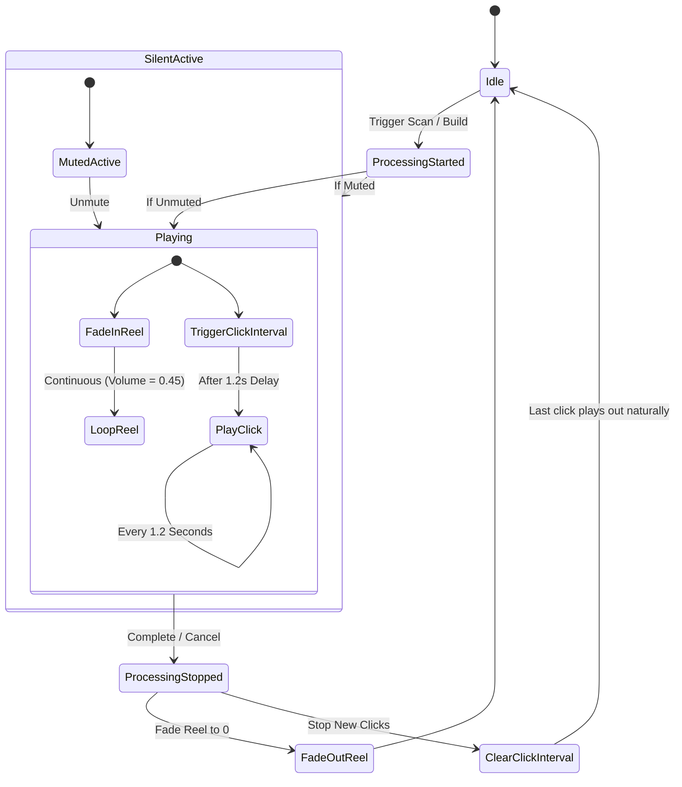

# Bombe Background Processing Audio Specifications

This document outlines the real-world audio playback behavior and specifications required for the background mechanical Bombe machine simulator in the Camerata Orchestrator application.

## Assets
* **`reel.mp3`**: Loopable background machinery/motor whirr.
* **`clicks.mp3`**: A single mechanical rotor drum click sequence.

---

## Behavior Logic & State Machine

### 1. `reel.mp3` (Ambient Motor Loop)
* **Start Behavior**: When processing starts, `reel.mp3` must be triggered immediately and **quickly faded in** (e.g. over 250ms) to its subdued background target volume (suggested: `0.45`).
* **Playback**: Loop continuously for the entire duration of the scanning or scaffolding process.
* **Stop Behavior**: When processing stops or is canceled, **do not cut the audio suddenly**. Quickly **fade out** the volume to `0` (e.g. over 250ms) and then pause/stop playback. This prevents jarring audio clicks or cuts.

### 2. `clicks.mp3` (Mechanical Rotor Clicks)
* **Single Clicking Loop**:
  - **Start Delay**: Waits exactly **1.0 second** after processing starts before playing the first click.
  - **Playback Interval**: Loops every **0.8 seconds** thereafter on a single thread.
* **Stop Behavior**: When processing stops or is canceled, the timer stops immediately, allowing the last triggered click to play out naturally.

### 3. Visual Rotor Dials (Visual Gearing & Sync)
Within each of the three banks, the rotors are arranged in a 3-row grid layout. The visual step-ticking rotation of the rotor dials is geared as follows:
* **Top Row**: Spins fast, with visual ticks in perfect sync across the bank, completing a full rotation in **0.9 seconds** (stepping every ~35ms) to create a rapid blur effect. The visual rotation starts after an initial **1.0 second** delay.
* **Middle Row**: Spins slowly, with visual ticks in perfect sync across the bank every **2.0 seconds** (26 steps = 52.0 seconds full duration). The visual rotation starts after an initial **1.7 seconds** delay.
* **Third Row**: Spins very slowly, with visual ticks in perfect sync across the bank every **3.0 seconds** (26 steps = 78.0 seconds full duration). The visual rotation starts after an initial **2.5 seconds** delay.

---

## Dioxus/Tauri Implementation Recommendations
* **Tauri Webview**: In webview contexts, standard HTML5 `web_sys::HtmlAudioElement` is fully supported.
* **Cloning Nodes**: To play clicks cleanly on intervals without cutoffs if the file is longer than the tick speed, create clone nodes (`audio_element.clone_node()`) in Rust/WASM to trigger fresh overlapping playbacks.
* **Autoplay Gating**: Remember that browser sandboxes require a user interaction gesture (like clicking the "🔊 Sound On" toggle button or starting a scan) before permitting programmatic audio playback. Ensure a permission boundary is wrapped around the initialization.
